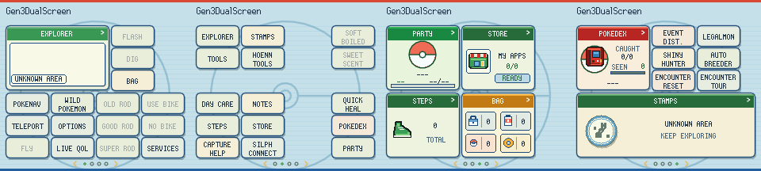
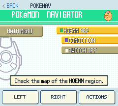
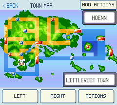
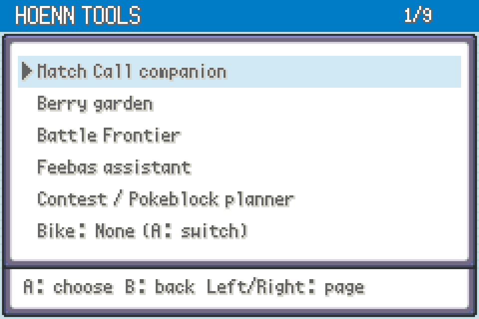
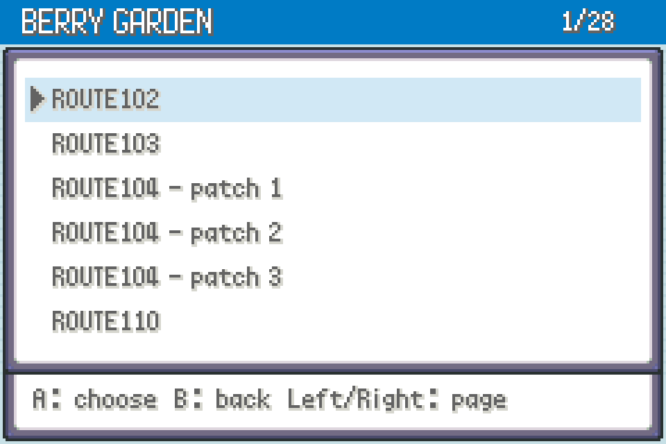

# Gen1Recomp Mods v1.3.1 — The Emerald Update

  
  
  
  

> **AI development disclaimer:** These mods and their documentation were created with AI assistance using OpenAI Codex. AI-generated code can contain bugs or incorrect assumptions; automated checks do not guarantee correctness. Treat these as experimental mods and keep backups of your saves.

A collection of independently installable **Emerald / FireRed / LeafGreen mods**: Pokémon generation, events, hunting, breeding, remote services, a companion screen and everyday quality-of-life improvements. Includes mod ZIPs, feature documentation, screenshots and validation summaries.

Built for **Emerald / FireRed / LeafGreen** on **gen1recomp 0.3.42 or newer** in [gen1recomp](https://github.com/bryanthaboi/gen1recomp). These are unofficial mods using mod API 2 and `engine_internals`. Compatibility differs by package; read each mod's instructions. No ROMs, imported game caches or player save files are included.

## One download for all QoL features

The former standalone QoL mods are now the **[QoL Suite](https://github.com/CapnJames95/gen1recomp-mod-releases/releases/download/v1.3.1/frlg-qol-suite-0.3.9.zip)**: **32 components in one download**, with **31 applicable to each game**. Turn individual features on or off to get exactly the setup you want. The seven main mods remain separate, and the suite works without Dual Screen.

1. Import the QoL Suite ZIP, **disable any old standalone QoL copies**, enable the suite and restart the game.
2. Open **START → QOL → QOL SETTINGS**.
3. Use **Up/Down** to select a feature and **A** to turn it **ON/OFF**. **SELECT** opens that feature’s options, **Left/Right** changes pages, and **B** goes back. Dual Screen also offers these switches on **Live QoL**.

See the [suite instructions](mods/frlg-qol-suite/README.md) and [screenshots of every included component](docs/RELEASE-SCREENSHOTS.md).

## New in v1.3.1 — Event Distributions update

**Event Distributions 1.4.5** adds **START → EVENTS → Repeat redemptions: OFF/ON**, defaulting to OFF. Receive supported gifts again while keeping USED markers, original receipts and the redemption journal. Save normally to keep the setting and RNG progress.

Aura Mew and every other non-preserved event choice now generate fresh results when redeemed repeatedly, including without closing EVENTS. Event-specific shiny, trainer, gender and origin rules still apply. Natures can naturally recur; the nine preserved JEREMY specimens intentionally remain fixed. Native ticket journeys and story flags are not reset.

Automated FR/LG/Emerald checks cover same-menu repeats, save/reload and delivery protections; **5,943/5,943 generated exports passed PKHeX**, plus strict modkit validation and lint. The complete collection ZIP includes this update; all other packages are unchanged from v1.3. [Full event changes and limits](mods/event-distributor/README.md).

## New features and fixes since public v1.2.0

**v1.3 — The Emerald Update** includes these changes since [v1.2.0](https://github.com/CapnJames95/gen1recomp-mod-releases/releases/tag/v1.2.0):

- **Emerald compatibility:** all eight packages support Emerald, FireRed and LeafGreen with game-specific encounters, services, breeding, field actions and save/export handling.
- **Eight Emerald companions:** Hoenn Tools adds Match Call rematches, berry tracking, Frontier records/entry checks, Feebas notes with optional spot reveal, Contest/Pokéblock planning, bike exchange, daily events and Secret Base tools. Berry Garden groups trees into **27 patch destinations** with safe adjacent teleports. Bike exchange is inline; remote registry exit no longer runs the PC script that could block the facing tile. Decoration placement requires your own base PC.
- **One QoL Suite:** the previously separate QoL downloads are combined into **Suite 0.3.9**, containing 32 individually configurable components (31 applicable per game). Services, teleport, daycare and Scrollable Start Menu are included. Disable old standalone copies before enabling the suite.
- **Gen3DualScreen 0.4.14:** renamed from FRLG Dual Screen **0.3.16** and updated from Kanto Gear **3.3.3 to 3.4.0**. Adds Emerald integration, current E/FR/LG branding, Hoenn Tools access and desktop Side by Side / Separate Window options.
- **Shared Home defaults:** the Thor’s four-page layout, tile visibility and 31 option defaults apply across all three games. Existing Home layouts migrate once with a backup; later custom edits persist. Tiles can be rearranged or hidden, and visibility saves immediately.
- **Compact tiles and direct actions:** three text-only launchers fit beside one regular widget. Old/Good/Super Rod, bike use and bike swap have separate compact tiles; bike swap shows the current bike name and swaps immediately. Fly, Dig, Flash, Sweet Scent and Soft-Boiled are compact and dim when unusable. The Field widget and duplicate native Teleport shortcut are removed; Squirt Bottle and Headbutt shortcuts are hidden.
- **Menu and battle fixes:** paged mod tools use **PREV PAGE / NEXT PAGE / BACK**. QoL Back navigation retains parent pages, cursors and Start instead of skipping to the overworld. Fixes Party sprites over the nickname keyboard/overworld, Emerald shop counts covering item sprites and Move Deleter cancellation. Owned/wild Emerald Summary displays IV/EV values; battle effectiveness uses native type and immunity calculations. Tap the Wild Pokémon filter to cycle Uncaught/All/Caught.
- **Scrollable Start Menu 0.3.1:** corrected scrolling and Emerald row spacing, while retaining saved folders and ordering. Manual resize/move controls have been removed; menus use automatic sizing and their normal position.
- **Quick Field Actions and HM Field Kit:** Auto Surf becomes Quick Field Actions, adding A-button Cut, Strength, Rock Smash and Waterfall, plus Emerald Dive/surfacing. Field Kit also supplies Sweet Scent without teaching it on engine 0.3.42+. It accepts any non-egg party Pokémon for owned HMs, regardless of learnset; HM ownership, badges and valid terrain remain required. Moves are not permanently taught.
- **Teleport improvements:** **Unlock All: ON/OFF** is an immediate toggle at the bottom of the destination list and defaults OFF for new settings. Fixes Emerald progression eligibility, Fly-map service checks, final-page touch navigation and map service actions.
- **Encounter Tour 0.3.0 / Reset 0.4.0** (from **0.1.3 / 0.2.0**): Hoenn static encounters, gifts, fossils, NPC trades and earned Johto starter rewards. Repeat original starters in all three games after earning the Pokédex, collected at Oak’s lab or Route 101 without rewinding the story or changing starter/rival choices.
- **LegalMon 0.18.1 / Auto Breeder 1.1.2** (from **0.17.1 / 1.0.3**): Hoenn acquisition profiles, breeding/tutor support, Emerald egg-generation rules and export compatibility. **Shiny Hunter 0.2.1** (from **0.1.5**) supports Emerald and the Feebas assistant’s direct entrypoint; opening the assistant does not start a hunt.
- **Event Distributions 1.4.1** (from **1.3.0**): native Emerald Aurora, Mystic and Eon Ticket journeys, Emerald export support and preserved original event/egg provenance. Existing claim IDs and USED markers remain. English Emerald’s native Old Sea Map/Mew unlock is intentionally excluded.
- **Performance and persistence:** fixes repeated bag sanitation during HM polling that caused the measured Emerald slowdown on Thor. Adds Frontier/interrupted-action safeguards, save/reload checks for generated Pokémon, event receipts, daycare and encounter resets, and protection against stale confirmations or return points crossing save sessions.

**Sweet Scent fixed upstream:** [gen1recomp 0.3.42](https://github.com/bryanthaboi/gen1recomp/releases/tag/v0.3.42) fixes [our report #2601](https://github.com/bryanthaboi/gen1recomp/issues/2601). Native Party Sweet Scent now starts an encounter in isolated Safe Mode tests for all three games. Use 0.3.42 for this fix. **HM Field Kit 0.2.4 / QoL Suite 0.3.9** now supplies Sweet Scent through any non-egg party member without teaching it, including the existing Dual Screen tile. Encounter terrain and native battle restrictions still apply. [Retest details](docs/SWEET-SCENT-RETEST.md).

**Known limits:** Disable L/R Help remains FR/LG-only; Hoenn Tools is Emerald-only. Automated checks pass, but thorough gameplay validation, fresh PKHeX checks for the new starter repeats and fuller desktop-layout checks remain outstanding. The latest map-flicker fix is installed on Thor and Mac; Thor gameplay confirmation is pending. [Current screenshots](docs/SCREENSHOTS.md) use native rendering with synthetic sessions; historical examples are labelled.

## Mod overview

Click a mod’s name to jump to its full features, screenshots and download.

### Main mods

| Mod | What it does |
| --- | --- |
| [Gen3DualScreen](#mod-frlg-dual-screen) | A Kanto Gear-based companion screen that connects mod shortcuts, editors, encounters and QoL controls. |
| [LegalMon](#mod-legalmon) | Configure Pokémon, validate supported acquisition constraints and deliver them to party or PC. |
| [Event Distributions](#mod-event-distributions) | Browse and recreate supported event Pokémon, eggs and island tickets. |
| [Shiny Hunter](#mod-shiny-hunter) | Automate encounter attempts and stop for shinies or other selected targets. |
| [Auto Breeder](#mod-auto-breeder) | Search engine-generated eggs for selected IVs, shininess and other traits. |
| [Encounter Tour](#mod-encounter-tour) | Teleport to static encounters, gifts and other destinations, individually or on a tour. |
| [Encounter Reset](#mod-encounter-reset) | Reset encounters, gifts, fossils, trades or roamers; prepare repeat starter gifts without rewinding the story. |

### QoL tools

All of these are included in the single QoL Suite download and can be toggled individually.

| Mod | What it does |
| --- | --- |
| [Hoenn Tools](#mod-hoenn-tools) | Eight Emerald companions: rematches, berries, Frontier, Feebas, contests, bikes, daily events and secret bases. |
| [Pokémon Services — Pokémon Centre tools](#mod-pokemon-services) | Access native PCs, shops, healing and other Pokémon services remotely. |
| [Fly Teleport](#mod-fly-teleport) | Teleport to native Fly destinations; optional Dual Screen Home tile. |
| [Day Care Viewer](#mod-day-care-viewer) | Inspect daycare and breeding details, manage deposited Pokémon and teleport to daycare. |
| [Quick Heal Party](#mod-quick-heal-party) | Heal one Pokémon or the whole party with owned medicine after reviewing the cost. |
| [Capture Assistant](#mod-capture-assistant) | Compare owned balls, catch estimates and moveset risks during wild battles. |
| [Summary IVs](#mod-summary-ivs) | Show inline Summary IVs and inspect uncaught wild Pokémon in a read-only native preview. |
| [Scrollable Start Menu](#mod-scrollable-start-menu) | Expand and scroll the native Start menu; sort entries and group mod shortcuts into folders. |
| [Quiet EXP](#mod-quiet-exp) | Hide individual EXP announcements while retaining EXP gains, level-ups and move learning. |
| [Quick Field Actions](#mod-auto-surf-prompt) | Press A for eligible field actions; Emerald also supports Dive and surfacing. |
| [Disable L/R Help](#mod-disable-lr-help) | Free shoulder buttons from native Help and L=A without consuming hotkey input. |
| [Sorted Bag](#mod-sorted-bag) | Sort Bag pockets into a consistent order. |
| [Battle Ball Shortcut](#mod-battle-ball-shortcut) | Open a ball picker directly from the wild battle command menu. |
| [Battle Bar Speed](#mod-battle-bar-speed) | Adjust battle HP and EXP bar animation speed. |
| [Held Berry Replacement](#mod-held-berry-replacement) | Replace consumed held berries from your Bag when available. |
| [Dex Companion](#mod-dex-companion) | Browse caught status, evolution information and encounter details. |
| [Faster Center Healing](#mod-faster-center-healing) | Shorten the Pokémon Center healing presentation. |
| [HM Field Kit](#mod-hm-field-kit) | Use eligible field moves without permanently teaching them to the party. |
| [Hold Fast Forward](#mod-hold-fast-forward) | Hold a configured button to temporarily speed up the game. |
| [Fast / Instant Text](#mod-fast--instant-text) | Speed up dialogue or display its text instantly. |
| [Key Item Help](#mod-key-item-help) | Show usage guidance for supported key items. |
| [Town Map Companion](#mod-town-map-companion) | Add location and service information to the map experience. |
| [Party Held Items](#mod-party-held-items) | Manage held items from the party interface. |
| [Party Nickname](#mod-party-nickname) | Rename eligible Pokémon from the party menu. |
| [Party Move Reminder](#mod-party-move-reminder) | Access move relearning from the party menu using the normal payment. |
| [Quicker Save Confirmation](#mod-quicker-save-confirmation) | Reduce steps in the normal save confirmation flow. |
| [Repel Reuse Prompt](#mod-repel-reuse-prompt) | Offer to use another owned Repel when the current one expires. |
| [Reusable TMs](#mod-reusable-tms) | Keep TMs after teaching compatible moves. |
| [Running From Start](#mod-running-from-start) | Allow running without waiting for the usual Running Shoes unlock. |
| [Shop Owned Count](#mod-shop-owned-count) | Show how many of each shop item you already own. |
| [Expanded Summary Info](#mod-expanded-summary-info) | Display additional Pokémon stats, IVs, EVs and related details. |
| [VS Seeker Readiness](#mod-vs-seeker-readiness) | FR/LG VS Seeker battery status; Emerald Match Call rematches and locations. |

## Gen3DualScreen 0.4.14

**Current 0.4.14:** Emerald’s **POKENAV** tile opens the full native PokéNav after you obtain it. Emerald map/PokéNav screens keep the upper display black and render without tool-bar overlap. This version also uses the Thor's shared four-page Home preset in Emerald, FireRed and LeafGreen, including a one-time migration for existing saves. The previous layout is backed up; later edits remain saved. Compact launchers, individual rod/bike tiles, dimmed field actions, immediate visibility saving and the paged **BACK** footer are included. Squirt Bottle and Headbutt shortcuts are hidden. All 31 default options match the captured Thor configuration.

Use gen1recomp **0.3.42 or newer** for all collection features. The Kanto Gear 3.4.0 foundation introduced Emerald support; all eight packages now support all three target games with edition-specific limitations.

Includes a built-in Y/F7 ball picker, configurable under Options → Battle, with a clear CHOOSE BALL prompt and themed selection/confirmation screens. No separate ball mod is required.

[Download 0.4.14](https://github.com/CapnJames95/gen1recomp-mod-releases/releases/download/v1.3.1/frlg-dual-screen-0.4.14.zip) · [Instructions, coverage and limits](mods/frlg_dual_screen/README.md) · [Validation](mods/frlg_dual_screen/VALIDATION.md)

**Gen3DualScreen is built on Kanto Gear 3.4.0 by AverageConsumer.** It extends Kanto Gear’s DS-style companion interface with FireRed/LeafGreen styling and integrations that bring the other mods in this collection together: shared Home shortcuts, live controls, encounter tools and QoL settings. Adds a Home encounter browser with caught/seen/new labels, sprite-triggered battles and configurable uncaught hotkeys; Home shortcuts for supported collection tools and direct-touch/live editors for the original five, native-menu fallback and live toggles for applicable QoL components. Disable the original Kanto Gear/DS mod while using this replacement. **AYN Thor is the only tested dual-screen device. Other dual-screen devices have not been tested.**

Use [Encounter Tour 0.3.0](https://github.com/CapnJames95/gen1recomp-mod-releases/releases/download/v1.3.1/encounter-tour-0.3.0.zip) and [Shiny Hunter 0.2.1](https://github.com/CapnJames95/gen1recomp-mod-releases/releases/download/v1.3.1/shiny-hunter-0.2.1.zip) for live-editor/encounter coordination. Only current versions are kept in downloads. Version 0.3.1 lets you tap the battery indicator to switch to a saved percentage display. Home tiles hide their matching native Start entries while enabled. Virtual controller buttons were removed in 0.2.2; direct touch menus and physical controls remain.

### Differences from Kanto Gear

This compares **Gen3DualScreen 0.4.14** with its **[Kanto Gear 3.4.0](https://github.com/AverageConsumer/kanto-gear/releases/tag/v3.4.0)** foundation. The two projects have independent version numbers.

- **Gen III collection focus.** This fork targets Emerald, FireRed and LeafGreen, with Gen III styling and integrations for this collection. Emerald support builds on the Kanto Gear 3.4.0 foundation.
- **Home shortcuts for this collection.** Adds shortcuts for installed, enabled Pokémon Services, LegalMon, Event Distributions, Shiny Hunter, Auto Breeder, Encounter Tour, Day Care Viewer and Encounter Reset. Their matching native Start entries are hidden while the companion is enabled and restored when it is disabled.
- **Integrated mod editors.** LegalMon, Event Distributions, Shiny Hunter, Auto Breeder and Encounter Tour can display their original editors on the lower screen, with supported row taps and LegalMon keyboard input. Other supported tools open through native menu rendering.
- **Optional live editing.** The five integrated editors have a PAUSED/LIVE switch, allowing physical field movement while using their touch controls. Actions wait for safe conditions; searches, text entry, automation and native menus retain the required modal ownership.
- **Targeted wild encounters.** Adds a Wild Pokémon page with caught/seen/new labels, current-tile or current-map views, tappable encounter cards and an uncaught-species shortcut. Encounters use native generation and battle rules but intentionally bypass normal step chance and Repel. This does not force shininess or select scripted legendary encounters.
- **Shared QoL controls.** Live QoL exposes switches for applicable installed suite components. Quick Heal Party and Capture Assistant have their own Home tiles. Detailed configuration stays in each mod. Scrollable Start Menu is included in the QoL Suite and supplies the native menu renderer.
- **Coordination between mods.** Ball Shortcut shares popup ownership with the companion, Shop Owned Count supplies quantities to its shop rows, and encounter shortcuts yield to battles, menus and active hunting/automation.
- **Built-in battle tools.** Dual Screen has its own themed ball picker with native ball sprites, configurable controller/keyboard shortcuts and touch confirmation; Battle Ball Shortcut is not required. Fight rows show type-effectiveness badges, not full damage predictions.
- **Native generation/export fixes.** Shared corrections cover identified ability-slot, gift-egg, NPC-trade and roamer PID/IV issues. Existing Pokémon are not rerolled; use in-game SAVE + EXPORT for the export correction.
- **Battery percentage toggle.** Tap the header battery indicator to switch between its icon and a saved numeric percentage preference.
- **Separate settings.** The fork has its own mod identity; existing Kanto Gear settings and notes are not automatically migrated. Install the other collection mods separately and disable Kanto Gear while this replacement is enabled.

**Inherited from Kanto Gear:** the companion-screen foundation, Home system, display layouts, core touch adapters, optional Silph Connect presence and the 3.3.3 pointer/summary fixes. These are upstream features, not original additions by this collection. This fork does not promise full feature parity; unknown or specialized menus can fall back to native rendering and physical controls, and device testing is limited to AYN Thor. Other dual-screen devices have not been tested. [Detailed controls and limits](mods/frlg_dual_screen/README.md).

## Downloads

Public releases are hosted in [gen1recomp-mod-releases](https://github.com/CapnJames95/gen1recomp-mod-releases/releases/latest). Collection release numbers are separate from each mod’s version.

### All-in-one manual-install bundle

**[Download the complete collection — 8 installable packages](https://github.com/CapnJames95/gen1recomp-mod-releases/releases/download/v1.3.1/gen1recomp-all-mods-manual-install.zip)**

The 32 QoL components are combined into one QoL suite; seven other mods remain separate. Disable previously installed standalone QoL packages before enabling the suite. Standalone QoL downloads have been removed; the suite is the only QoL package.

Download the ZIP directly from the release assets; no GitHub sign-in is required. The bundle uses standard uncompressed ZIP entries for extractor compatibility.

Extract this ZIP, then copy the contents of its `mods/` folder into the game's actual mod directory. Each mod must sit directly inside that directory as `<mod-id>/manifest.json`; avoid an extra `mods/mods/` layer. Restart and enable the mods you want. All mods retain their individual settings and identities.

**This bundle is for manual extraction, not the launcher's “Import mod .zip” command.** It includes `INSTALL.txt` with installation steps and every included version. Back up your existing saves/mod folders before replacing matching mod folders. On AYN Thor, your file manager needs access to the game's mod directory; otherwise use the individual imports below.

### Main mod downloads

| Mod | Version | Installable ZIP | Instructions |
| --- | --- | --- | --- |
| LegalMon | **0.18.1** | [Download](https://github.com/CapnJames95/gen1recomp-mod-releases/releases/download/v1.3.1/legalmon-0.18.1.zip) | [README](mods/legalmon/README.md) |
| Event Distributions | **1.4.5** | [Download](https://github.com/CapnJames95/gen1recomp-mod-releases/releases/download/v1.3.1/event-distributor-1.4.5.zip) | [README](mods/event-distributor/README.md) |
| Shiny Hunter | **0.2.1** | [Download](https://github.com/CapnJames95/gen1recomp-mod-releases/releases/download/v1.3.1/shiny-hunter-0.2.1.zip) | [README](mods/shiny-hunter/README.md) |
| Auto Breeder | **1.1.2** | [Download](https://github.com/CapnJames95/gen1recomp-mod-releases/releases/download/v1.3.1/autobreeder-1.1.2.zip) | [README](mods/autobreeder/README.md) |
| Encounter Tour — static encounter teleports | **0.3.0** | [Download](https://github.com/CapnJames95/gen1recomp-mod-releases/releases/download/v1.3.1/encounter-tour-0.3.0.zip) | [README](mods/encounter-tour/README.md) |
| Encounter Reset | **0.4.0** | [Download](https://github.com/CapnJames95/gen1recomp-mod-releases/releases/download/v1.3.1/encounter-reset-0.4.0.zip) | [README](mods/encounter-reset/README.md) |
| Gen3DualScreen | **0.4.14** | [Download](https://github.com/CapnJames95/gen1recomp-mod-releases/releases/download/v1.3.1/frlg-dual-screen-0.4.14.zip) | [README](mods/frlg_dual_screen/README.md) |

### Combined QoL package

[QoL Suite 0.3.9](https://github.com/CapnJames95/gen1recomp-mod-releases/releases/download/v1.3.1/frlg-qol-suite-0.3.9.zip) — one import for 32 QoL components (31 applicable per game), with individual toggles and original options in START → QOL → QOL SETTINGS. Requires Dual Screen 0.3.21+ for companion integration. Disable standalone QoL packages and restart before enabling it. [Instructions](mods/frlg-qol-suite/README.md) · [Validation](mods/frlg-qol-suite/VALIDATION.md).

On GitHub, choose **Download raw file** for the suite ZIP. Import it through **MODS → Import mod .zip**, enable it and restart. Choose individual features inside **START → QOL → QOL SETTINGS**.

The seven other packages remain independently installable; LegalMon is not a required dependency. Avoid running multiple automation tools at the same time. The full combination of these mods has not been gameplay-tested together.

## Hoenn Tools 0.1.1 — included in QoL Suite 0.3.2

Emerald-only tools for **Match Call rematches and locations, berry gardens, Battle Frontier records and entry checks, Feebas fishing notes and optional spot reveal, Contest/Pokéblock planning, Mach/Acro bike exchange, daily events and secret bases**. Opens from START → QOL or the Gen3DualScreen Home tile. Dual Screen is optional.

The dashboards use native data and refresh on opening. Pokéblock previews consume nothing; Feebas reveal does not advance RNG. The bike switch requires an owned bike and checks activity/terrain restrictions. Secret Base arrangement opens the native UI only while facing your own base PC.

[Full features and controls](qol/mods/frlg_qol_hoenn_tools/README.md) · [Download QoL Suite](https://github.com/CapnJames95/gen1recomp-mod-releases/releases/download/v1.3.1/frlg-qol-suite-0.3.9.zip)

Native menu previews with synthetic state; not hardware gameplay screenshots:

## Pokémon Services 0.1.3 — Pokémon Centre tools

**START → MODS → Pokemon Services → OPEN SERVICES**, **START → SERVICES**, or the **SERVICES** Home tile with Gen3DualScreen 0.4.0.

Remote native Pokemon/item PCs, free party healing, all town/island Poke Marts, Celadon department-store counters and vending machines, free Move Reminder (no mushrooms or Heart Scales), Move Deleter, Name Rater, Day Care management. Uses existing game logic, imported stock, normal shop prices and native restrictions. Move relearning is free and preserves owned mushrooms. Two Island retains progression-dependent stock; other remote services bypass travel. Day Care eggs use Four Island in FR/LG and Route 117 in Emerald. Emerald uses Lilycove item counters and vending; furniture is excluded.

[QoL Suite download](https://github.com/CapnJames95/gen1recomp-mod-releases/releases/download/v1.3.1/frlg-qol-suite-0.3.9.zip) · [Instructions and screenshots](mods/pokemon-services/README.md) · [Validation](mods/pokemon-services/VALIDATION.md). 402 automated checks pass across both editions, including Dual Screen launch integration. Physical device playtesting remains outstanding.

Historical preview (older build): [Pokemon Services](docs/screenshots/pokemon-services/services-home.png).

## LegalMon 0.18.1

**START → LEGALMON** — configure a Pokémon, validate its acquisition constraints, inspect the result and confirm delivery to party or PC.

- Supported generating routes for **all 386 Gen III species**, with exact species, level, nature, gender, ability, shiny status, IV constraints and moves.
- FireRed, LeafGreen, Ruby, Sapphire, Emerald, Colosseum and XD origin choices; exact acquisition route and original-trainer controls.
- GameCube coverage includes **48 regular Colosseum Shadows, 83 XD Shadows, nine Poké Spot species and three Japanese e-Reader Shadows**, plus supported starters, gifts, trades and evolutions.
- Acquisition-specific PID/IV/RNG proofs, strict rejection of unsupported requests, bounded resumable searches and explain-legality reports.
- All-31 and shiny-seed finders, Hidden Power and IV filters, result browsing, IV/stat comparison, pinned results and locks/rerolls.
- Searchable species/moves, saved builds, recent builds and party/PC capacity checks. Trainer ID and Secret ID use a controller-friendly numeric keypad.
- Alternate acquisition search and explicit egg routes; H1/H2/H4 ordinary wild profiles, all 28 Unown forms, standard FRLG tutors and Cape Brink moves.
- Imported FRLG NPC trades preserve their fixed PID/IV/OT records; supported pre-evolution moves include a chronological teaching/evolution proof and delivery recheck.
- FRLG egg-move and shared-parent inheritance, bounded breeding chains and supported parental Sketch sources, with whole-moveset parent proofs.
- Earlier-stage TM/HM/tutor teaching and moves learned on an evolution-triggering level gain; delivery reconstructs the proof before generating the Pokémon. Special evolution histories and recursive parent PID/IV ancestry remain outside coverage.

Coverage means supported acquisition routes, not every possible origin or build. Shiny locks and special IV restrictions remain enforced; a search budget expiring does not prove impossibility. [Full features and limits](mods/legalmon/README.md).

| Home | GameCube e-Reader result |
| --- | --- |
| Historical preview (older build): [LegalMon home](docs/screenshots/legalmon-home.png). | Historical preview (older build): [LegalMon e-Reader result](docs/screenshots/legalmon-ereader.png). |

## Event Distributions 1.4.5

**START → EVENTS** — browse **87 campaign menus, 322 Pokémon choices and 670 selectable variants**.

- GBA and Japanese gifts, Pokémon Center NY, bonus-disc distributions, event eggs and ticket encounters.
- Nine preserved JEREMY gifts, Japanese city OT choices, regional Mt. Battle Ho-Oh rewards and both Wishing Star Jirachi methods. Eon replicas carry Soul Dew; Mystic journeys support the remaining unused counterpart. See [what is new and what remains missing](mods/event-distributor/README.md#previous-additions-in-130).
- Normal/shiny availability checks against your trainer identity, with clear explanations for unavailable variants.
- Event eggs delivered as eggs or already hatched; normal walking/hatching support and the correct event/hatcher identities.
- **Aurora Ticket and Mystic Ticket** delivery unlocks native island travel and Deoxys, Lugia and Ho-Oh encounters; you catch them normally.
- Search/filter controls, hide-used and available-shiny filters, detailed result previews and party/PC delivery.
- Persistent claim tracking and redemption journal for deliveries, hatches, tickets and captures.
- **Repeat redemptions: OFF/ON** (default OFF), with preserved history and fresh event-valid results on repeated selections. The nine preserved JEREMY specimens remain fixed.

Fixed event OTs, shiny locks, origin restrictions, ribbons and RNG correlations are preserved. Keep the mod enabled through event-egg hatching and Japanese-OT export. These are generated replicas, not evidence of historical event attendance. [Coverage](mods/event-distributor/COVERAGE.md) · [Instructions](mods/event-distributor/README.md).

| Campaign archive | Native ticket confirmation |
| --- | --- |
| Historical preview (older build): [Event archive](docs/screenshots/events-home.png). | Historical preview (older build): [Aurora Ticket confirmation](docs/screenshots/events-ticket.png). |

## Shiny Hunter 0.2.1

**START → SHINY HUNTER** — automate repeated encounter attempts and stop when a wanted result appears.

- Automatic horizontal/vertical walking, static/gift interaction, registered-rod fishing and recorded-input routes.
- Filters for species, nature, gender, ability and minimum IVs; protects **any shiny by default**, even outside your filters.
- Restores a starting-point snapshot after rejected attempts, including Surf/bicycle and Safari state.
- Speed choices from **1× to 256×**, with 64× as the default for new configurations; checks every simulation tick.
- Optional normal ball-use auto-capture, with inventory, storage, fainting and timeout safeguards.
- START/F10 pause, starting-point recovery and a history of the latest 100 shinies.

It does not force shininess, change PID/IVs or guarantee capture. Reset attempts rewind progress after the starting point. Recorded routes depend on timing; coverage varies by encounter. [Full coverage and controls](mods/shiny-hunter/README.md).

| Encounter modes | Speed settings |
| --- | --- |
| Historical preview (older build): [Shiny Hunter modes](docs/screenshots/shiny-hunter-modes.png). | Historical preview (older build): [Shiny Hunter speed options](docs/screenshots/shiny-hunter-speeds.png). |

## Auto Breeder 1.1.2

**START → AUTO BREEDER** — search engine-generated eggs for your selected offspring targets.

- Choose parents from your party or Four Island Day Care.
- Target all six perfect IVs or individual perfect stats, plus shininess, nature, gender and ability.
- Optional virtual-parent improvement using compatible offspring, preserving your original parents and held items.
- Engine breeding, inheritance and hatch routines; targets filter generated results rather than overwriting traits.
- Pause/resume and extend the attempt budget; inspect working parents and the matching result.
- Explicitly keep a result as an egg or a level-5 hatchling, with party/PC capacity handling.
- Keep each improved working parent once per improvement, already hatched, with explicit confirmation and party/PC capacity checks. Original unchanged parents cannot be duplicated.
- **Export support:** in-game **Save + export for PKHeX**, marked-result OT-name export correction, and repair of the old single-ability-slot issue.

Use **Export / repair / help → Save + export for PKHeX** for the corrected export. Returning to the desktop launcher unloads the runtime correction; a subsequent launcher export can overwrite the corrected file. Unclaimed search progress is session-only. [Instructions and limitations](mods/autobreeder/README.md).

| Offspring targets | Matching result |
| --- | --- |
| Historical preview (older build): [Auto Breeder targets](docs/screenshots/autobreeder-targets.png). | Historical preview (older build): [Auto Breeder result](docs/screenshots/autobreeder-result.png). |

## Fly Teleport 0.2.2

**START → TELEPORT** — all 20 native Fly destinations in the usual scrolling FRLG menu, including the Route 4/10 Pokémon Centers and all seven Sevii Islands. Game progression is the default: destinations unlock using the native Fly visited flags. Toggle **Unlock All: OFF / ON** at the top of the teleport menu to include unvisited locations immediately, or use **UNLOCK ALL** in the mod manager. No Fly move is required; normal map-entry scripts still run.

Gen3DualScreen 0.3.16 adds a **TELEPORT** Home tile automatically when this mod is installed and enabled. Busy-state and landing checks protect travel.

[QoL Suite download](https://github.com/CapnJames95/gen1recomp-mod-releases/releases/download/v1.3.1/frlg-qol-suite-0.3.9.zip) · [Instructions](mods/fly-teleport/README.md) · [Validation](mods/fly-teleport/VALIDATION.md)

Historical preview (older build): [Fly Teleport](docs/screenshots/fly-teleport/destinations-firered.png).

## Day Care Viewer 0.2.1

**START → DAY CARE** — check Route 5 and Four Island without travelling there, in the same native menu style as Auto Breeder and LegalMon.

View deposited Pokémon, levels gained, fees, EXP, steps, current and projected moves, IVs/EVs/stats, held items and trainer details. Includes breeding compatibility, offspring species, egg readiness, steps to the next egg check and party egg progress. Manage / teleport adds native party deposits, paid withdrawals and travel to either daycare. Egg collection stays at the native attendant: Four Island in FRLG or Route 117 in Emerald; browsing remains read-only.

[QoL Suite download](https://github.com/CapnJames95/gen1recomp-mod-releases/releases/download/v1.3.1/frlg-qol-suite-0.3.9.zip) · [Instructions and screenshots](mods/daycare-viewer/README.md) · [Verification](mods/daycare-viewer/TEST-REPORT.md)

Historical preview (older build): [Day Care Viewer](docs/screenshots/daycare-viewer/daycare-home.png).

## Encounter Tour 0.3.0 — static encounter teleports

Emerald has 31 destinations, including original Hoenn starters, the earned Johto choice, gifts, fossils, trades and legendary/static encounters. Native story prerequisites still apply.

**START → ENCOUNTER TOUR** — teleport to fixed encounters or follow an automatic tour. LegalMon is not required.

- **FR/LG: 40 catalogue entries**, with 39 version-compatible destinations per game: starters, legendaries, event islands, static battles, gifts/eggs, fossils, Game Corner prizes and NPC trades.
- Browse by category and Pokémon; review encounter notes before choosing **Teleport here**.
- Automatic touring advances after a matching acquisition or original completion flag, once the field is idle. Start from any selected encounter or skip a stop.
- **START pauses** the tour; **Return to start** restores your original position while retaining current Pokémon, items and story progress.
- Native scripts handle interaction, battle, catching, trades and gifts. Existing prerequisites and completed encounters are not reset.
- Busy-state and landing checks reject unsafe teleports during battles, dialogue, movement, linked activities or Safari games.

Event-island teleports bypass ferry/ticket access, but puzzles and encounters remain native. Roamers and external event/GameCube gifts have no fixed FRLG destination. Return points and tour progress last only for the current session. [Full catalogue and controls](mods/encounter-tour/README.md).

| Encounter categories | Deoxys destination and notes |
| --- | --- |
| Historical preview (older build): [Encounter Tour categories](docs/screenshots/encounter-tour-categories.png). | Historical preview (older build): [Encounter Tour Deoxys](docs/screenshots/encounter-tour-deoxys.png). |

## Encounter Reset 0.4.0

**Original starters in all three games:** after receiving the Pokédex, prepare a repeat gift, return to Oak’s lab (FR/LG) or Route 101 (Emerald), and collect it through Encounter Reset. Requires a free party slot; original story, rival and starter choice stay intact.

**Emerald:** native Hoenn encounters, rewards and roamer resets, plus original starter repeats. [Edition-specific coverage](mods/encounter-reset/README.md).

**START → ENCOUNTER RESET** — individually restore Articuno, Zapdos, Moltres, Mewtwo, Lugia, Ho-Oh, Deoxys, each Snorlax, each Electrode and Lostelle's Hypno. Restores your previously unlocked roaming beast after capture or defeat, plus Eevee, Lapras, each Dojo prize, Magikarp, the Togepi egg, all three fossil revivals and all nine NPC trades. Matches Encounter Tour's native menu style.

Leave the encounter map, select one entry, confirm its reset and return to catch it normally. Keeps existing Pokémon and Pokédex records. Deoxys restarts its puzzle; Hypno replays the rescue, reward and return trip. Roamer options cannot unlock a different starter's beast. [Download ZIP](https://github.com/CapnJames95/gen1recomp-mod-releases/releases/download/v1.3.1/encounter-reset-0.4.0.zip) · [Coverage and instructions](mods/encounter-reset/README.md) · [Validation](mods/encounter-reset/VALIDATION.md)

Historical preview (older build): [Encounter Reset menu](docs/screenshots/encounter-reset-home.png).

## QoL Suite features

The QoL Suite includes 31 applicable features for each game. Emerald omits Disable L/R Help and gains Hoenn Tools; Match Call replaces VS Seeker status, and service/travel data follows Hoenn. Use QOL SETTINGS for individual switches and original options. Component version numbers and screenshots document their source history; install only the suite.

Every entry below includes its features, download and instructions. **Several mods have effect-focused native UI examples**, including a before/after inventory comparison. These use real mod hooks and rendering with isolated test data; they are not live-play captures. Remaining entries retain explicitly labelled manager images because a useful effect capture is not available. Individual READMEs also retain detail/options screens. [Validation](qol/VALIDATION.md) · [Engine-owned features and scope](qol/ENGINE_FEATURES.md).

### Summary IVs 0.2.4

Shows all six IVs (0–31) beside the native Pokémon Skills stat labels without changing the calculated stats. Works in party and PC summaries; eggs are excluded and missing data shows `--`. The SHOW IVS setting is read-only. With Dual Screen 0.3.13+, the native Skills page appears below and uses physical navigation controls.

**Wild Pokémon preview:** press keyboard **I** or controller **X / West** at the ordinary wild-battle command menu. Inspect native summary pages and toggle IV/EV values with Select. The battle pauses, data is read-only, and no caught requirement applies. Keyboard/gamepad bindings are configurable; existing saved bindings are preserved. This addition has automated coverage but has not been tested on physical hardware.

[QoL Suite download](https://github.com/CapnJames95/gen1recomp-mod-releases/releases/download/v1.3.1/frlg-qol-suite-0.3.9.zip) · [Instructions and validation](mods/summary-ivs/README.md)

Historical preview (older build): [Native Skills page with IVs](docs/screenshots/summary-ivs/firered.png).

### Disable L/R Help 0.1.0

Suppresses native L/R Help and the L=A alias while enabled, leaving shoulder presses available for menu navigation and mod hotkeys. Disabling restores normal behaviour without rewriting saved button settings. It adds no overlay; the image below shows the existing Party Held Items panel whose L shortcut remains available.

[QoL Suite download](https://github.com/CapnJames95/gen1recomp-mod-releases/releases/download/v1.3.1/frlg-qol-suite-0.3.9.zip) · [Instructions and validation](mods/disable-lr-help/README.md)

### Quick Heal Party 0.1.0

**START → QUICK HEAL** — preview the healing items to spend and resulting party HP/status, then confirm. Heal the whole party or one Pokémon using owned medicine. Revives and status cures are configurable; Full Restores, Max Potions and Max Revives are protected by default. Uses native field item actions and the collection's FRLG menu styling.

[QoL Suite download](https://github.com/CapnJames95/gen1recomp-mod-releases/releases/download/v1.3.1/frlg-qol-suite-0.3.9.zip) · [Instructions](mods/quick-heal-party/README.md) · [Validation](mods/quick-heal-party/VALIDATION.md)

Historical preview (older build): [Quick Heal review](docs/screenshots/quick-heal-party/quick-heal-review.png).

### Capture Assistant 0.1.1

With **Gen3DualScreen 0.4.0+** active, the assistant opens on the **bottom screen over the companion UI**, keeping the battle visible above. Tap rows and Back, or use physical controls. Closing restores the companion.

**R at the wild battle command menu** — compare owned balls, see native one-throw catch estimates and hypothetical 1 HP/sleep improvements, and inspect moveset risks. Reading takes no turn and spends no items. Master Balls are excluded from recommendations. **START → CAPTURE HELP** provides instructions. Matches the collection's native FRLG menus.

[QoL Suite download](https://github.com/CapnJames95/gen1recomp-mod-releases/releases/download/v1.3.1/frlg-qol-suite-0.3.9.zip) · [Instructions and limits](mods/capture-assistant/README.md) · [Validation](mods/capture-assistant/VALIDATION.md)

Historical preview (older build): [Capture Assistant ball comparison](docs/screenshots/capture-assistant/capture-balls.png).

The two assistants pass 140 shared checks per edition, including native item/catch routines and production-loader tests. These screenshots are native renders of synthetic test sessions; physical device testing remains outstanding.

### Scrollable Start Menu 0.3.1

The native START menu fits the game’s available rows, then scrolls through longer mod lists. Manual resizing and moving have been removed; saved folders and ordering remain. Width adapts to entry labels; the current selection stays visible with a scrollbar. START → ORGANIZE MENU adds saved manual/A-Z ordering, named folders, and controls to move mod shortcuts between them. Native callbacks, wraparound, exit confirmation and Safari status remain supported. Dual Screen's touch menu has its own layout. [Features and validation](mods/frlg_scrollable_start/README.md).

| First selection | Scrolled to last selection |
| --- | --- |
|  |  |

These examples render the actual native menu with isolated fixture entries and imported assets.

Historical preview (older build): [Folder and ordering controls](docs/screenshots/start-organizer-preview.png).

### Quiet EXP 0.1.0

Quiet EXP skips individual EXP announcements while keeping level-ups and move learning. It changes presentation without removing earned EXP.

[QoL Suite download](https://github.com/CapnJames95/gen1recomp-mod-releases/releases/download/v1.3.1/frlg-qol-suite-0.3.9.zip) · [Instructions](qol/mods/frlg_qol_quiet_exp/README.md)

 [Fix report](qol/FIXES.md). Battle Hints and Move Inspector have been removed; all other QoL mods remain. Update Dual Screen and Ball Shortcut together.

### Quick Field Actions 0.3.0

Renamed from Auto Surf. Press A facing water, a cuttable tree, a Strength boulder, a smashable rock or a waterfall to activate the eligible move without confirmation or used-move text. Waterfall requires surfing and facing up; Strength enables normal boulder pushing. Emerald also supports Dive and surfacing. Normal animations, badge/move gates, HM Field Kit compatibility and native interaction priority remain intact. Walking alone does not trigger it. Existing Auto Surf settings carry over.

[QoL Suite download](https://github.com/CapnJames95/gen1recomp-mod-releases/releases/download/v1.3.1/frlg-qol-suite-0.3.9.zip) · [Full instructions](qol/mods/frlg_qol_auto_surf/README.md)

*Manager screen only; an in-use effect capture is not available for this mod. A still settings image does not demonstrate its gameplay behavior or timing.*

### Sorted Bag

Sort displayed pocket rows without rewriting saved inventory.

Sort by name, descending quantity, or numeric item ID. Pocket assignment stays native. TM Case and Berry Pouch have separate renderers and are not reordered. Manual bag ordering is hidden while enabled; disable to restore it.

[QoL Suite download](https://github.com/CapnJames95/gen1recomp-mod-releases/releases/download/v1.3.1/frlg-qol-suite-0.3.9.zip) · [Full instructions](qol/mods/frlg_qol_bag_sort/README.md)

Before: original inventory order.

After: alphabetical rows, with the same item quantities.

### Battle Ball Shortcut

Throw a selected ordinary Ball with SELECT from a wild single battle command menu.

Configure Poke/Great/Ultra Ball, then SELECT (Tab/Shift) in the main command menu. No fallback to a different Ball and no Master Ball option. Empty stock falls through. Trainer, Safari, double, link, spectated and tutorial battles excluded. The battle engine still resolves the normal turn and catch.

[QoL Suite download](https://github.com/CapnJames95/gen1recomp-mod-releases/releases/download/v1.3.1/frlg-qol-suite-0.3.9.zip) · [Full instructions](qol/mods/frlg_qol_ball_shortcut/README.md)

*Manager screen only; an in-use effect capture is not available for this mod. A still settings image does not demonstrate its gameplay behavior or timing.*

### Battle Bar Speed

Choose independent instant HP and EXP bars while preserving battle logic and callbacks.

INSTANT HP and INSTANT EXP can be toggled separately. Uses upstream's own instant-tween path, retaining callbacks and display values. Move-animation on/off and overall battle speed are already engine options; animation-script time scaling is not included.

[QoL Suite download](https://github.com/CapnJames95/gen1recomp-mod-releases/releases/download/v1.3.1/frlg-qol-suite-0.3.9.zip) · [Full instructions](qol/mods/frlg_qol_battle_pacing/README.md)

*Manager screen only; an in-use effect capture is not available for this mod. A still settings image does not demonstrate its gameplay behavior or timing.*

### Held Berry Replacement

Replace a berry actually consumed in battle using one matching berry from your Bag.

Restocks after battle writeback, only for confirmed berry consumption and an unchanged party member with an empty item slot. Never manufactures berries, restocks during battle, or replaces items merely lost to Knock Off/Thief. Link battles excluded.

[QoL Suite download](https://github.com/CapnJames95/gen1recomp-mod-releases/releases/download/v1.3.1/frlg-qol-suite-0.3.9.zip) · [Full instructions](qol/mods/frlg_qol_berry_restock/README.md)

*Manager screen only; an in-use effect capture is not available for this mod. A still settings image does not demonstrate its gameplay behavior or timing.*

### Dex Companion

Search seen species, inspect imported evolutions and locations, and count owned species in the current area.

**0.1.2 Start-menu fix:** without Scrollable Start Menu, overflowing menus use a compact right-hand scrolling sidebar. If both HM Field Kit and Dex Companion are installed, update both and restart.

[QoL Suite download](https://github.com/CapnJames95/gen1recomp-mod-releases/releases/download/v1.3.1/frlg-qol-suite-0.3.9.zip) · [Full instructions](qol/mods/frlg_qol_dex_companion/README.md)

Selecting a seen species shows its imported evolution rule and available wild-location records.

### Faster Center Healing 0.2.0

Accelerate the Center machine animation and remove its remaining jingle wait.

Choose animation speed 2x/4x/8x (default 4x). WAIT FOR JINGLE defaults off: the nurse continues when the faster animation finishes, while the jingle plays out normally. Healing, dialogue and callbacks remain native; unrelated sound waits are unchanged.

[QoL Suite download](https://github.com/CapnJames95/gen1recomp-mod-releases/releases/download/v1.3.1/frlg-qol-suite-0.3.9.zip) · [Full instructions](qol/mods/frlg_qol_fast_healing/README.md)

*Manager screen only; an in-use effect capture is not available for this mod. A still settings image does not demonstrate its gameplay behavior or timing.*

### HM Field Kit

Use owned HMs with any non-egg party Pokémon, even if its species cannot learn the move. The HM must be in your bag; badge and terrain requirements remain. Moves and PP are never changed.

START > QOL > HM FIELD KIT lists actions currently usable. Existing overworld Cut/Surf/Strength/Rock Smash/Waterfall checks use the same owned-HM fallback. Badge and terrain checks remain. Fly is not added to this menu: WorldAPI.flyTo is unsupported in this FRLG beta, so this package does not provide destination selection. Retain a taught Fly for the native party menu. No moveslots are modified; using a field move retains its normal game effects.

**0.1.2 Start-menu fix:** without Scrollable Start Menu, overflowing menus use a compact right-hand scrolling sidebar. If both HM Field Kit and Dex Companion are installed, update both and restart.

**0.2.1:** restores native execution for eligible untaught HMs, including companion Field Kit integration.

**0.2.0:** fixes Flash availability in dark caves. In the mod options, **FULL CAVE LIGHTING** (off by default) instantly removes cave darkness without needing Flash, an HM or a badge. Turn it off to restore normal lighting; this setting does not change saved Flash state.

[QoL Suite download](https://github.com/CapnJames95/gen1recomp-mod-releases/releases/download/v1.3.1/frlg-qol-suite-0.3.9.zip) · [Full instructions](qol/mods/frlg_qol_hm_field_kit/README.md)

*Manager screen only; an in-use effect capture is not available for this mod. A still settings image does not demonstrate its gameplay behavior or timing.*

### Hold Fast Forward

Temporarily speed up gameplay while holding a spare keyboard key.

Hold F9 or L3 by default; choose 2x/4x/8x. Legacy keyboard/controller choices remain available. Releasing restores native category speed immediately, without changing settings. Respects the engine's speed locks. Controller speed up/down and touch hold are already native.

[QoL Suite download](https://github.com/CapnJames95/gen1recomp-mod-releases/releases/download/v1.3.1/frlg-qol-suite-0.3.9.zip) · [Full instructions](qol/mods/frlg_qol_hold_fast_forward/README.md)

*Manager screen only; an in-use effect capture is not available for this mod. A still settings image does not demonstrate its gameplay behavior or timing.*

### Fast / Instant Text

Reveal dialogue pages immediately while retaining all confirmation and choice prompts.

TEXT selects instant (default) or fast. Applies to field and battle pages using the FRLG Message printer. Does not auto-confirm, skip scripted pauses, or change separate menu printers.

[QoL Suite download](https://github.com/CapnJames95/gen1recomp-mod-releases/releases/download/v1.3.1/frlg-qol-suite-0.3.9.zip) · [Full instructions](qol/mods/frlg_qol_instant_text/README.md)

*Manager screen only; an in-use effect capture is not available for this mod. A still settings image does not demonstrate its gameplay behavior or timing.*

### Key Item Help

Explain useful key items after acquisition and in Bag descriptions.

Authored guidance replaces descriptions for Bicycle, Town Map, VS Seeker, Itemfinder, three rods, Poke Flute and Silph Scope. First acquisition through Bag.add queues a LegalMon-style help panel after scripts, movement and other UI finish. ACQUISITION HELP disables popups. Existing saves do not trigger retroactive popups. Unknown items retain native descriptions. Direct inventory writes bypass this notification. VS Seeker Readiness takes priority for that item's description when both mods are enabled.

[QoL Suite download](https://github.com/CapnJames95/gen1recomp-mod-releases/releases/download/v1.3.1/frlg-qol-suite-0.3.9.zip) · [Full instructions](qol/mods/frlg_qol_key_item_help/README.md)

The mod’s native help panel explains the Bicycle and registered-item shortcut.

### Town Map Companion

Read service notes and native Fly eligibility for the Town Map cursor.

Press SELECT on an idle Town Map or Fly map for service notes. Fly availability uses the native map's selection checks; nothing unlocks destinations or bypasses badges. Notes cover main towns, not every building. Story access is not promised.

[QoL Suite download](https://github.com/CapnJames95/gen1recomp-mod-releases/releases/download/v1.3.1/frlg-qol-suite-0.3.9.zip) · [Full instructions](qol/mods/frlg_qol_map_services/README.md)

*Manager screen only; an in-use effect capture is not available for this mod. A still settings image does not demonstrate its gameplay behavior or timing.*

### Party Held Items

Read all party held-item names in a compact panel.

Press the logical L shoulder action on the normal party list (bind it in CONTROLS). Displays names without covering native HP/item icons. Read-only; giving/taking items remains native.

[QoL Suite download](https://github.com/CapnJames95/gen1recomp-mod-releases/releases/download/v1.3.1/frlg-qol-suite-0.3.9.zip) · [Full instructions](qol/mods/frlg_qol_party_items/README.md)

Pressing L in the party list opens a compact list of Pokémon and held items.

### Party Nickname

Rename non-Egg Pokemon from the party list, regardless of original trainer.

On the normal party list, highlight a Pokemon and press SELECT (default Tab/Shift). Eggs, battle selection and item-target menus are excluded. Own, event/gift and genuinely traded Pokemon can all be renamed; original-trainer data is not changed. Uses the original naming UI and 10-character limit.

[QoL Suite download](https://github.com/CapnJames95/gen1recomp-mod-releases/releases/download/v1.3.1/frlg-qol-suite-0.3.9.zip) · [Full instructions](qol/mods/frlg_qol_party_nickname/README.md)

Pressing SELECT in the party list opens the native nickname keyboard for Charmander.

### Party Move Reminder

Open the move reminder from the party list with the original FRLG mushroom payment.

On the normal party list press START (default Escape). Costs two Tiny Mushrooms, otherwise one Big Mushroom, only after learning. Cancel/no eligible move costs nothing. FRLG uses mushrooms; Emerald uses one Heart Scale. The reminder inside Pokémon Services is free. Available wherever the normal party menu opens.

[QoL Suite download](https://github.com/CapnJames95/gen1recomp-mod-releases/releases/download/v1.3.1/frlg-qol-suite-0.3.9.zip) · [Full instructions](qol/mods/frlg_qol_party_reminder/README.md)

Pressing START in the party list opens the native move reminder when a Big Mushroom is available.

**Observed 0.1.0 limitation:** the Tiny Mushroom lookup uses `TINY MUSHROOM`, but the real imported item is `TINYMUSHROOM`; two Tiny Mushrooms are not recognized in the tested cache. The Big Mushroom path opens correctly. The release has been preserved unchanged; use one Big Mushroom until this is fixed.

### Quicker Save Confirmation

Remove the redundant second confirmation from the normal Save menu.

Selecting YES performs the existing save operation immediately. The first confirmation, success/failure handling and atomic persistence remain. This does not accelerate disk I/O or bypass verification.

[QoL Suite download](https://github.com/CapnJames95/gen1recomp-mod-releases/releases/download/v1.3.1/frlg-qol-suite-0.3.9.zip) · [Full instructions](qol/mods/frlg_qol_quick_save_prompt/README.md)

*Manager screen only; an in-use effect capture is not available for this mod. A still settings image does not demonstrate its gameplay behavior or timing.*

### Repel Reuse Prompt

Offer another owned Repel after the existing wear-off message.

After dismissing the normal expiry message, choose YES or NO; B means no. Prefers the last used type, then Max/Super/normal Repel. No prompt when none remain. The default selection is NO.

[QoL Suite download](https://github.com/CapnJames95/gen1recomp-mod-releases/releases/download/v1.3.1/frlg-qol-suite-0.3.9.zip) · [Full instructions](qol/mods/frlg_qol_repel_reuse/README.md)

After the original Repel expiry message, the mod offers another owned Repel and defaults to NO.

### Reusable TMs

Keep a TM after successfully teaching its move, including the replacement-move flow.

Retains compatibility checks, friendship changes and move replacement/cancel behavior. Selling, tossing, giving and other item use still consume inventory normally. HMs remain unchanged.

[QoL Suite download](https://github.com/CapnJames95/gen1recomp-mod-releases/releases/download/v1.3.1/frlg-qol-suite-0.3.9.zip) · [Full instructions](qol/mods/frlg_qol_reusable_tms/README.md)

*Manager screen only; an in-use effect capture is not available for this mod. A still settings image does not demonstrate its gameplay behavior or timing.*

### Running From Start

Hold B to run immediately, without changing the Running Shoes story flag.

No configuration beyond ENABLED. Indoor running already works in this upstream build. This only removes the shoes requirement.

[QoL Suite download](https://github.com/CapnJames95/gen1recomp-mod-releases/releases/download/v1.3.1/frlg-qol-suite-0.3.9.zip) · [Full instructions](qol/mods/frlg_qol_running_start/README.md)

*Manager screen only; an in-use effect capture is not available for this mod. A still settings image does not demonstrate its gameplay behavior or timing.*

### Shop Owned Count

Show owned quantity while browsing a shop, before entering the purchase dialogue.

Browsing the buy list shows current Bag count below the money box. Native quantity/confirmation count remains unchanged. Cancel row has no count. Does not include PC inventory or held items.

[QoL Suite download](https://github.com/CapnJames95/gen1recomp-mod-releases/releases/download/v1.3.1/frlg-qol-suite-0.3.9.zip) · [Full instructions](qol/mods/frlg_qol_shop_count/README.md)

The added OWNED 7 panel shows the Bag quantity while browsing Potions.

### Expanded Summary Info

Read nature effects and optional IV/EV values from the Summary screen.

In an out-of-battle Summary screen press SELECT. Nature effects and ability appear in a paged read-only panel. SHOW IV/EV is off by default. These are Gen III IVs (0–31) and EVs, not Gen I DVs/stat experience. Native ability description remains on the normal Summary.

[QoL Suite download](https://github.com/CapnJames95/gen1recomp-mod-releases/releases/download/v1.3.1/frlg-qol-suite-0.3.9.zip) · [Full instructions](qol/mods/frlg_qol_summary_info/README.md)

The extra Summary panel shows nature modifiers and optional IV/EV values.

### VS Seeker Readiness

Show VS Seeker battery charge in its Bag description.

Open the Key Items pocket and highlight VS Seeker. The description updates when reopened; full battery does not guarantee a nearby eligible rematch. Does not charge the battery or unlock encounters.

[QoL Suite download](https://github.com/CapnJames95/gen1recomp-mod-releases/releases/download/v1.3.1/frlg-qol-suite-0.3.9.zip) · [Full instructions](qol/mods/frlg_qol_vs_seeker_status/README.md)

The VS Seeker’s Bag description shows 42/100 charge and 58 remaining steps.

## Earlier public updates

These notes describe the public releases before v1.3.

**Collection v1.2.0:** Summary IVs 0.2.3 adds the native wild-Pokémon preview and configurable controls. Dex Companion 0.1.2 and HM Field Kit 0.1.2 fix the Start-menu overflow fallback. The manual-install bundle includes all three updates.

**Event Distributions 1.3.0** adds nine preserved JEREMY gifts, city OT selections, regional Ho-Oh rewards and the alternate Wishing Star Jirachi method. It also fixes Eon held items and Mystic Ticket claims/origins. Existing USED markers are preserved. [Additions and known omissions](mods/event-distributor/README.md#previous-additions-in-130).

This update adds Fly Teleport 0.2.0, Summary IVs 0.2.3 and Disable L/R Help 0.1.0. Dual Screen 0.3.16 adds menu touch controls and touch-held fast-forward; Encounter Reset 0.2.0 expands gifts, fossils and NPC trades. Auto Surf, Faster Center Healing, Party Nickname, Key Item Help and Scrollable Start Menu include their completed fixes. PC Box Tools is removed; Four-Item Wheel remains paused.

Four-Item Wheel is temporarily withdrawn from the downloads and manual-install bundle.

The current versions are listed in the download table above. These packages include native three-game compatibility, save/reload checks, Frontier safeguards and the latest Emerald encounter additions. See [current test scope and limitations](docs/VERIFICATION.md). Battle Type Hints, Move Inspector and Key Item Wheel are not included.

Downloads contain **8 installable mod ZIPs** (including the QoL Suite), plus **one all-in-one manual-install bundle**. Superseded archives, checksum sidecars and macOS metadata are excluded. [Release details](docs/UPDATE-CHECK.md) · [QoL fixes](qol/FIXES.md).

### Pokémon legality corrections

The six updated native-generation companion mods pass all 438 sampled Pokémon legality checks across FireRed and LeafGreen. See [fixes, downloads and export instructions](docs/LEGALITY-FIXES.md).

### Touchscreen support

All collection mods have touch access with Gen3DualScreen 0.3.16, including menu paging, keyboards, contextual shortcuts and Hold Fast Forward 0.2.1. [Controls and verification](docs/TOUCH-SUPPORT.md).

## Screenshots and verification

Images are native UI renders from the mods' development harnesses, using locally imported game assets. They show real drawing code with fixture/demo state, not a recording of a live playthrough. Earlier screenshots may omit later-added menu entries; the versioned README and code define current functionality. See [screenshot provenance and reproduction](docs/SCREENSHOTS.md).

Release ZIPs are rebuilt from current source. Runtime files are compared against their ZIP counterparts; repository README files add galleries. Archive integrity, nested ZIP metadata, image decoding and documentation links are checked during collection. The packages retain their original test reports; collection checks do not constitute a new full-game QA run. See [collection verification](docs/VERIFICATION.md). The repository and all archives are checked for macOS `._` files, `.DS_Store` and `__MACOSX` entries.

## Repository layout

- `downloads/`: seven main mod ZIPs and the manual-install bundle; `downloads/QOL/` contains the combined QoL Suite ZIP.
- `mods/` and `qol/mods/`: feature instructions and validation summaries. Runtime code is included in the downloadable ZIPs.
- `docs/screenshots/`: native UI examples and galleries.
- `tools/`: package verification and screenshot helpers.

## Credits

**Kanto Gear — AverageConsumer.** Gen3DualScreen is built upon **[Kanto Gear 3.4.0](https://github.com/AverageConsumer/kanto-gear/releases/tag/v3.4.0)**, which provides its companion-screen foundation. This fork adds E/FR/LG presentation and features that connect the other mods in this collection, including Home shortcuts, live mod editors, encounter tools and shared QoL controls. Kanto Gear’s MIT license, original notices and font credits are retained in [the Dual Screen credits](mods/frlg_dual_screen/README.md#credits-and-differences-from-kanto-gear).

**[Pokémon Gen 1 Recompilation Project](https://github.com/bryanthaboi/gen1recomp) — BOIS CLUB GAMES, LLC.** The host engine and mod API make these mods possible.

**[gen1recomp DS mod](https://github.com/BartInTheField/gen1recomp-ds-mod) — BartInTheField.** Reviewed for companion-screen composition and interaction ideas; no code from that project is copied into this fork.

**PKHeX contributors.** Independent checks described in the mod reports use PKHeX as a legality reference and regression validator; they are not certification of every possible result or future checker version.

Original package licenses and notices are preserved, including Event Distributions’ GPL-3.0 license. This collection grants no rights to Pokémon game assets. The collection’s additions and documentation were developed with AI assistance, as noted above.

**Thank you to the gen1recomp Discord community.** Everyone who tested builds, reported bugs and shared feedback helped make this collection better.
