# Gen1Recomp Mods

  
  
  
  

> **AI development disclaimer:** These mods and their documentation were created with AI assistance using OpenAI Codex. AI-generated code can contain bugs or incorrect assumptions; automated checks do not guarantee correctness. Treat these as experimental mods and keep backups of your saves.

A collection of independently installable **FireRed / LeafGreen mods**: Pokémon generation, events, hunting, breeding, remote services, a companion screen and everyday quality-of-life improvements. Includes mod ZIPs, feature documentation and screenshots. Runtime Lua source and the original licenses/notices are included in each individual ZIP.

Built for **FireRed / LeafGreen** in [gen1recomp](https://github.com/bryanthaboi/gen1recomp). These are unofficial mods using mod API 2 and `engine_internals`. Compatibility differs by package; read each mod's instructions. No ROMs, imported game caches or player save files are included.

## Mod overview

Click a mod’s name to jump to its full features, screenshots and download.

### Main mods

| Mod | What it does |
| --- | --- |
| [FRLG Dual Screen](#mod-frlg-dual-screen) | A Kanto Gear-based companion screen that connects mod shortcuts, editors, encounters and QoL controls. |
| [Pokémon Services — Pokémon Centre tools](#mod-pokemon-services) | Access native PCs, shops, healing and other Pokémon services remotely. |
| [LegalMon](#mod-legalmon) | Configure Pokémon, validate supported acquisition constraints and deliver them to party or PC. |
| [Event Distributions](#mod-event-distributions) | Browse and recreate supported event Pokémon, eggs and island tickets. |
| [Shiny Hunter](#mod-shiny-hunter) | Automate encounter attempts and stop for shinies or other selected targets. |
| [Auto Breeder](#mod-auto-breeder) | Search engine-generated eggs for selected IVs, shininess and other traits. |
| [Fly Teleport](#mod-fly-teleport) | Teleport to all 20 Fly destinations; optional Dual Screen Home tile. |
| [Day Care Viewer](#mod-day-care-viewer) | Inspect daycare and breeding details, manage deposited Pokémon and teleport to daycare. |
| [Encounter Tour](#mod-encounter-tour) | Teleport to static encounters, gifts and other destinations, individually or on a tour. |
| [Encounter Reset](#mod-encounter-reset) | Reset individual encounters, gifts, fossils, NPC trades or your roaming beast. |

### QoL tools

| Mod | What it does |
| --- | --- |
| [Quick Heal Party](#mod-quick-heal-party) | Heal one Pokémon or the whole party with owned medicine after reviewing the cost. |
| [Capture Assistant](#mod-capture-assistant) | Compare owned balls, catch estimates and moveset risks during wild battles. |
| [Summary IVs](#mod-summary-ivs) | Show inline Summary IVs and inspect uncaught wild Pokémon in a read-only native preview. |
| [Scrollable Start Menu](#mod-scrollable-start-menu) | Expand and scroll the native Start menu; sort entries and group mod shortcuts into folders. |
| [Quiet EXP](#mod-quiet-exp) | Hide individual EXP announcements while retaining EXP gains, level-ups and move learning. |
| [Auto Surf](#mod-auto-surf-prompt) | Press A facing water to start Surf directly; no walking trigger or confirmation. |
| [Disable L/R Help](#mod-disable-lr-help) | Free shoulder buttons from native Help and L=A without consuming hotkey input. |
| [Sorted Bag](#mod-sorted-bag) | Sort Bag pockets into a consistent order. |
| [Battle Ball Shortcut](#mod-battle-ball-shortcut) | Open a ball picker directly from the wild battle command menu. |
| [Battle Bar Speed](#mod-battle-bar-speed) | Adjust battle HP and EXP bar animation speed. |
| [Held Berry Replacement](#mod-held-berry-replacement) | Replace consumed held berries from your Bag when available. |
| [Dex Companion](#mod-dex-companion) | Browse caught status, evolution information and encounter details. |
| [Faster Center Healing](#mod-faster-center-healing) | Shorten the Pokémon Center healing presentation. |
| [HM Field Kit](#mod-hm-field-kit) | Use eligible field moves without permanently teaching them to the party. |
| [Hold Fast Forward](#mod-hold-fast-forward) | Hold a configured button to temporarily speed up the game. |
| [Fast / Instant Text](#mod-fast--instant-text) | Speed up dialogue or display its text instantly. |
| [Key Item Help](#mod-key-item-help) | Show usage guidance for supported key items. |
| [Town Map Companion](#mod-town-map-companion) | Add location and service information to the map experience. |
| [Party Held Items](#mod-party-held-items) | Manage held items from the party interface. |
| [Party Nickname](#mod-party-nickname) | Rename eligible Pokémon from the party menu. |
| [Party Move Reminder](#mod-party-move-reminder) | Access move relearning from the party menu using the normal payment. |
| [Quicker Save Confirmation](#mod-quicker-save-confirmation) | Reduce steps in the normal save confirmation flow. |
| [Repel Reuse Prompt](#mod-repel-reuse-prompt) | Offer to use another owned Repel when the current one expires. |
| [Reusable TMs](#mod-reusable-tms) | Keep TMs after teaching compatible moves. |
| [Running From Start](#mod-running-from-start) | Allow running without waiting for the usual Running Shoes unlock. |
| [Shop Owned Count](#mod-shop-owned-count) | Show how many of each shop item you already own. |
| [Expanded Summary Info](#mod-expanded-summary-info) | Display additional Pokémon stats, IVs, EVs and related details. |
| [VS Seeker Readiness](#mod-vs-seeker-readiness) | Show VS Seeker battery charge and readiness in its Bag description. |

## FRLG Dual Screen 0.3.16

Version 0.3.10 adds FRLG Dual Screen branding to startup, Home and settings, retaining the Kanto Gear credit.

Includes a built-in Y/F7 ball picker, configurable under Options → Battle, with a clear CHOOSE BALL prompt and themed selection/confirmation screens. No separate ball mod is required.

[Download 0.3.16](https://github.com/CapnJames95/gen1recomp-mod-releases/releases/download/v1.2.0/frlg-dual-screen-0.3.16.zip) · [Instructions, coverage and limits](mods/frlg_dual_screen/README.md) · [Validation](mods/frlg_dual_screen/VALIDATION.md)

**FRLG Dual Screen is built on Kanto Gear 3.3.3 by AverageConsumer.** It extends Kanto Gear’s DS-style companion interface with FireRed/LeafGreen styling and integrations that bring the other mods in this collection together: shared Home shortcuts, live controls, encounter tools and QoL settings. Adds a Home encounter browser with caught/seen/new labels, sprite-triggered battles and configurable uncaught hotkeys; Home shortcuts for supported collection tools and direct-touch/live editors for the original five, native-menu fallback and live toggles for all 23 QoL mods. Disable the original Kanto Gear/DS mod while using this replacement. **AYN Thor is the only tested dual-screen device. Other dual-screen devices have not been tested.**

Use [Encounter Tour 0.1.3](https://github.com/CapnJames95/gen1recomp-mod-releases/releases/download/v1.2.0/encounter-tour-0.1.3.zip) and [Shiny Hunter 0.1.5](https://github.com/CapnJames95/gen1recomp-mod-releases/releases/download/v1.2.0/shiny-hunter-0.1.5.zip) for live-editor/encounter coordination. Only current versions are kept in downloads. Version 0.3.1 lets you tap the battery indicator to switch to a saved percentage display. Home tiles hide their matching native Start entries while enabled. Virtual controller buttons were removed in 0.2.2; direct touch menus and physical controls remain.

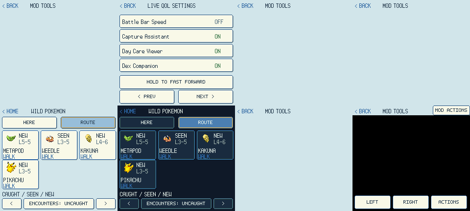

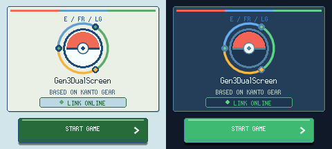

### Differences from Kanto Gear

This compares **FRLG Dual Screen 0.3.12** with its **[Kanto Gear 3.3.3](https://github.com/AverageConsumer/kanto-gear/releases/tag/v3.3.3)** foundation. The two projects have independent version numbers.

- **FireRed/LeafGreen focus.** Kanto Gear supports Gen 1, Gen 2 and FRLG. This fork targets FireRed and LeafGreen, with Gen III blue borders, cream panels, edition accents and light/dark styling.
- **Home shortcuts for this collection.** Adds shortcuts for installed, enabled Pokémon Services, LegalMon, Event Distributions, Shiny Hunter, Auto Breeder, Encounter Tour, Day Care Viewer and Encounter Reset. Their matching native Start entries are hidden while the companion is enabled and restored when it is disabled.
- **Integrated mod editors.** LegalMon, Event Distributions, Shiny Hunter, Auto Breeder and Encounter Tour can display their original editors on the lower screen, with supported row taps and LegalMon keyboard input. Other supported tools open through native menu rendering.
- **Optional live editing.** The five integrated editors have a PAUSED/LIVE switch, allowing physical field movement while using their touch controls. Actions wait for safe conditions; searches, text entry, automation and native menus retain the required modal ownership.
- **Targeted wild encounters.** Adds a Wild Pokémon page with caught/seen/new labels, current-tile or current-map views, tappable encounter cards and an uncaught-species shortcut. Encounters use native generation and battle rules but intentionally bypass normal step chance and Repel. This does not force shininess or select scripted legendary encounters.
- **Shared QoL controls.** Live QoL exposes enabled settings for 23 supported QoL tools. Quick Heal Party and Capture Assistant have their own Home tiles. Detailed configuration stays in each mod. Scrollable Start Menu is a separate QoL download and supplies the native menu renderer.
- **Coordination between mods.** Ball Shortcut shares popup ownership with the companion, Shop Owned Count supplies quantities to its shop rows, and encounter shortcuts yield to battles, menus and active hunting/automation.
- **Built-in battle tools.** Dual Screen has its own themed ball picker with native ball sprites, configurable controller/keyboard shortcuts and touch confirmation; Battle Ball Shortcut is not required. Fight rows show type-effectiveness badges, not full damage predictions.
- **Native generation/export fixes.** Shared corrections cover identified ability-slot, gift-egg, NPC-trade and roamer PID/IV issues. Existing Pokémon are not rerolled; use in-game SAVE + EXPORT for the export correction.
- **Battery percentage toggle.** Tap the header battery indicator to switch between its icon and a saved numeric percentage preference.
- **Separate settings.** The fork has its own mod identity; existing Kanto Gear settings and notes are not automatically migrated. Install the other collection mods separately and disable Kanto Gear while this replacement is enabled.

**Inherited from Kanto Gear:** the companion-screen foundation, Home system, display layouts, core touch adapters, optional Silph Connect presence and the 3.3.3 pointer/summary fixes. These are upstream features, not original additions by this collection. This fork does not promise full feature parity; unknown or specialized menus can fall back to native rendering and physical controls, and device testing is limited to AYN Thor. Other dual-screen devices have not been tested. [Detailed controls and limits](mods/frlg_dual_screen/README.md).

## Downloads

Public releases are hosted in [gen1recomp-mod-releases](https://github.com/CapnJames95/gen1recomp-mod-releases/releases/latest). Collection release numbers are separate from each mod’s version.

### All-in-one manual-install bundle

**[Download all 38 mods in one ZIP](https://github.com/CapnJames95/gen1recomp-mod-releases/releases/download/v1.2.0/gen1recomp-all-mods-manual-install.zip)**

Use this direct download while signed in to GitHub. If viewing the ZIP’s file page instead, choose **Download raw file**; do not save the webpage itself. The bundle uses standard uncompressed ZIP entries for extractor compatibility.

Extract this ZIP, then copy the contents of its `mods/` folder into the game's actual mod directory. Each mod must sit directly inside that directory as `<mod-id>/manifest.json`; avoid an extra `mods/mods/` layer. Restart and enable the mods you want. All mods retain their individual settings and identities.

**This bundle is for manual extraction, not the launcher's “Import mod .zip” command.** It includes `INSTALL.txt` with installation steps and every included version. Back up your existing saves/mod folders before replacing matching mod folders. On AYN Thor, your file manager needs access to the game's mod directory; otherwise use the individual imports below.

### Main mod downloads

| Mod | Version | Installable ZIP | Instructions / source |
| --- | --- | --- | --- |
| Pokemon Services | **0.1.3** | [Download](https://github.com/CapnJames95/gen1recomp-mod-releases/releases/download/v1.2.0/pokemon-services-0.1.3.zip) | [README](mods/pokemon-services/README.md) |
| LegalMon | **0.17.1** | [Download](https://github.com/CapnJames95/gen1recomp-mod-releases/releases/download/v1.2.0/legalmon-0.17.1.zip) | [README](mods/legalmon/README.md) |
| Event Distributions | **1.3.0** | [Download](https://github.com/CapnJames95/gen1recomp-mod-releases/releases/download/v1.2.0/event-distributor-1.3.0.zip) | [README](mods/event-distributor/README.md) |
| Shiny Hunter | **0.1.5** | [Download](https://github.com/CapnJames95/gen1recomp-mod-releases/releases/download/v1.2.0/shiny-hunter-0.1.5.zip) | [README](mods/shiny-hunter/README.md) |
| Auto Breeder | **1.0.3** | [Download](https://github.com/CapnJames95/gen1recomp-mod-releases/releases/download/v1.2.0/autobreeder-1.0.3.zip) | [README](mods/autobreeder/README.md) |
| Fly Teleport | **0.2.0** | [Download](https://github.com/CapnJames95/gen1recomp-mod-releases/releases/download/v1.2.0/fly-teleport-0.2.0.zip) | [README](mods/fly-teleport/README.md) |
| Day Care Viewer | **0.2.1** | [Download](https://github.com/CapnJames95/gen1recomp-mod-releases/releases/download/v1.2.0/daycare-viewer-0.2.1.zip) | [README](mods/daycare-viewer/README.md) |
| Encounter Tour — static encounter teleports | **0.1.3** | [Download](https://github.com/CapnJames95/gen1recomp-mod-releases/releases/download/v1.2.0/encounter-tour-0.1.3.zip) | [README](mods/encounter-tour/README.md) |
| Encounter Reset | **0.2.0** | [Download](https://github.com/CapnJames95/gen1recomp-mod-releases/releases/download/v1.2.0/encounter-reset-0.2.0.zip) | [README](mods/encounter-reset/README.md) |
| FRLG Dual Screen | **0.3.16** | [Download](https://github.com/CapnJames95/gen1recomp-mod-releases/releases/download/v1.2.0/frlg-dual-screen-0.3.16.zip) | [README](mods/frlg_dual_screen/README.md) |

### QoL downloads

| Mod | Version | Installable ZIP | Instructions / source |
| --- | --- | --- | --- |
| Quick Heal Party | **0.1.0** | [Download](https://github.com/CapnJames95/gen1recomp-mod-releases/releases/download/v1.2.0/quick-heal-party-0.1.0.zip) | [README](mods/quick-heal-party/README.md) |
| Capture Assistant | **0.1.1** | [Download](https://github.com/CapnJames95/gen1recomp-mod-releases/releases/download/v1.2.0/capture-assistant-0.1.1.zip) | [README](mods/capture-assistant/README.md) |
| Summary IVs | **0.2.3** | [Download](https://github.com/CapnJames95/gen1recomp-mod-releases/releases/download/v1.2.0/summary-ivs-0.2.3.zip) | [README](mods/summary-ivs/README.md) |
| Disable L/R Help | **0.1.0** | [Download](https://github.com/CapnJames95/gen1recomp-mod-releases/releases/download/v1.2.0/disable-lr-help-0.1.0.zip) | [README](mods/disable-lr-help/README.md) |
| FRLG Scrollable Start Menu | **0.2.2** | [Download](https://github.com/CapnJames95/gen1recomp-mod-releases/releases/download/v1.2.0/frlg-scrollable-start-0.2.2.zip) | [README](mods/frlg_scrollable_start/README.md) |
| FRLG QoL collection — 28 independent mods | **Mixed versions** | [Choose individual mod ZIPs](qol/PACKAGES.md) | [Individual ZIPs](qol/PACKAGES.md) / [README](qol/README.md) |

Download ZIPs from the release assets below the release notes. Import individual mod ZIPs through the launcher's **MODS → Import mod .zip**, enable them and restart. Each QoL mod has its own directly importable ZIP in `downloads/QOL/`, with `manifest.json` at the archive root. Choose the QoL mods you want from the package list. Use your own supported imported ROM and back up saves before trying beta mods.

The mods are independently installable; LegalMon is not a required dependency. Avoid running multiple automation tools at the same time. The full combination of these mods has not been gameplay-tested together.

## Pokémon Services 0.1.3 — Pokémon Centre tools

**START → MODS → Pokemon Services → OPEN SERVICES**, **START → SERVICES**, or the **SERVICES** Home tile with FRLG Dual Screen 0.3.12.

Remote native Pokemon/item PCs, free party healing, all town/island Poke Marts, Celadon department-store counters and vending machines, free Move Reminder (no mushrooms), Move Deleter, Name Rater, Day Care management. Uses existing game logic, imported stock, normal shop prices and native restrictions. Move relearning is free and preserves owned mushrooms. Two Island retains progression-dependent stock; other remote services bypass travel. Day Care eggs are collected on Four Island.

[Download](https://github.com/CapnJames95/gen1recomp-mod-releases/releases/download/v1.2.0/pokemon-services-0.1.3.zip) · [Instructions and screenshots](mods/pokemon-services/README.md) · [Validation](mods/pokemon-services/VALIDATION.md). 402 automated checks pass across both editions, including Dual Screen launch integration. Physical device playtesting remains outstanding.

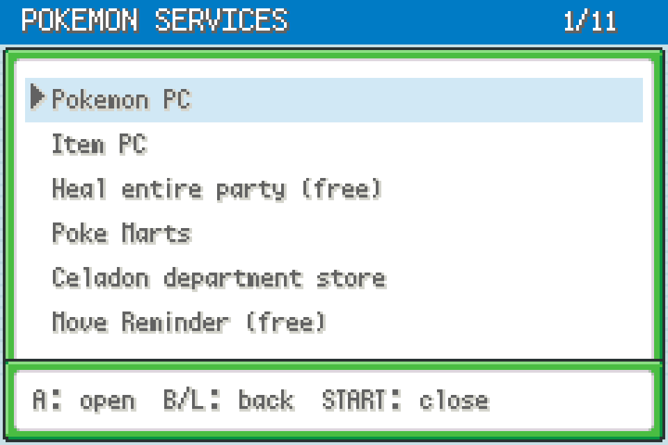

## LegalMon 0.17.1

**START → LEGALMON** — configure a Pokémon, validate its acquisition constraints, inspect the result and confirm delivery to party or PC.

- Supported generating routes for **all 386 Gen III species**, with exact species, level, nature, gender, ability, shiny status, IV constraints and moves.
- FireRed, LeafGreen, Ruby, Sapphire, Emerald, Colosseum and XD origin choices; exact acquisition route and original-trainer controls.
- GameCube coverage includes **48 regular Colosseum Shadows, 83 XD Shadows, nine Poké Spot species and three Japanese e-Reader Shadows**, plus supported starters, gifts, trades and evolutions.
- Acquisition-specific PID/IV/RNG proofs, strict rejection of unsupported requests, bounded resumable searches and explain-legality reports.
- All-31 and shiny-seed finders, Hidden Power and IV filters, result browsing, IV/stat comparison, pinned results and locks/rerolls.
- Searchable species/moves, saved builds, recent builds and party/PC capacity checks. Trainer ID and Secret ID use a controller-friendly numeric keypad.
- Alternate acquisition search and explicit egg routes; H1/H2/H4 ordinary wild profiles, all 28 Unown forms, standard FRLG tutors and Cape Brink moves.
- Imported FRLG NPC trades preserve their fixed PID/IV/OT records; supported pre-evolution moves include a chronological teaching/evolution proof and delivery recheck.
- FRLG egg-move and shared-parent inheritance, bounded breeding chains and supported parental Sketch sources, with whole-moveset parent proofs.
- Earlier-stage TM/HM/tutor teaching and moves learned on an evolution-triggering level gain; delivery reconstructs the proof before generating the Pokémon. Special evolution histories and recursive parent PID/IV ancestry remain outside coverage.

Coverage means supported acquisition routes, not every possible origin or build. Shiny locks and special IV restrictions remain enforced; a search budget expiring does not prove impossibility. [Full features and limits](mods/legalmon/README.md).

| Home | GameCube e-Reader result |
| --- | --- |
| 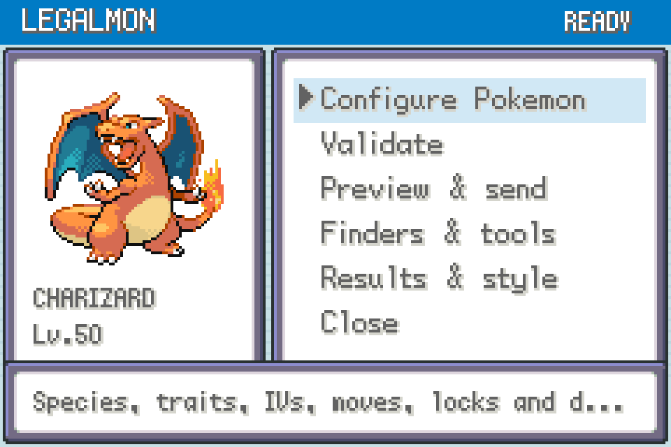 | 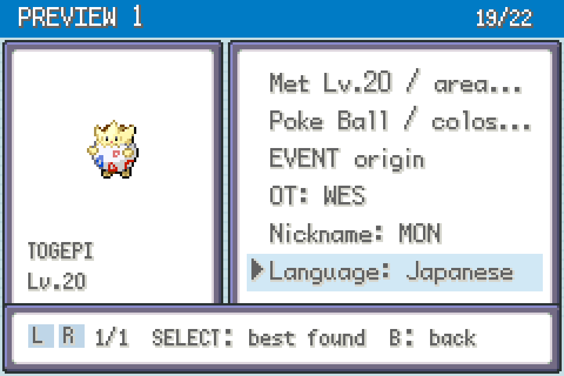 |

## Event Distributions 1.3.0

**START → EVENTS** — browse **87 campaign menus, 322 Pokémon choices and 670 selectable variants**.

- GBA and Japanese gifts, Pokémon Center NY, bonus-disc distributions, event eggs and ticket encounters.
- Nine preserved JEREMY gifts, Japanese city OT choices, regional Mt. Battle Ho-Oh rewards and both Wishing Star Jirachi methods. Eon replicas carry Soul Dew; Mystic journeys support the remaining unused counterpart. See [what is new and what remains missing](mods/event-distributor/README.md#whats-new-in-130).
- Normal/shiny availability checks against your trainer identity, with clear explanations for unavailable variants.
- Event eggs delivered as eggs or already hatched; normal walking/hatching support and the correct event/hatcher identities.
- **Aurora Ticket and Mystic Ticket** delivery unlocks native island travel and Deoxys, Lugia and Ho-Oh encounters; you catch them normally.
- Search/filter controls, hide-used and available-shiny filters, detailed result previews and party/PC delivery.
- Persistent claim tracking and redemption journal for deliveries, hatches, tickets and captures.

Fixed event OTs, shiny locks, origin restrictions, ribbons and RNG correlations are preserved. Keep the mod enabled through event-egg hatching and Japanese-OT export. These are generated replicas, not evidence of historical event attendance. [Coverage](mods/event-distributor/COVERAGE.md) · [Instructions](mods/event-distributor/README.md).

| Campaign archive | Native ticket confirmation |
| --- | --- |
| 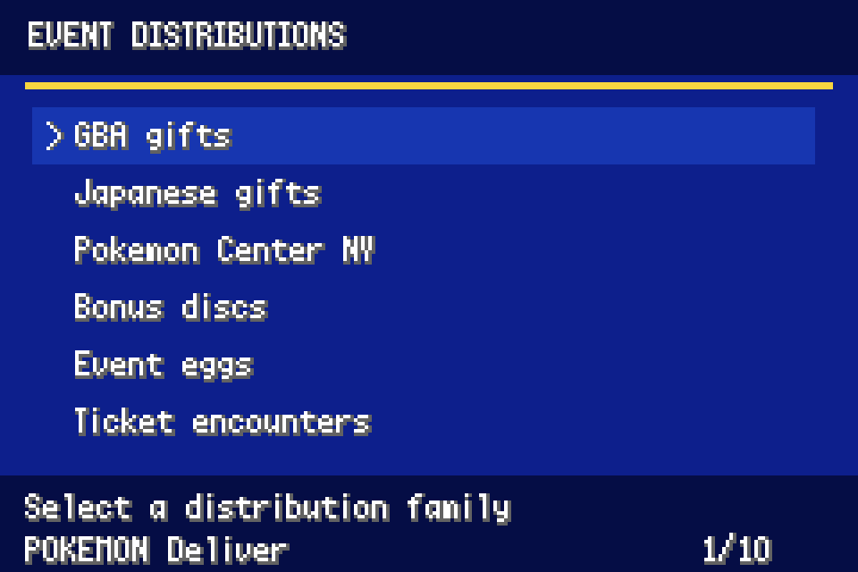 | 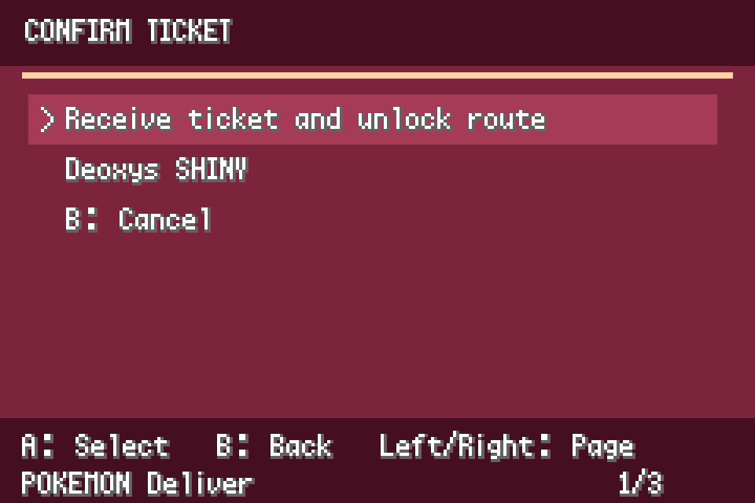 |

## Shiny Hunter 0.1.5

**START → SHINY HUNTER** — automate repeated encounter attempts and stop when a wanted result appears.

- Automatic horizontal/vertical walking, static/gift interaction, registered-rod fishing and recorded-input routes.
- Filters for species, nature, gender, ability and minimum IVs; protects **any shiny by default**, even outside your filters.
- Restores a starting-point snapshot after rejected attempts, including Surf/bicycle and Safari state.
- Speed choices from **1× to 256×**, with 64× as the default for new configurations; checks every simulation tick.
- Optional normal ball-use auto-capture, with inventory, storage, fainting and timeout safeguards.
- START/F10 pause, starting-point recovery and a history of the latest 100 shinies.

It does not force shininess, change PID/IVs or guarantee capture. Reset attempts rewind progress after the starting point. Recorded routes depend on timing; coverage varies by encounter. [Full coverage and controls](mods/shiny-hunter/README.md).

| Encounter modes | Speed settings |
| --- | --- |
| 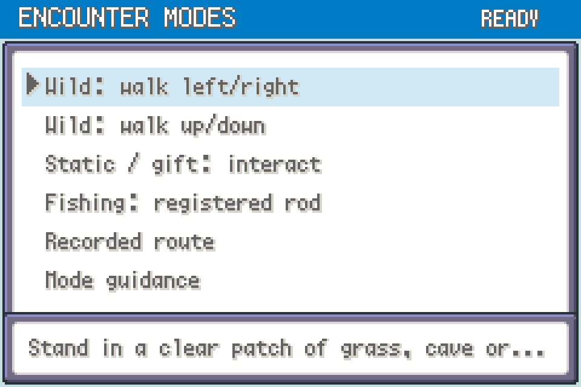 | 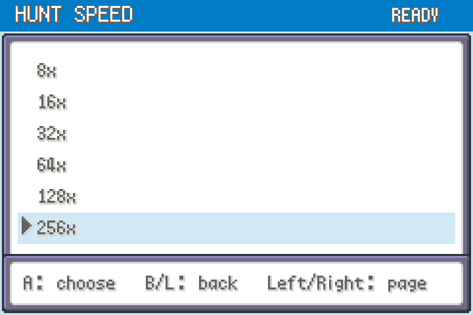 |

## Auto Breeder 1.0.3

**START → AUTO BREEDER** — search engine-generated eggs for your selected offspring targets.

- Choose parents from your party or Four Island Day Care.
- Target all six perfect IVs or individual perfect stats, plus shininess, nature, gender and ability.
- Optional virtual-parent improvement using compatible offspring, preserving your original parents and held items.
- Engine breeding, inheritance and hatch routines; targets filter generated results rather than overwriting traits.
- Pause/resume and extend the attempt budget; inspect working parents and the matching result.
- Explicitly keep a result as an egg or a level-5 hatchling, with party/PC capacity handling.
- Keep each improved working parent once per improvement, already hatched, with explicit confirmation and party/PC capacity checks. Original unchanged parents cannot be duplicated.
- **Export support:** in-game **Save + export for PKHeX**, marked-result OT-name export correction, and repair of the old single-ability-slot issue.

Use **Export / repair / help → Save + export for PKHeX** for the corrected export. Returning to the desktop launcher unloads the runtime correction; a subsequent launcher export can overwrite the corrected file. Unclaimed search progress is session-only. [Instructions and limitations](mods/autobreeder/README.md).

| Offspring targets | Matching result |
| --- | --- |
| 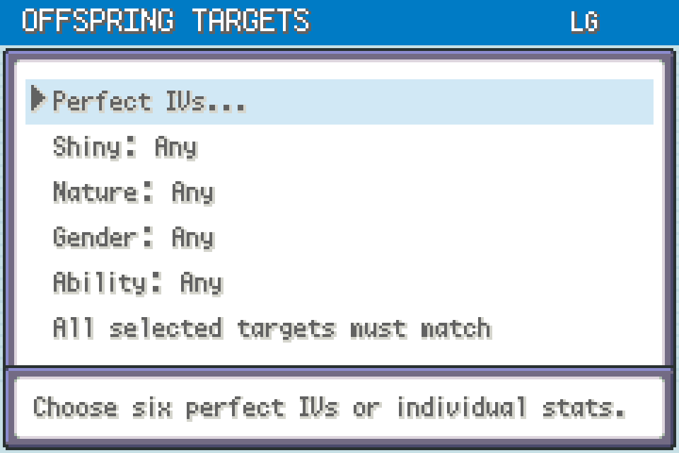 | 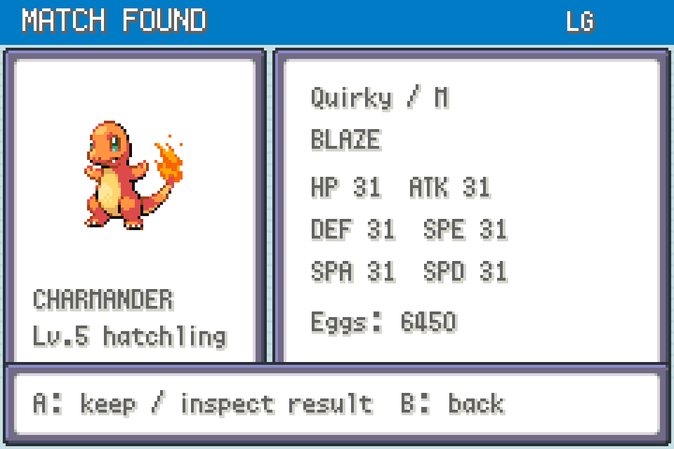 |

## Fly Teleport 0.2.0

**START → TELEPORT** — all 20 native Fly destinations in the usual scrolling FRLG menu, including the Route 4/10 Pokémon Centers and all seven Sevii Islands. Game progression is the default: destinations unlock using the native Fly visited flags. Switch to All unlocked in the teleport menu or mod manager to include unvisited locations. No Fly move is required; normal map-entry scripts still run.

FRLG Dual Screen 0.3.16 adds a **TELEPORT** Home tile automatically when this mod is installed and enabled. Busy-state and landing checks protect travel.

[Download](https://github.com/CapnJames95/gen1recomp-mod-releases/releases/download/v1.2.0/fly-teleport-0.2.0.zip) · [Instructions](mods/fly-teleport/README.md) · [Validation](mods/fly-teleport/VALIDATION.md)

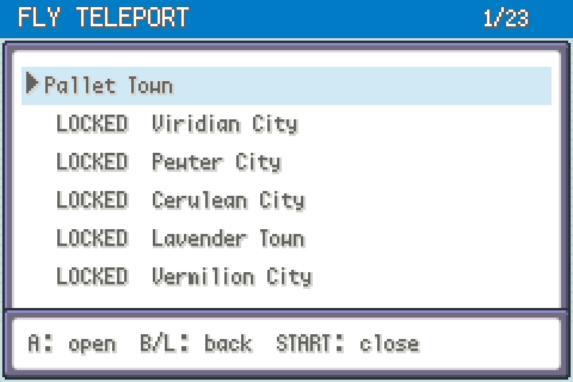

## Day Care Viewer 0.2.1

**START → DAY CARE** — check Route 5 and Four Island without travelling there, in the same native menu style as Auto Breeder and LegalMon.

View deposited Pokémon, levels gained, fees, EXP, steps, current and projected moves, IVs/EVs/stats, held items and trainer details. Includes breeding compatibility, offspring species, egg readiness, steps to the next egg check and party egg progress. Manage / teleport adds native party deposits, paid withdrawals and travel to either daycare. Egg collection stays at Four Island; browsing remains read-only.

[Download](https://github.com/CapnJames95/gen1recomp-mod-releases/releases/download/v1.2.0/daycare-viewer-0.2.1.zip) · [Instructions and screenshots](mods/daycare-viewer/README.md) · [Verification](mods/daycare-viewer/TEST-REPORT.md)

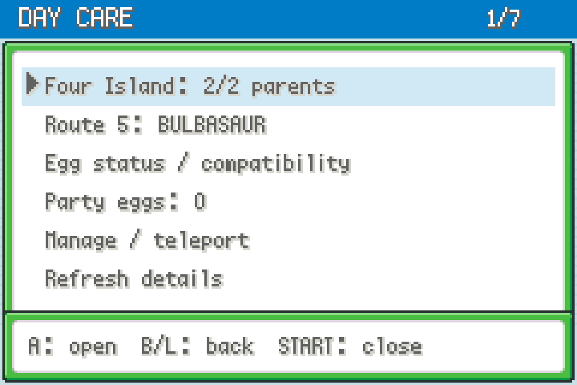

## Encounter Tour 0.1.3 — static encounter teleports

**START → ENCOUNTER TOUR** — teleport to fixed encounters or follow an automatic tour. LegalMon is not required.

- **40 catalogue entries**, with 39 version-compatible destinations per game: starters, legendaries, event islands, static battles, gifts/eggs, fossils, Game Corner prizes and NPC trades.
- Browse by category and Pokémon; review encounter notes before choosing **Teleport here**.
- Automatic touring advances after a matching acquisition or original completion flag, once the field is idle. Start from any selected encounter or skip a stop.
- **START pauses** the tour; **Return to start** restores your original position while retaining current Pokémon, items and story progress.
- Native scripts handle interaction, battle, catching, trades and gifts. Existing prerequisites and completed encounters are not reset.
- Busy-state and landing checks reject unsafe teleports during battles, dialogue, movement, linked activities or Safari games.

Event-island teleports bypass ferry/ticket access, but puzzles and encounters remain native. Roamers and external event/GameCube gifts have no fixed FRLG destination. Return points and tour progress last only for the current session. [Full catalogue and controls](mods/encounter-tour/README.md).

| Encounter categories | Deoxys destination and notes |
| --- | --- |
| 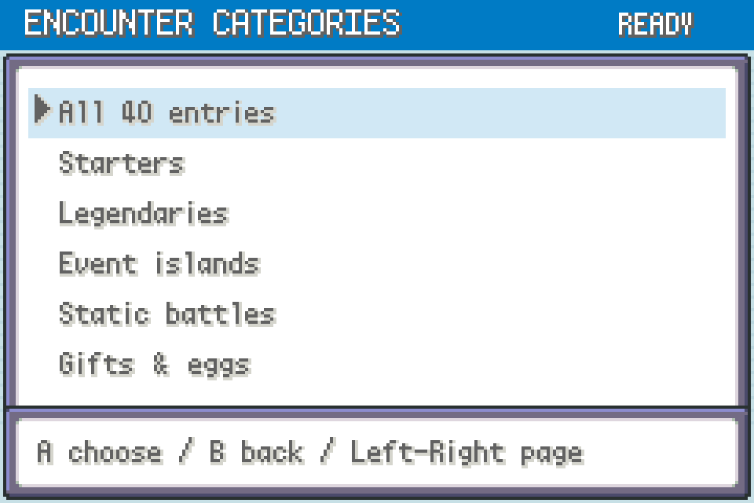 | 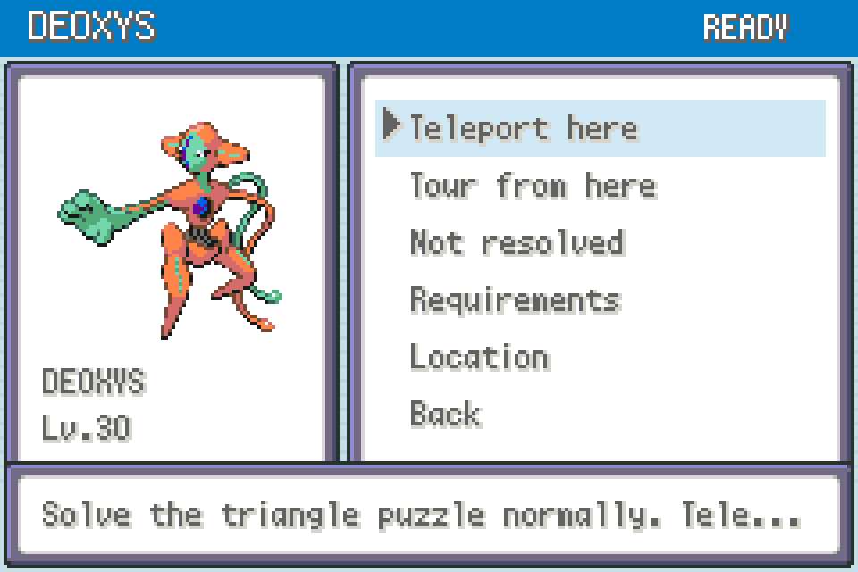 |

## Encounter Reset 0.2.0

**START → ENCOUNTER RESET** — individually restore Articuno, Zapdos, Moltres, Mewtwo, Lugia, Ho-Oh, Deoxys, each Snorlax, each Electrode and Lostelle's Hypno. Restores your previously unlocked roaming beast after capture or defeat, plus Eevee, Lapras, each Dojo prize, Magikarp, the Togepi egg, all three fossil revivals and all nine NPC trades. Matches Encounter Tour's native menu style.

Leave the encounter map, select one entry, confirm its reset and return to catch it normally. Keeps existing Pokémon and Pokédex records. Deoxys restarts its puzzle; Hypno replays the rescue, reward and return trip. Roamer options cannot unlock a different starter's beast. [Download ZIP](https://github.com/CapnJames95/gen1recomp-mod-releases/releases/download/v1.2.0/encounter-reset-0.2.0.zip) · [Coverage and instructions](mods/encounter-reset/README.md) · [Validation](mods/encounter-reset/VALIDATION.md)

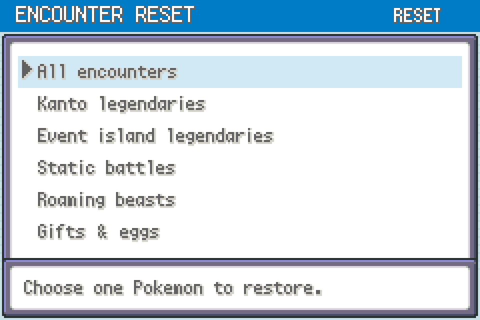

## All 28 QoL tools

Each package is independently installable, has its own ENABLED setting and supports both FireRed and LeafGreen. HM Field Kit and Dex Companion share a START → QOL entry when installed together. These are experimental extensions targeting upstream dev commit `84e076b2d1e2dda36073ff55ec7c311a6b97519c`.

Every entry below includes its features, download and instructions. **Several mods have effect-focused native UI examples**, including a before/after inventory comparison. These use real mod hooks and rendering with isolated test data; they are not live-play captures. Remaining entries retain explicitly labelled manager images because a useful effect capture is not available. Individual READMEs also retain detail/options screens. [Validation](qol/VALIDATION.md) · [Engine-owned features and scope](qol/ENGINE_FEATURES.md).

### Summary IVs 0.2.3

Shows all six IVs (0–31) beside the native Pokémon Skills stat labels without changing the calculated stats. Works in party and PC summaries; eggs are excluded and missing data shows `--`. The SHOW IVS setting is read-only. With Dual Screen 0.3.13+, the native Skills page appears below and uses physical navigation controls.

**Wild Pokémon preview:** press keyboard **I** or controller **X / West** at the ordinary wild-battle command menu. Inspect native summary pages and toggle IV/EV values with Select. The battle pauses, data is read-only, and no caught requirement applies. Keyboard/gamepad bindings are configurable; existing saved bindings are preserved. This addition has automated coverage but has not been tested on physical hardware.

[Download ZIP](https://github.com/CapnJames95/gen1recomp-mod-releases/releases/download/v1.2.0/summary-ivs-0.2.3.zip) · [Instructions and validation](mods/summary-ivs/README.md)

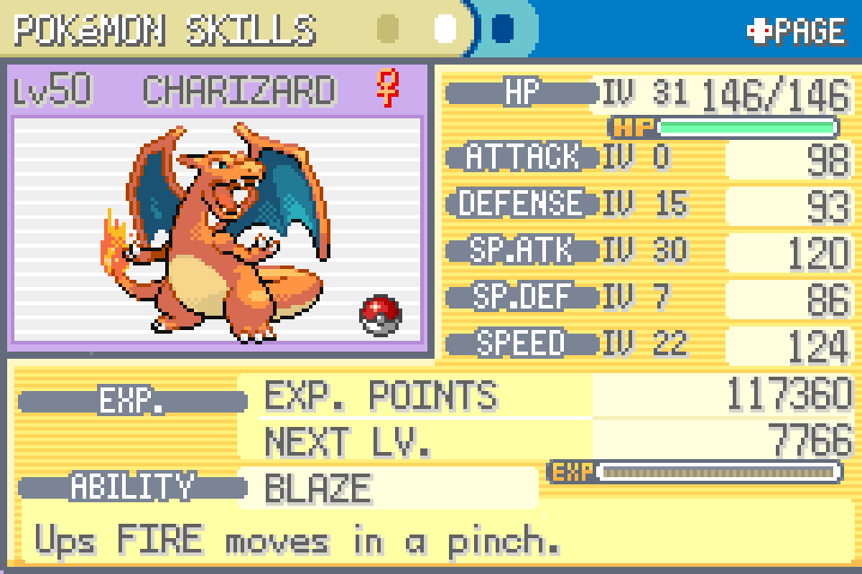

### Disable L/R Help 0.1.0

Suppresses native L/R Help and the L=A alias while enabled, leaving shoulder presses available for menu navigation and mod hotkeys. Disabling restores normal behaviour without rewriting saved button settings. It adds no overlay; the image below shows the existing Party Held Items panel whose L shortcut remains available.

[Download ZIP](https://github.com/CapnJames95/gen1recomp-mod-releases/releases/download/v1.2.0/disable-lr-help-0.1.0.zip) · [Instructions and validation](mods/disable-lr-help/README.md)

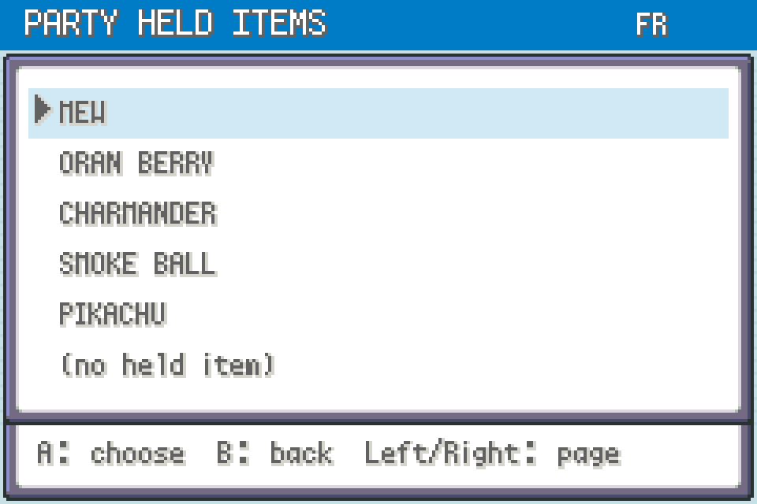

### Quick Heal Party 0.1.0

**START → QUICK HEAL** — preview the healing items to spend and resulting party HP/status, then confirm. Heal the whole party or one Pokémon using owned medicine. Revives and status cures are configurable; Full Restores, Max Potions and Max Revives are protected by default. Uses native field item actions and the collection's FRLG menu styling.

[Download](https://github.com/CapnJames95/gen1recomp-mod-releases/releases/download/v1.2.0/quick-heal-party-0.1.0.zip) · [Instructions](mods/quick-heal-party/README.md) · [Validation](mods/quick-heal-party/VALIDATION.md)

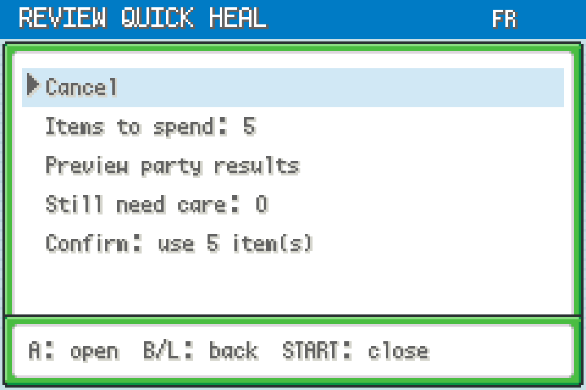

### Capture Assistant 0.1.1

With **FRLG Dual Screen 0.3.12+** active, the assistant opens on the **bottom screen over the companion UI**, keeping the battle visible above. Tap rows and Back, or use physical controls. Closing restores the companion.

**R at the wild battle command menu** — compare owned balls, see native one-throw catch estimates and hypothetical 1 HP/sleep improvements, and inspect moveset risks. Reading takes no turn and spends no items. Master Balls are excluded from recommendations. **START → CAPTURE HELP** provides instructions. Matches the collection's native FRLG menus.

[Download](https://github.com/CapnJames95/gen1recomp-mod-releases/releases/download/v1.2.0/capture-assistant-0.1.1.zip) · [Instructions and limits](mods/capture-assistant/README.md) · [Validation](mods/capture-assistant/VALIDATION.md)

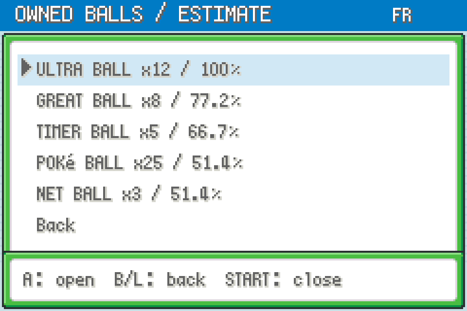

The two assistants pass 140 shared checks per edition, including native item/catch routines and production-loader tests. These screenshots are native renders of synthetic test sessions; physical device testing remains outstanding.

### Scrollable Start Menu 0.2.2

The native START menu grows to nine visible rows, then scrolls as you move through longer mod lists. Width adapts to entry labels; the current selection stays visible with a scrollbar. START → ORGANIZE MENU adds saved manual/A-Z ordering, named folders, and controls to move mod shortcuts between them. Native callbacks, wraparound, exit confirmation and Safari status remain supported. Dual Screen's touch menu has its own layout. [Features and validation](mods/frlg_scrollable_start/README.md).

| First selection | Scrolled to last selection |
| --- | --- |
| 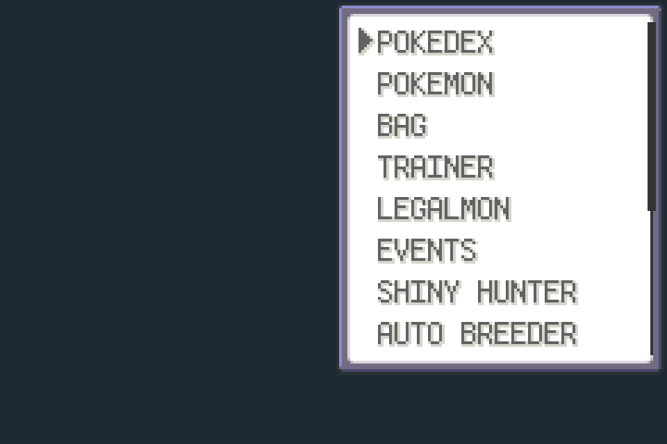 | 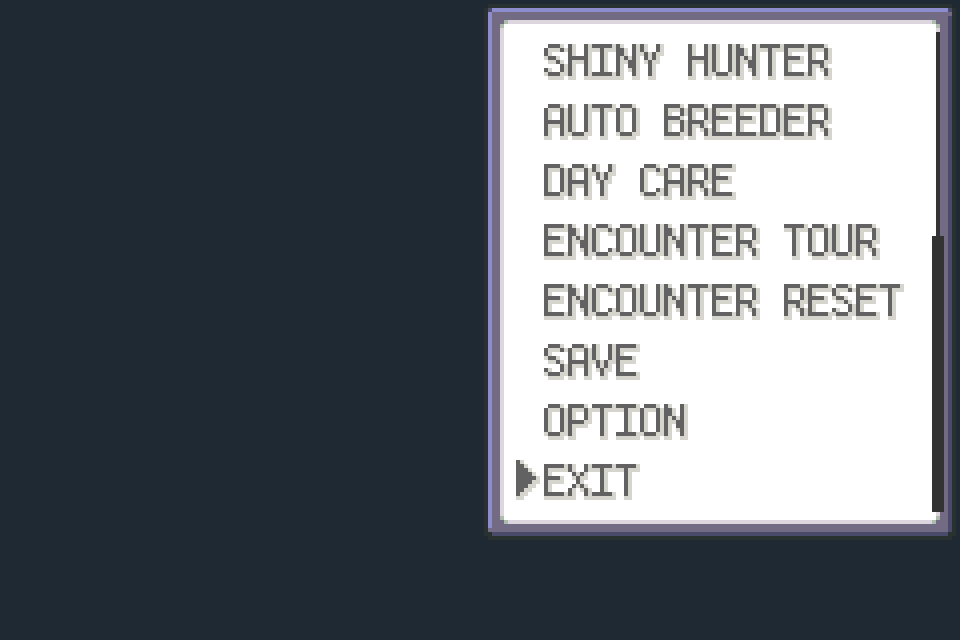 |

These examples render the actual native menu with isolated fixture entries and imported assets.

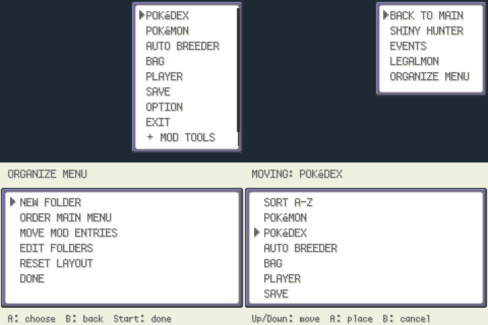

### Quiet EXP 0.1.0

Quiet EXP skips individual EXP announcements while keeping level-ups and move learning. It changes presentation without removing earned EXP.

[Download ZIP](https://github.com/CapnJames95/gen1recomp-mod-releases/releases/download/v1.2.0/frlg_qol_quiet_exp-0.1.0.zip) · [Instructions](qol/mods/frlg_qol_quiet_exp/README.md)

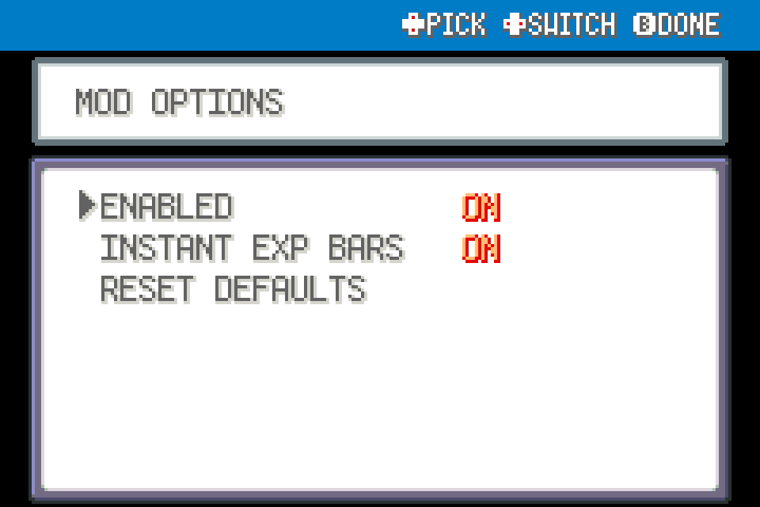

 [Fix report](qol/FIXES.md). Battle Hints and Move Inspector have been removed; all other QoL mods remain. Update Dual Screen and Ball Shortcut together.

### Auto Surf 0.2.0

Press A facing adjacent water to start Surf directly.

Walking into water no longer triggers a prompt. A skips the YES/NO and “used Surf” text, then starts normal Surf execution. Requires the normal badge and party Surf capability (or HM Field Kit). Native NPC/script interaction priority and busy-state checks remain intact. Replace the existing Auto Surf Prompt package and restart.

[Download ZIP](https://github.com/CapnJames95/gen1recomp-mod-releases/releases/download/v1.2.0/frlg_qol_auto_surf-0.2.0.zip) · [Full instructions](qol/mods/frlg_qol_auto_surf/README.md)

*Manager screen only; an in-use effect capture is not available for this mod. A still settings image does not demonstrate its gameplay behavior or timing.*

### Sorted Bag

Sort displayed pocket rows without rewriting saved inventory.

Sort by name, descending quantity, or numeric item ID. Pocket assignment stays native. TM Case and Berry Pouch have separate renderers and are not reordered. Manual bag ordering is hidden while enabled; disable to restore it.

[Download ZIP](https://github.com/CapnJames95/gen1recomp-mod-releases/releases/download/v1.2.0/frlg_qol_bag_sort-0.1.1.zip) · [Full instructions](qol/mods/frlg_qol_bag_sort/README.md)

Before: original inventory order.

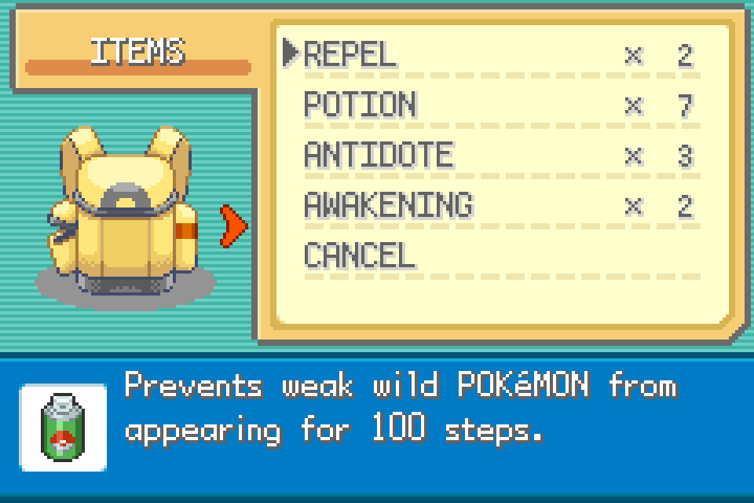

After: alphabetical rows, with the same item quantities.

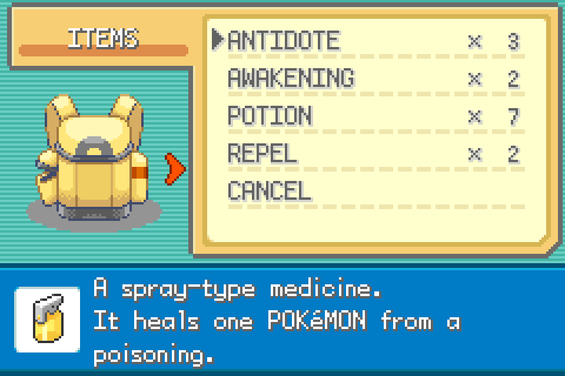

### Battle Ball Shortcut

Throw a selected ordinary Ball with SELECT from a wild single battle command menu.

Configure Poke/Great/Ultra Ball, then SELECT (Tab/Shift) in the main command menu. No fallback to a different Ball and no Master Ball option. Empty stock falls through. Trainer, Safari, double, link, spectated and tutorial battles excluded. The battle engine still resolves the normal turn and catch.

[Download ZIP](https://github.com/CapnJames95/gen1recomp-mod-releases/releases/download/v1.2.0/frlg_qol_ball_shortcut-0.2.2.zip) · [Full instructions](qol/mods/frlg_qol_ball_shortcut/README.md)

*Manager screen only; an in-use effect capture is not available for this mod. A still settings image does not demonstrate its gameplay behavior or timing.*

### Battle Bar Speed

Choose independent instant HP and EXP bars while preserving battle logic and callbacks.

INSTANT HP and INSTANT EXP can be toggled separately. Uses upstream's own instant-tween path, retaining callbacks and display values. Move-animation on/off and overall battle speed are already engine options; animation-script time scaling is not included.

[Download ZIP](https://github.com/CapnJames95/gen1recomp-mod-releases/releases/download/v1.2.0/frlg_qol_battle_pacing-0.1.1.zip) · [Full instructions](qol/mods/frlg_qol_battle_pacing/README.md)

*Manager screen only; an in-use effect capture is not available for this mod. A still settings image does not demonstrate its gameplay behavior or timing.*

### Held Berry Replacement

Replace a berry actually consumed in battle using one matching berry from your Bag.

Restocks after battle writeback, only for confirmed berry consumption and an unchanged party member with an empty item slot. Never manufactures berries, restocks during battle, or replaces items merely lost to Knock Off/Thief. Link battles excluded.

[Download ZIP](https://github.com/CapnJames95/gen1recomp-mod-releases/releases/download/v1.2.0/frlg_qol_berry_restock-0.1.1.zip) · [Full instructions](qol/mods/frlg_qol_berry_restock/README.md)

*Manager screen only; an in-use effect capture is not available for this mod. A still settings image does not demonstrate its gameplay behavior or timing.*

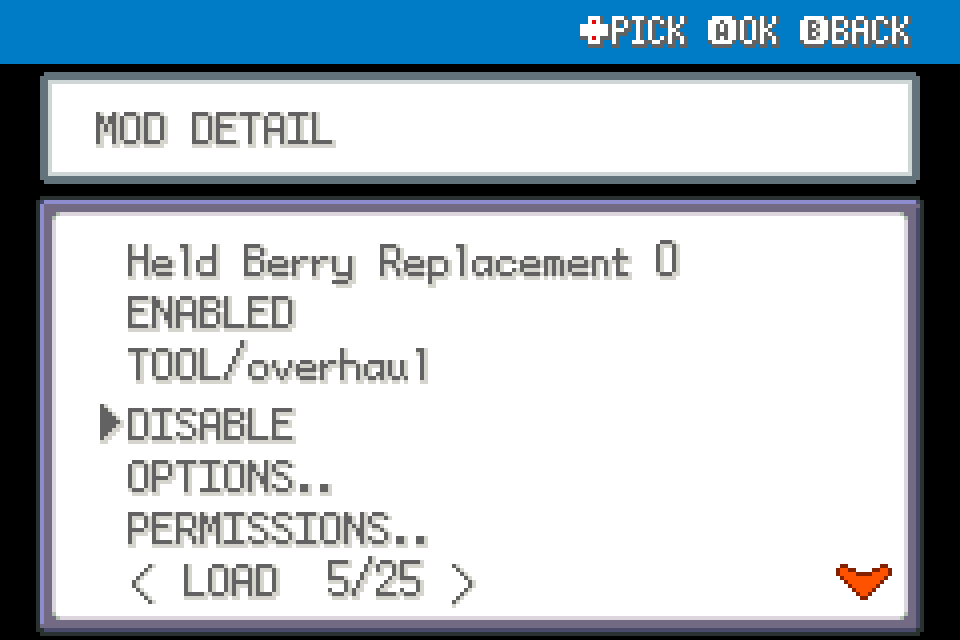

### Dex Companion

Search seen species, inspect imported evolutions and locations, and count owned species in the current area.

**0.1.2 Start-menu fix:** without Scrollable Start Menu, overflowing menus use a compact right-hand scrolling sidebar. If both HM Field Kit and Dex Companion are installed, update both and restart.

[Download ZIP](https://github.com/CapnJames95/gen1recomp-mod-releases/releases/download/v1.2.0/frlg_qol_dex_companion-0.1.2.zip) · [Full instructions](qol/mods/frlg_qol_dex_companion/README.md)

Selecting a seen species shows its imported evolution rule and available wild-location records.

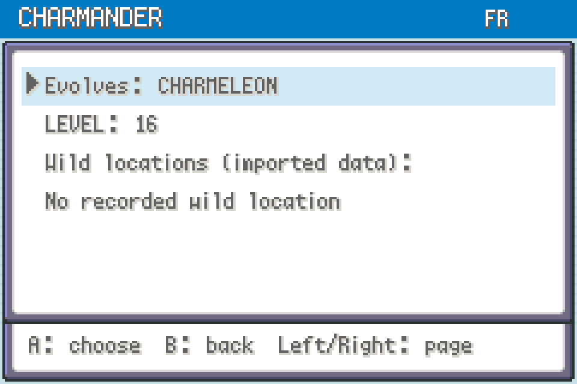

### Faster Center Healing 0.2.0

Accelerate the Center machine animation and remove its remaining jingle wait.

Choose animation speed 2x/4x/8x (default 4x). WAIT FOR JINGLE defaults off: the nurse continues when the faster animation finishes, while the jingle plays out normally. Healing, dialogue and callbacks remain native; unrelated sound waits are unchanged.

[Download ZIP](https://github.com/CapnJames95/gen1recomp-mod-releases/releases/download/v1.2.0/frlg_qol_fast_healing-0.2.0.zip) · [Full instructions](qol/mods/frlg_qol_fast_healing/README.md)

*Manager screen only; an in-use effect capture is not available for this mod. A still settings image does not demonstrate its gameplay behavior or timing.*

### HM Field Kit

Use owned HMs with compatible party Pokemon without teaching the move.

START > QOL > HM FIELD KIT lists actions currently usable. Existing overworld Cut/Surf/Strength/Rock Smash/Waterfall checks use the same compatible-party fallback. Badge and terrain checks remain. Fly is not added to this menu: WorldAPI.flyTo is unsupported in this FRLG beta, so this package does not provide destination selection. Retain a taught Fly for the native party menu. No moveslots or flags are modified.

**0.1.2 Start-menu fix:** without Scrollable Start Menu, overflowing menus use a compact right-hand scrolling sidebar. If both HM Field Kit and Dex Companion are installed, update both and restart.

[Download ZIP](https://github.com/CapnJames95/gen1recomp-mod-releases/releases/download/v1.2.0/frlg_qol_hm_field_kit-0.1.2.zip) · [Full instructions](qol/mods/frlg_qol_hm_field_kit/README.md)

*Manager screen only; an in-use effect capture is not available for this mod. A still settings image does not demonstrate its gameplay behavior or timing.*

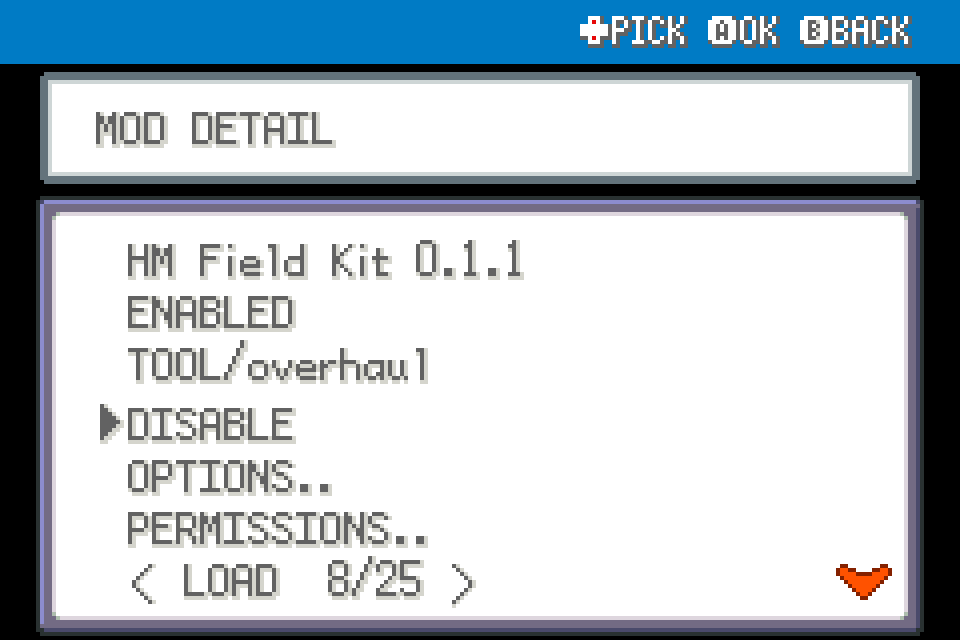

### Hold Fast Forward

Temporarily speed up gameplay while holding a spare keyboard key.

Hold Right Ctrl by default; choose Left Ctrl/F6 and 2x/4x/8x. Releasing restores native category speed immediately, without changing settings. Respects the engine's speed locks. Controller speed up/down and touch hold are already native.

[Download ZIP](https://github.com/CapnJames95/gen1recomp-mod-releases/releases/download/v1.2.0/frlg_qol_hold_fast_forward-0.2.1.zip) · [Full instructions](qol/mods/frlg_qol_hold_fast_forward/README.md)

*Manager screen only; an in-use effect capture is not available for this mod. A still settings image does not demonstrate its gameplay behavior or timing.*

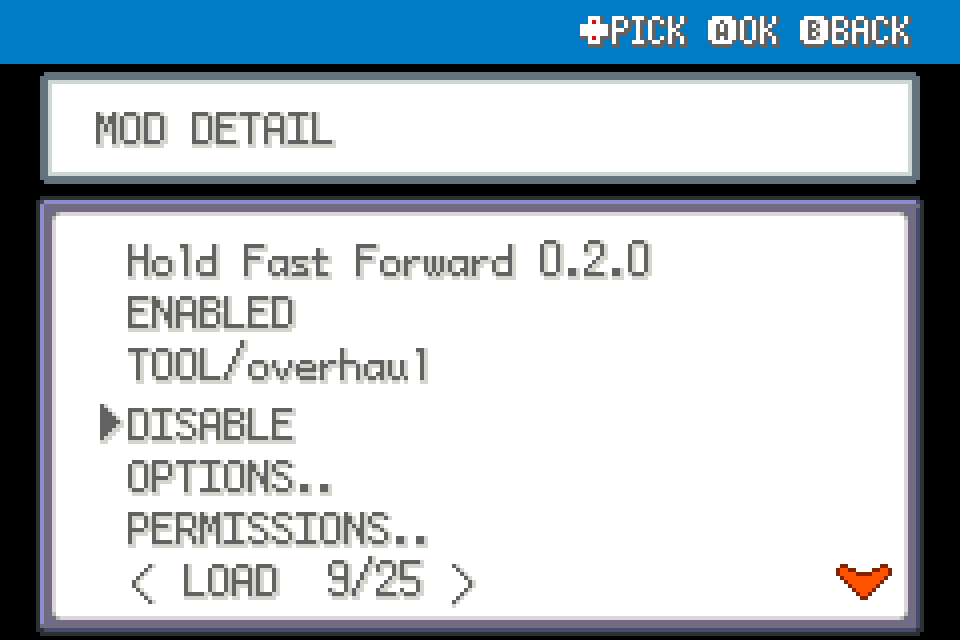

### Fast / Instant Text

Reveal dialogue pages immediately while retaining all confirmation and choice prompts.

TEXT selects instant (default) or fast. Applies to field and battle pages using the FRLG Message printer. Does not auto-confirm, skip scripted pauses, or change separate menu printers.

[Download ZIP](https://github.com/CapnJames95/gen1recomp-mod-releases/releases/download/v1.2.0/frlg_qol_instant_text-0.1.1.zip) · [Full instructions](qol/mods/frlg_qol_instant_text/README.md)

*Manager screen only; an in-use effect capture is not available for this mod. A still settings image does not demonstrate its gameplay behavior or timing.*

### Key Item Help

Explain useful key items after acquisition and in Bag descriptions.

Authored guidance replaces descriptions for Bicycle, Town Map, VS Seeker, Itemfinder, three rods, Poke Flute and Silph Scope. First acquisition through Bag.add queues a LegalMon-style help panel after scripts, movement and other UI finish. ACQUISITION HELP disables popups. Existing saves do not trigger retroactive popups. Unknown items retain native descriptions. Direct inventory writes bypass this notification. VS Seeker Readiness takes priority for that item's description when both mods are enabled.

[Download ZIP](https://github.com/CapnJames95/gen1recomp-mod-releases/releases/download/v1.2.0/frlg_qol_key_item_help-0.1.2.zip) · [Full instructions](qol/mods/frlg_qol_key_item_help/README.md)

The mod’s native help panel explains the Bicycle and registered-item shortcut.

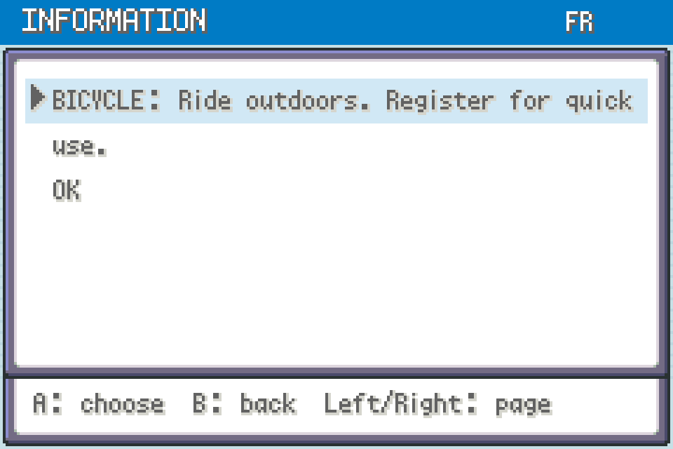

### Town Map Companion

Read service notes and native Fly eligibility for the Town Map cursor.

Press SELECT on an idle Town Map or Fly map for service notes. Fly availability uses the native map's selection checks; nothing unlocks destinations or bypasses badges. Notes cover main towns, not every building. Story access is not promised.

[Download ZIP](https://github.com/CapnJames95/gen1recomp-mod-releases/releases/download/v1.2.0/frlg_qol_map_services-0.1.1.zip) · [Full instructions](qol/mods/frlg_qol_map_services/README.md)

*Manager screen only; an in-use effect capture is not available for this mod. A still settings image does not demonstrate its gameplay behavior or timing.*

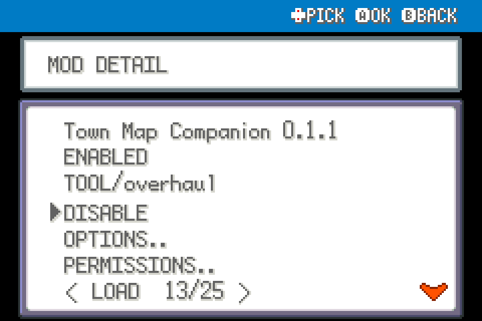

### Party Held Items

Read all party held-item names in a compact panel.

Press the logical L shoulder action on the normal party list (bind it in CONTROLS). Displays names without covering native HP/item icons. Read-only; giving/taking items remains native.

[Download ZIP](https://github.com/CapnJames95/gen1recomp-mod-releases/releases/download/v1.2.0/frlg_qol_party_items-0.1.1.zip) · [Full instructions](qol/mods/frlg_qol_party_items/README.md)

Pressing L in the party list opens a compact list of Pokémon and held items.

### Party Nickname

Rename non-Egg Pokemon from the party list, regardless of original trainer.

On the normal party list, highlight a Pokemon and press SELECT (default Tab/Shift). Eggs, battle selection and item-target menus are excluded. Own, event/gift and genuinely traded Pokemon can all be renamed; original-trainer data is not changed. Uses the original naming UI and 10-character limit.

[Download ZIP](https://github.com/CapnJames95/gen1recomp-mod-releases/releases/download/v1.2.0/frlg_qol_party_nickname-0.2.0.zip) · [Full instructions](qol/mods/frlg_qol_party_nickname/README.md)

Pressing SELECT in the party list opens the native nickname keyboard for Charmander.

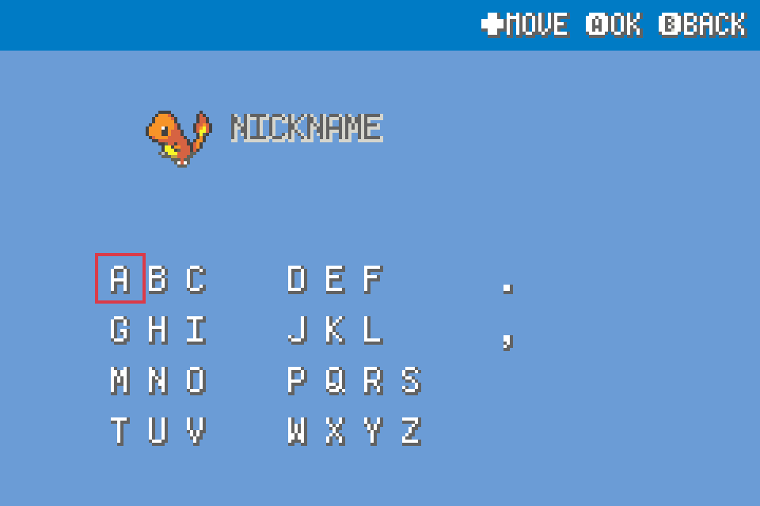

### Party Move Reminder

Open the move reminder from the party list with the original FRLG mushroom payment.

On the normal party list press START (default Escape). Costs two Tiny Mushrooms, otherwise one Big Mushroom, only after learning. Cancel/no eligible move costs nothing. Uses FRLG's actual currency, not Heart Scales. Available wherever the normal party menu opens.

[Download ZIP](https://github.com/CapnJames95/gen1recomp-mod-releases/releases/download/v1.2.0/frlg_qol_party_reminder-0.1.1.zip) · [Full instructions](qol/mods/frlg_qol_party_reminder/README.md)

Pressing START in the party list opens the native move reminder when a Big Mushroom is available.

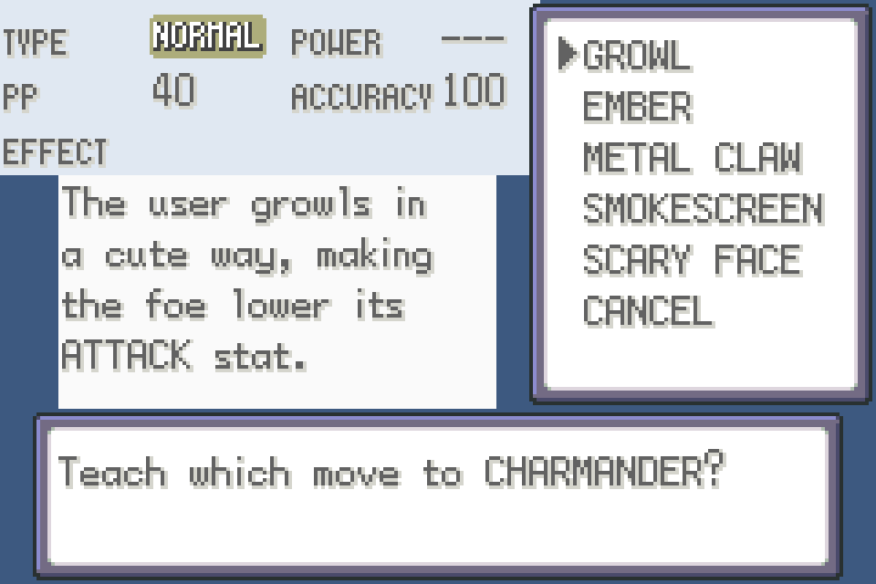

**Observed 0.1.0 limitation:** the Tiny Mushroom lookup uses `TINY MUSHROOM`, but the real imported item is `TINYMUSHROOM`; two Tiny Mushrooms are not recognized in the tested cache. The Big Mushroom path opens correctly. The release has been preserved unchanged; use one Big Mushroom until this is fixed.

### Quicker Save Confirmation

Remove the redundant second confirmation from the normal Save menu.

Selecting YES performs the existing save operation immediately. The first confirmation, success/failure handling and atomic persistence remain. This does not accelerate disk I/O or bypass verification.

[Download ZIP](https://github.com/CapnJames95/gen1recomp-mod-releases/releases/download/v1.2.0/frlg_qol_quick_save_prompt-0.1.1.zip) · [Full instructions](qol/mods/frlg_qol_quick_save_prompt/README.md)

*Manager screen only; an in-use effect capture is not available for this mod. A still settings image does not demonstrate its gameplay behavior or timing.*

### Repel Reuse Prompt

Offer another owned Repel after the existing wear-off message.

After dismissing the normal expiry message, choose YES or NO; B means no. Prefers the last used type, then Max/Super/normal Repel. No prompt when none remain. The default selection is NO.

[Download ZIP](https://github.com/CapnJames95/gen1recomp-mod-releases/releases/download/v1.2.0/frlg_qol_repel_reuse-0.1.1.zip) · [Full instructions](qol/mods/frlg_qol_repel_reuse/README.md)

After the original Repel expiry message, the mod offers another owned Repel and defaults to NO.

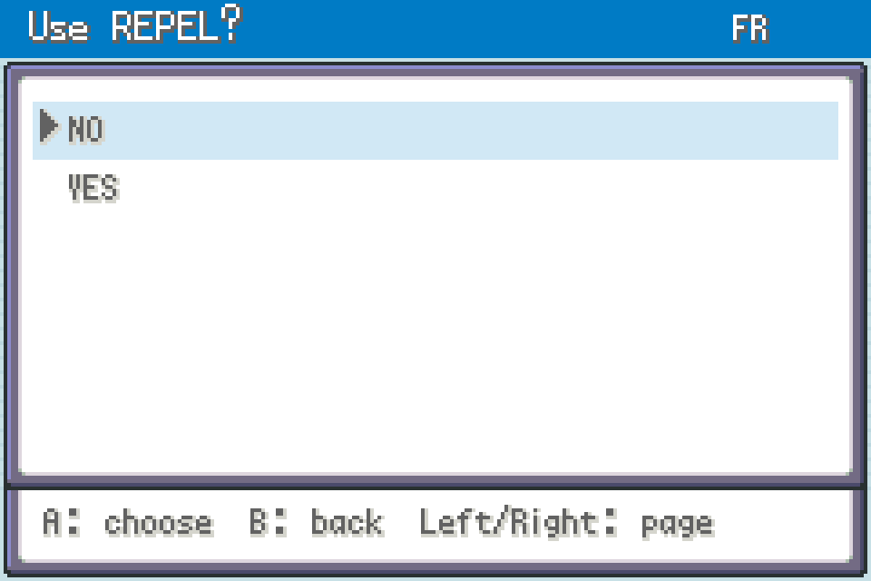

### Reusable TMs

Keep a TM after successfully teaching its move, including the replacement-move flow.

Retains compatibility checks, friendship changes and move replacement/cancel behavior. Selling, tossing, giving and other item use still consume inventory normally. HMs remain unchanged.

[Download ZIP](https://github.com/CapnJames95/gen1recomp-mod-releases/releases/download/v1.2.0/frlg_qol_reusable_tms-0.1.1.zip) · [Full instructions](qol/mods/frlg_qol_reusable_tms/README.md)

*Manager screen only; an in-use effect capture is not available for this mod. A still settings image does not demonstrate its gameplay behavior or timing.*

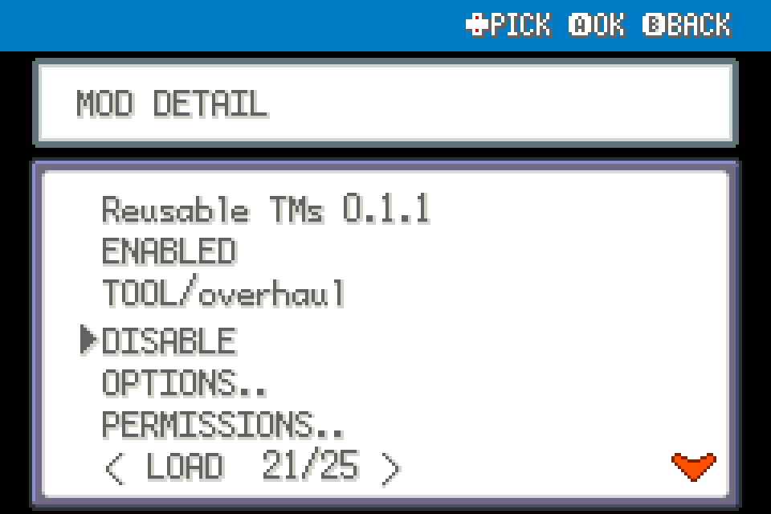

### Running From Start

Hold B to run immediately, without changing the Running Shoes story flag.

No configuration beyond ENABLED. Indoor running already works in this upstream build. This only removes the shoes requirement.

[Download ZIP](https://github.com/CapnJames95/gen1recomp-mod-releases/releases/download/v1.2.0/frlg_qol_running_start-0.1.1.zip) · [Full instructions](qol/mods/frlg_qol_running_start/README.md)

*Manager screen only; an in-use effect capture is not available for this mod. A still settings image does not demonstrate its gameplay behavior or timing.*

### Shop Owned Count

Show owned quantity while browsing a shop, before entering the purchase dialogue.

Browsing the buy list shows current Bag count below the money box. Native quantity/confirmation count remains unchanged. Cancel row has no count. Does not include PC inventory or held items.

[Download ZIP](https://github.com/CapnJames95/gen1recomp-mod-releases/releases/download/v1.2.0/frlg_qol_shop_count-0.2.0.zip) · [Full instructions](qol/mods/frlg_qol_shop_count/README.md)

The added OWNED 7 panel shows the Bag quantity while browsing Potions.

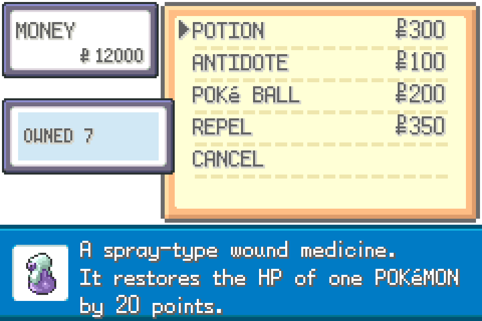

### Expanded Summary Info

Read nature effects and optional IV/EV values from the Summary screen.

In an out-of-battle Summary screen press SELECT. Nature effects and ability appear in a paged read-only panel. SHOW IV/EV is off by default. These are Gen III IVs (0–31) and EVs, not Gen I DVs/stat experience. Native ability description remains on the normal Summary.

[Download ZIP](https://github.com/CapnJames95/gen1recomp-mod-releases/releases/download/v1.2.0/frlg_qol_summary_info-0.1.1.zip) · [Full instructions](qol/mods/frlg_qol_summary_info/README.md)

The extra Summary panel shows nature modifiers and optional IV/EV values.

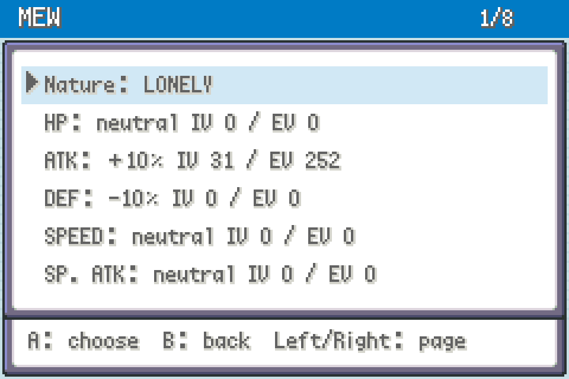

### VS Seeker Readiness

Show VS Seeker battery charge in its Bag description.

Open the Key Items pocket and highlight VS Seeker. The description updates when reopened; full battery does not guarantee a nearby eligible rematch. Does not charge the battery or unlock encounters.

[Download ZIP](https://github.com/CapnJames95/gen1recomp-mod-releases/releases/download/v1.2.0/frlg_qol_vs_seeker_status-0.1.1.zip) · [Full instructions](qol/mods/frlg_qol_vs_seeker_status/README.md)

The VS Seeker’s Bag description shows 42/100 charge and 58 remaining steps.

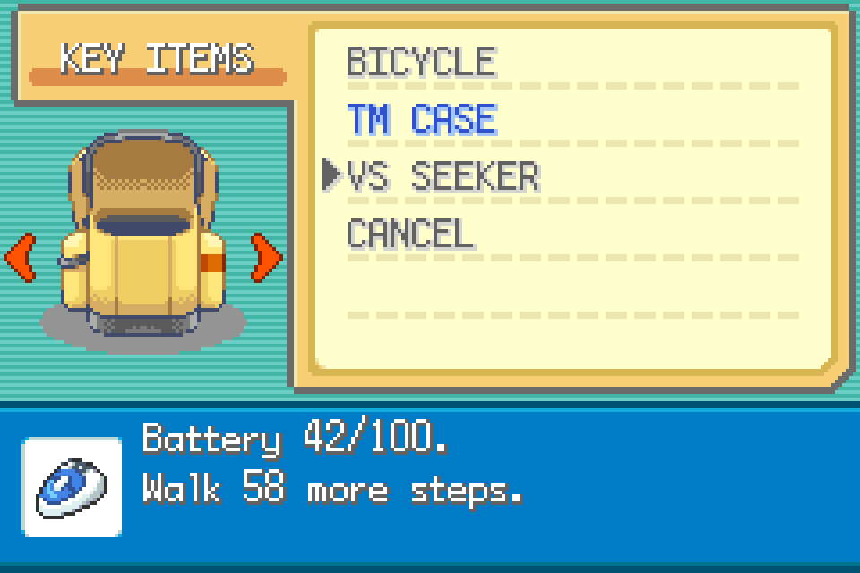

## Updates

**Collection v1.2.0:** Summary IVs 0.2.3 adds the native wild-Pokémon preview and configurable controls. Dex Companion 0.1.2 and HM Field Kit 0.1.2 fix the Start-menu overflow fallback. The manual-install bundle includes all three updates.

**Event Distributions 1.3.0** expands the catalogue to 87 campaigns, 322 choices and 670 variants, preserving existing USED markers. Read [what is new and what remains missing](mods/event-distributor/README.md#whats-new-in-130). The manual-install bundle includes this update.

This update adds Fly Teleport 0.2.0, Summary IVs 0.2.3 and Disable L/R Help 0.1.0. Dual Screen 0.3.16 adds menu touch controls and touch-held fast-forward; Encounter Reset 0.2.0 expands gifts, fossils and NPC trades. Auto Surf, Faster Center Healing, Party Nickname, Key Item Help and Scrollable Start Menu include their completed fixes. PC Box Tools is removed; Four-Item Wheel remains paused.

Four-Item Wheel is temporarily withdrawn from the downloads and manual-install bundle.

Current releases include **LegalMon 0.17.1**, **FRLG Dual Screen 0.3.16**, **Day Care Viewer 0.2.1** and **Scrollable Start Menu 0.2.2**. Auto Breeder **1.0.3**, Shiny Hunter **0.1.5**, Encounter Tour **0.1.3**, Encounter Reset **0.2.0**, Pokémon Services **0.1.3** and Battle Ball Shortcut **0.2.2** are included alongside Summary IVs, Quick Heal Party, Capture Assistant and Quiet EXP. The latest packages include completed battle-control, menu-organization and native generation/export fixes. [Legality fixes](docs/LEGALITY-FIXES.md) · [Functional test snapshot](docs/FUNCTIONAL-PASS.md). Battle Type Hints and Move Inspector have been removed from the current packages.

Downloads contain **38 current individual mod ZIPs** (ten at the top level and 28 in `QOL/`), plus **one all-in-one manual-install bundle**. Superseded archives, checksum sidecars and macOS metadata are excluded. [Release details](docs/UPDATE-CHECK.md) · [QoL fixes](qol/FIXES.md).

### Pokémon legality corrections

The six updated native-generation companion mods pass all 438 sampled Pokémon legality checks across FireRed and LeafGreen. See [fixes, downloads and export instructions](docs/LEGALITY-FIXES.md).

### Touchscreen support

All collection mods have touch access with FRLG Dual Screen 0.3.16, including menu paging, keyboards, contextual shortcuts and Hold Fast Forward 0.2.1. [Controls and verification](docs/TOUCH-SUPPORT.md).

## Screenshots and verification

Images are native UI renders from the mods' development harnesses, using locally imported game assets. They show real drawing code with fixture/demo state, not a recording of a live playthrough. Earlier screenshots may omit later-added menu entries; the versioned README and code define current functionality. See [screenshot provenance and reproduction](docs/SCREENSHOTS.md).

Original release ZIPs are preserved byte-for-byte. Source runtime files were compared against their ZIP counterparts; repository README files add galleries. Archive integrity, nested ZIP metadata, image decoding and documentation links are checked during collection. The packages retain their original test reports; collection checks do not constitute a new full-game QA run. See [collection verification](docs/VERIFICATION.md). The repository and all archives are checked for macOS `._` files, `.DS_Store` and `__MACOSX` entries.

## Repository layout

This public repository hosts release documentation and screenshots. Download packages from [Releases](https://github.com/CapnJames95/gen1recomp-mod-releases/releases/latest). The development repository remains private.

## Credits

**Kanto Gear — AverageConsumer.** FRLG Dual Screen is built upon **[Kanto Gear 3.3.3](https://github.com/AverageConsumer/kanto-gear/releases/tag/v3.3.3)**, which provides its companion-screen foundation. This fork adds FireRed/LeafGreen presentation and features that connect the other mods in this collection, including Home shortcuts, live mod editors, encounter tools and shared QoL controls. Kanto Gear’s MIT license, original notices and font credits are retained in [the Dual Screen source](mods/frlg_dual_screen/README.md#attribution).

**[Pokémon Gen 1 Recompilation Project](https://github.com/bryanthaboi/gen1recomp) — BOIS CLUB GAMES, LLC.** The host engine and mod API make these mods possible.

**[gen1recomp DS mod](https://github.com/BartInTheField/gen1recomp-ds-mod) — BartInTheField.** Reviewed for companion-screen composition and interaction ideas; no code from that project is copied into this fork.

**PKHeX contributors.** Independent checks described in the mod reports use PKHeX as a legality reference and regression validator; they are not certification of every possible result or future checker version.

Original package licenses and notices are preserved, including Event Distributions’ GPL-3.0 license. This collection grants no rights to Pokémon game assets. The collection’s additions and documentation were developed with AI assistance, as noted above.
