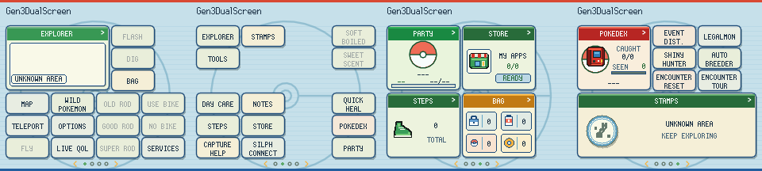
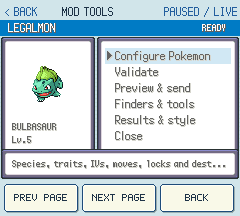

# Screenshots and preview provenance

[Every main mod and all 32 suite components](RELEASE-SCREENSHOTS.md) have current screenshot coverage.

## Current gallery status

The gallery contains **171 current native previews**, checked against the released versions: Gen3DualScreen **0.4.14**, QoL Suite **0.3.9** and the other versions listed in [release metadata](releases.json). The renderer hosts are gen1recomp **0.3.39 and 0.3.42**. These images were visually reviewed in contact sheets.

These are **native renderer previews with synthetic test state**, not AI-generated mockups or new hardware gameplay captures. They use locally imported fonts/sprites; ROMs, caches, player saves and traces containing local paths are not distributed. Empty inventories, zero records, test Pokémon and Unknown Area labels reflect the fixtures.

**114 older images are retained as historical examples**, not presented as current-build screenshots in the active READMEs. Their image embeds were replaced with explicitly labelled historical links. They may illustrate unchanged behaviour, but must not be used to infer current labels, version numbers, layouts or feature availability. The older Thor teleport capture is a hardware screenshot; the new previews do not extend hardware-validation claims.

The [image audit](screenshot-audit.json) records every retained PNG's SHA-256 and whether it represents the current UI (including unchanged earlier captures) or is retained as historical evidence. It also records package versions. A complete hardware gallery and exhaustive gameplay validation remain deferred.

## Shared Home layout

Emerald, pages 1–4:

FireRed, pages 1–4; the same shared defaults apply to LeafGreen:

These previews use the current shared preset. Game-specific unavailable shortcuts are omitted; other tiles retain their coordinates. Squirt Bottle and Headbutt are hidden. Rods/bike actions and field shortcuts use compact rows.

## Emerald navigation

These refreshed captures show the full native screen below the companion toolbar. The Emerald Home tile opens PokéNav; FR/LG keep MAP. Both are synthetic render previews, not Thor gameplay recordings.

| PokéNav | Town Map |
| --- | --- |
|  |  |

## Current mod menus

The companion renders the actual native mod menu. The paged footer shows **PREV PAGE / NEXT PAGE / BACK**. Each tool also works through its ordinary game menu without Dual Screen.

| Mod | Emerald | FireRed |
| --- | --- | --- |
| LegalMon | [Preview](screenshots/current/emerald-legalmon.png) | [Preview](screenshots/current/firered-legalmon.png) |
| Event Distributions | [Preview](screenshots/current/emerald-event-distributor.png) | [Preview](screenshots/current/firered-event-distributor.png) |
| Shiny Hunter | [Preview](screenshots/current/emerald-shiny_hunter.png) | [Preview](screenshots/current/firered-shiny_hunter.png) |
| Auto Breeder | [Preview](screenshots/current/emerald-autobreeder.png) | [Preview](screenshots/current/firered-autobreeder.png) |
| Encounter Tour | [Preview](screenshots/current/emerald-encounter_tour.png) | [Preview](screenshots/current/firered-encounter_tour.png) |
| Encounter Reset | [Preview](screenshots/current/emerald-encounter_reset.png) | [Preview](screenshots/current/firered-encounter_reset.png) |
| Pokémon Services | [Preview](screenshots/current/emerald-pokemon-services.png) | [Preview](screenshots/current/firered-pokemon-services.png) |
| Day Care | [Preview](screenshots/current/emerald-daycare-viewer.png) | [Preview](screenshots/current/firered-daycare-viewer.png) |
| Teleport | [Preview](screenshots/current/emerald-fly-teleport.png) | [Preview](screenshots/current/firered-fly-teleport.png) |

## QoL, starters and Hoenn

- All **32 suite component detail pages and their available options pages** were regenerated. These show actual component names, versions and option schemas in the native manager. The installed distribution remains the combined suite; they do not imply standalone downloads. The manager truncates long labels and uses a four-row options viewport.
- The suite's [31 applicable feature switches](screenshots/qol-suite-menu.png), [Field Kit options](screenshots/qol-suite-options.png), [shortcut list](screenshots/qol-suite-shortcuts.png) and [binding context](screenshots/qol-suite-shortcut-context.png) were refreshed.
- [Quick Field Actions](screenshots/frlg_qol_auto_surf-detail.png) now shows the current name instead of Auto Surf Prompt.
- [Emerald starter-repeat menu](screenshots/encounter-reset-emerald-starters-detail.png) and [FRLG starter-repeat menu](screenshots/encounter-reset-firered-starters-detail.png) show Prepare repeat starter / Collect prepared starter. These demonstrate the menu, not a completed collection or a new PKHeX result.
- Hoenn Tools: [Match Call](screenshots/hoenn-tools-match-call.png), [berry patches](screenshots/hoenn-tools-berries.png), [berry teleport/details](screenshots/hoenn-tools-berry-detail.png), [Frontier](screenshots/hoenn-tools-frontier.png), [Feebas](screenshots/hoenn-tools-feebas.png), [contest](screenshots/hoenn-tools-contest.png), [inline bike switch](screenshots/hoenn-tools-bike.png), [daily events](screenshots/hoenn-tools-daily-events.png), [Secret Bases](screenshots/hoenn-tools-secret-bases.png). Empty-party/base/rematch examples are intentional synthetic states.
- Start-menu ordering and folders remain current. Size/position editor images are historical: that feature was removed in Suite 0.3.9.
- Dual Screen Home pages, collection panels, startup and options were refreshed for 0.4.14. New Emerald PokéNav and Town Map captures show the isolated companion viewport.
- QoL effect previews were regenerated for Summary values, Dex/evolution, item help, held items, nickname entry, move reminder, Repel reuse, shop owned counts, bag sorting and VS Seeker charge.

## Reproduction

`tools/docs-preview/` renders shared Home pages and collection menus through LÖVE using the current combined suite. Set `KANTO_GEAR_HOST_PATH`, `KANTO_GEAR_MOD_PATH`, `KANTO_GEAR_PREVIEW_OUTPUT` (output filename prefix), `FRLG_COLLECTION_PATH`, `FRLG_QOL_COMBINED=1`, `FRLG_QOL_SUITE_ROOT` (absolute collection path without its leading slash), `POKEPORT_VERSION` and `POKEPORT_GBA_CACHE`. Run the preview folder with LÖVE from the host checkout. The preview creates synthetic sessions and never loads a player save.

Other retained current capture helpers:

| Helper | Coverage |
| --- | --- |
| `tools/capture-qol-manager.lua` | Component detail/options schemas |
| `mods/frlg-qol-suite/tests/capture.lua` | Combined suite settings and shortcuts |
| `tools/capture-qol-effects.lua` | Native QoL effects; retired move-details/battle-hints captures removed |
| `tools/capture-scrollable-start.lua` | Current native Start organiser, ordering and folders |
| `tools/emerald-port/capture-hoenn.lua` | Eight Hoenn entry panels and berry patch detail |
| `tools/emerald-port/capture-encounters.lua` | Current Tour/Reset menus, including native starter-row definitions |
| `tools/frlg-dual-screen/startup_preview/` | Current startup branding |
| `tools/frlg-dual-screen/portable_preview/` | Compact actions and Emerald owned/wild IV display |
| `tools/frlg-dual-screen/tile_settings_preview/` | Current Home visibility options |
| `tools/start-menu/preview/` | Historical size/position editor (removed) |

The trace helpers take source root, edition, imported cache directory and output trace directory; use `tools/render-manager-traces.py` to composite their draw operations. Manager/effects helpers expect the canonical `qol/mods` path; the suite helper expects the collection path without its leading slash; Hoenn/encounter helpers expect the collection root. All caches remain local.
