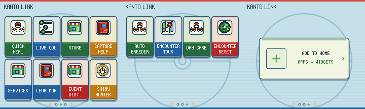

# Screenshot provenance

These images are **renders of real native drawing code with test/demo state**, not live gameplay captures or AI-generated mockups. They use the user's locally imported FRLG fonts, frames and sprites. Raw ROMs, texture caches and trace files containing local paths are not distributed.

| Filename prefix | Origin |
| --- | --- |
| `legalmon-` | Existing LegalMon development outputs, including 0.7.0 e-Reader previews and confirmation. Some general menu images were retained from earlier versions. |
| `events-` | Existing Event Distributions development outputs, including 1.2.0 egg delivery, journal and native-ticket UI. |
| `shiny-hunter-` | Existing Shiny Hunter development outputs, including 0.1.3 speed settings. The found result uses demo state, not a claimed real capture. |
| `autobreeder-` | Existing Auto Breeder development outputs. These demonstrate targets/results; some menu images predate 1.0.2's export/help entry. |
| `qol-firered-`, `qol-leafgreen-` | Existing QoL real-cache render tests for summary, moves, Dex, key-item help and paged start menu. |
| `frlg_qol_*` | Newly captured detail/options screens for all 26 packages, using upstream's unchanged native FRLG mod-manager drawing code and actual loaded mod option schemas. |

The QoL detail screen truncates long names to the engine's native 24-character limit. Options screens use the engine's four-row viewport. Some QoL mods only alter behavior and have no separate custom gameplay screen; their manager screens are shown explicitly as such.

## Reproduce the QoL manager images

Requires LuaJIT, Python with Pillow, an upstream gen1recomp source checkout containing `tests/modkit/sdk.lua`, and an already imported FRLG cache. The capture target is upstream dev commit `84e076b2d1e2dda36073ff55ec7c311a6b97519c`.

Run from the upstream checkout. Pass a **relative** path to this collection's `qol/mods` directory because the upstream test filesystem resolves paths relative to its checkout:

```sh
mkdir -p /tmp/qol-manager-traces
luajit /path/to/collection/tools/capture-qol-manager.lua \
  ../../relative/path/to/collection/qol/mods firered \
  '/path/to/firered/data/generated/gba' /tmp/qol-manager-traces
python3 /path/to/collection/tools/render-manager-traces.py /tmp/qol-manager-traces
```

The Lua helper loads the mods through the upstream test SDK, creates an in-memory manager state, and records its native draw calls. It never enters a player save or persists settings. The Python renderer composites the referenced local textures at native coordinates and enlarges the result with nearest-neighbor sampling. Its negative-scale handling supports the manager's down-arrow sprite.

The main four mods retain their original rendering/testing helpers where supplied; see their README and test documentation. The existing QoL UI harness is `qol/tests/real_cache.lua`.

## Added Encounter Tour and QoL effect examples

`encounter-tour-*` images come from Encounter Tour 0.1.0's original development outputs. They show its native home, categories, event destinations, Deoxys details and special-Pokémon notes.

`qol-effect-firered-*` images were captured with `tools/capture-qol-effects.lua`. This extends the existing real-cache fixture harness and calls the actual mod-wrapped party, bag, shop, PC, Repel and battle UI methods. It loads no player save and changes no installed mod. Synthetic inventory, party, battle and storage state makes the displayed effect reproducible. Bag before/after images use the same inventory with the sort option disabled/enabled. The native battle example is an isolated UI fixture, not a complete battle-playthrough capture.

Run it from the same upstream checkout and with the same relative-mod-path convention as the manager capture:

```sh
mkdir -p /tmp/qol-effect-traces
luajit /path/to/collection/tools/capture-qol-effects.lua \
  ../../relative/path/to/collection/qol/mods firered \
  '/path/to/firered/data/generated/gba' /tmp/qol-effect-traces
python3 /path/to/collection/tools/render-manager-traces.py /tmp/qol-effect-traces
```

The renderer also supports outlined rectangles and negative sprite scaling. Screenshot scripts do not modify shipped mod behavior. The Tiny Mushroom warning is retained as evidence of the issue documented in [the update check](UPDATE-CHECK.md); the move-reminder feature image shows the working Big Mushroom route.

## FRLG Dual Screen 0.2.0

`frlg-dual-screen/collection.png` and `frlg-dual-screen/native-ui.png` are contact sheets from the mod's actual LÖVE GPU preview harnesses, using isolated native-data test sessions. They show the new encounter browser, collection editors, controls, native-menu fallback, and light/dark companion pages. They are not captures from physical Thor hardware. See the mod's [validation report](../mods/frlg_dual_screen/VALIDATION.md) for the retained generation commands and coverage.

### Home mod tiles — 0.2.1

All five main mods enabled (left), and disabled (right). Same Home app renderer and theme.



## September 27 update examples

Day Care Viewer images use the native rendering fixture described in its test report. Encounter Reset images are supplied native UI fixtures from that mod's development. New LegalMon NPC-trade, Unown and profile-progress images come from its completed release workspace.

`start-menu-1.png` and `start-menu-14.png` use `tools/capture-scrollable-start.lua` and `tools/render-manager-traces.py`. Run the capture from the upstream checkout with a relative mod-folder path, edition, imported cache path and scratch trace directory, just like the QoL capture above. It loads the actual Start Menu mod and renders 14 synthetic entries at the first and last selection. The neutral background is a fixture; no gameplay scene or player save is used. Intermediate cache traces are not distributed.

Dual Screen 0.2.4 adds the battery percentage example; its updated collection sheet reflects removal of the virtual control deck. Screenshots do not establish physical-device compatibility.

### Scrollable Start Menu 0.2.0

`start-organizer-preview.png` combines four native-font/frame renders from `tools/capture-scrollable-start.lua`: organized main menu, folder, organizer and entry ordering. The capture loads the actual mod through the host SDK, uses synthetic folder settings and mod entries, and forbids storage writes. These are render fixtures, not live gameplay or device captures.

## Dual Screen startup branding

`frlg-dual-screen/startup.png` shows the 0.3.10 startup screen in light and dark themes, rendered by the retained LÖVE/GPU fixture in `tools/frlg-dual-screen/startup_preview/`. It preserves the Kanto Gear credit. This is a renderer preview, not a new device test.

Scrollable Start Menu 0.2.1 updates the ordering preview to show a picked-up entry and the A/Up/Down placement controls. Captured by the same isolated harness.
