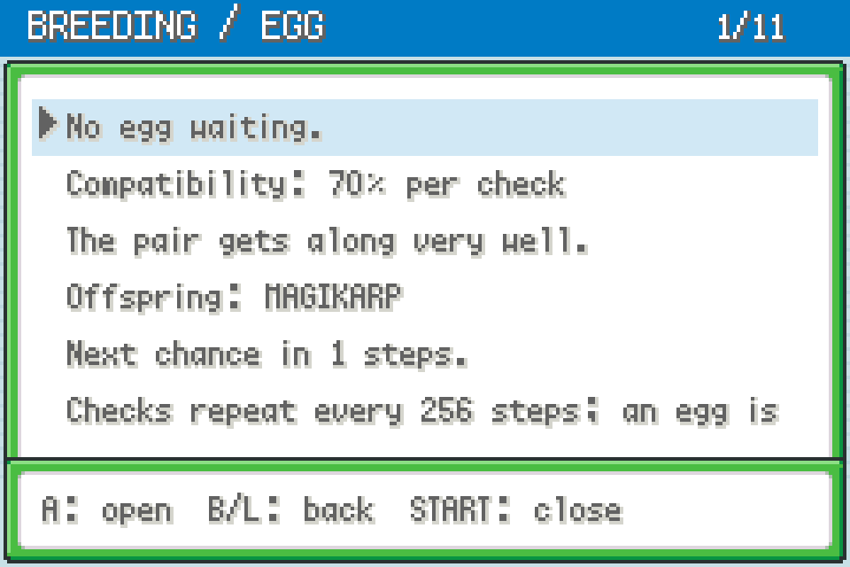
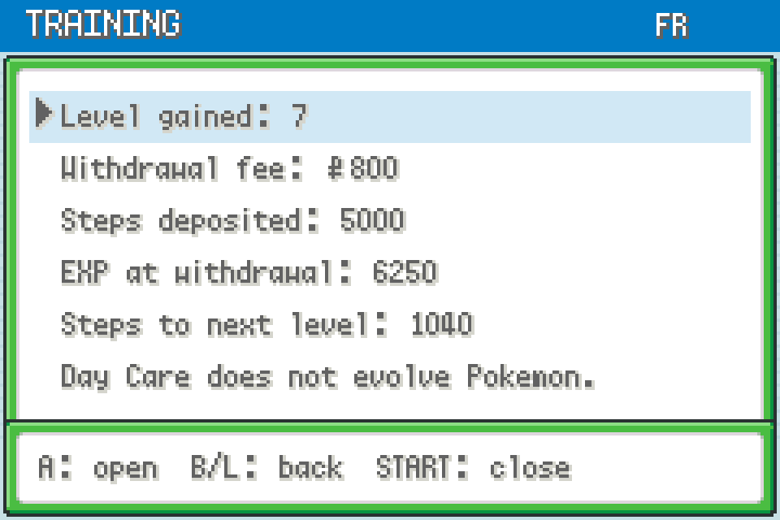
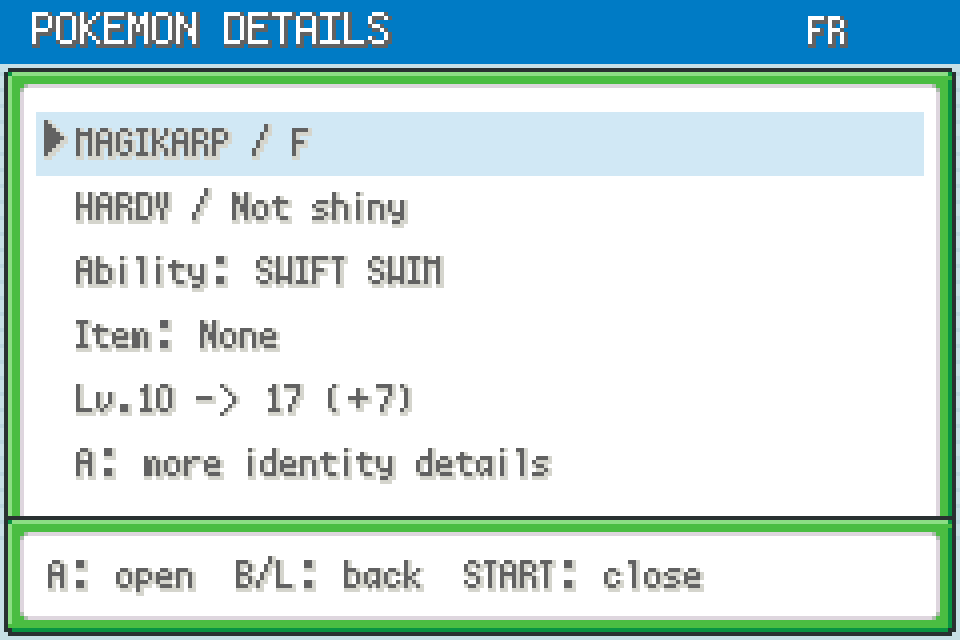
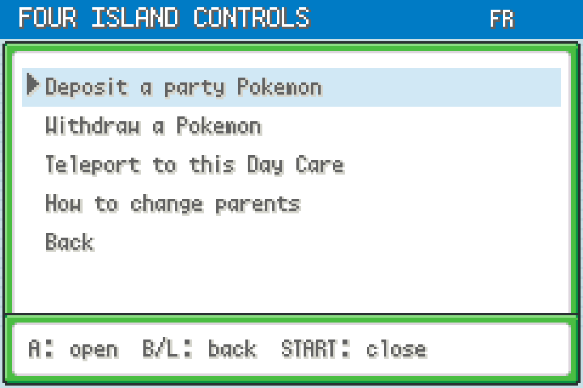
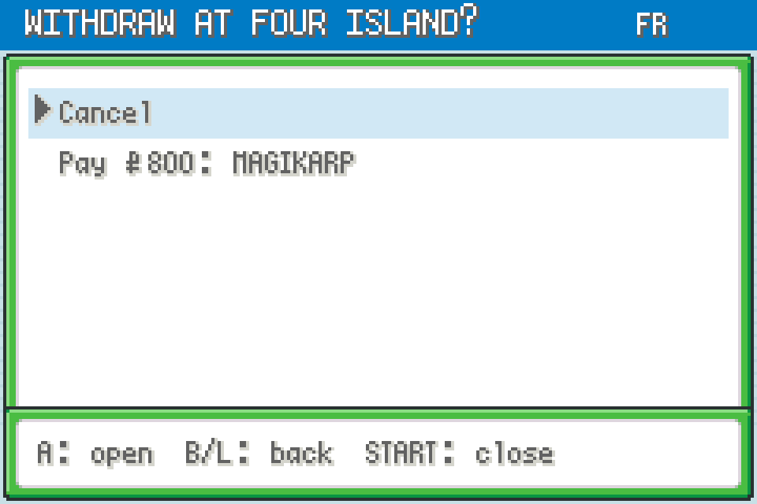

# Day Care Viewer 0.2.0

**START → DAY CARE** shows the real Route 5 and Four Island Day Cares from anywhere you can open the START menu in FireRed or LeafGreen.

Uses the same native FR/LG fonts, blue title bar, six-row scrolling menus and player-selected window frames as Auto Breeder and LegalMon. Independent mod; neither is required.

## Install

Import [daycare-viewer-0.2.1.zip](https://github.com/CapnJames95/gen1recomp-mod-releases/releases/download/v1.0.0/daycare-viewer-0.2.1.zip) using **MODS → Import mod .zip**, enable **Day Care Viewer** for your edition, and restart. Requires mod API 2, FR/LG engine internals and Gen1Recomp >=0.3.21 <0.4.0. Later engine changes within that range are not guaranteed compatible.

## Manage or travel

Open **START → DAY CARE → Manage / teleport**, then choose **Four Island** or **Route 5**. Four Island's overview also has a direct controls link.

- **Deposit a party Pokemon:** select a party member and confirm. Uses the native deposit routine, including PP restoration, held-mail handling, party compaction and the daycare-use statistic.
- **Withdraw a Pokemon:** select a deposited Pokémon, review the fee and confirm payment. Uses the native withdrawal, experience, move-learning, stat, mail and money routines. Make room in your party first.
- **Teleport to this Day Care:** confirm to land inside facing the attendant. A opens the original dialogue. Uses the native map warp and entry logic, with landing, movement, battle, script, link and Safari checks. Teleport bypasses travel/ferry access and does not unlock story flags.

To replace a parent, **withdraw it, then deposit its replacement**. Eggs cannot be deposited; keep another usable non-Egg Pokémon in your party. Four Island requires you to collect any pending egg before changing its parents, as in the native attendant's flow. Collect eggs in person. Confirmation defaults to Cancel, and stale party selections or changed withdrawal quotes are rejected. Save normally after making changes.

## Details available

- Both Four Island parents and Route 5's single deposited Pokémon, including empty slots.
- Nickname, species, gender, nature, shiny status, ability, held item, OT name and trainer ID, friendship, egg groups and stored-mail presence.
- Deposit level, level on withdrawal, levels gained, individual withdrawal fees and the combined Four Island fee.
- Steps accumulated, projected EXP and steps to the next level, including level-100 handling.
- Stored moves and a preview of the moves after withdrawal, including automatic replacement of old moves.
- All six IVs, EVs and projected stats at withdrawal.
- Egg ready/waiting status, native compatibility score, incompatibility explanation, possible offspring species (including Ditto, split species and incense rules), and steps until the next egg-generation check.
- Party egg cycle counts and earliest possible hatch-check estimates. Multiple eggs can delay each other; these are not guaranteed hatch times.

**Up/Down** scrolls, **Left/Right** skips five rows, **A** opens a detail screen, **B/L** goes back, and **START** closes the viewer. Reopen or select **Refresh details** to update its snapshot. Normal menus pause walking.

Browsing remains read-only and does not consume RNG or trigger level-up events. Confirmed management actions change the actual save session using native game logic; withdrawals charge money and apply training and automatic move changes. The mod does not automatically save. Auto Breeder's virtual parents and search results are separate from these actual deposited Pokémon.

Pending egg IVs, nature and shininess are not fully generated until collection, so they cannot be reported in advance. The compatibility score describes each periodic chance, not a guaranteed countdown to an egg. Route 5 cannot breed. Day Care training does not evolve Pokémon.

## Verification

110 native-data checks pass per edition (220 total), covering read-only state/RNG behavior, both storage representations, engine withdrawal agreement, level caps, egg countdown boundaries, split offspring, incense, incompatible pairs, party eggs, UI navigation, START registration, native deposits/withdrawals, fees, rejected actions, confirmations, real map warps and original attendant dialogue. Runtime validation, Gen III compatibility checks and distribution lint also pass. See [test report](TEST-REPORT.md).

Screens below are native drawing-code renders with isolated demo state and locally imported fonts, not captures of a live playthrough. No player save was loaded or modified. Full interactive/controller and device testing remains outstanding.

| Overview | Breeding |
| --- | --- |
|  |  |

| Training | Pokémon |
| --- | --- |
|  |  |

| Controls | Withdrawal confirmation |
| --- | --- |
|  |  |

## Native Pokémon legality corrections — 0.2.1

This release includes the shared FRLG generation/export corrections. It sets valid ability slots for newly generated/caught Pokémon, creates native gift eggs with the correct egg metadata, preserves fixed NPC-trade identity and contest values, and generates new roamers with retail FRLG PID/IV correlations. The roaming beast's stored personality and IVs now reach the battle without being regenerated. Native unhatched eggs receive the required OT-name padding during in-game export.

The same helper is bundled independently with Dual Screen, Shiny Hunter, Encounter Reset, Encounter Tour, Day Care Viewer and Pokémon Services. No additional mod is required. Co-loading these packages applies the corrections once; disabling every participating mod or unloading the game stops the wrappers. Existing Pokémon are not rerolled or bulk-repaired.

**For a cartridge save, use MODS → this mod → SAVE + EXPORT while in the field.** This first saves the active game and then exports with the egg-name correction loaded. The log gives the output path under `exports/<edition>/`. A fresh launcher export can still use the host's unpatched egg-name encoder; copy the in-game export directly. Restart after installing updates.

See the collection's `docs/LEGALITY-FIXES.md` for the regression results and limits. This corrects the identified defects; a passing sample matrix does not certify every possible modified ROM, species combination or future host release.
