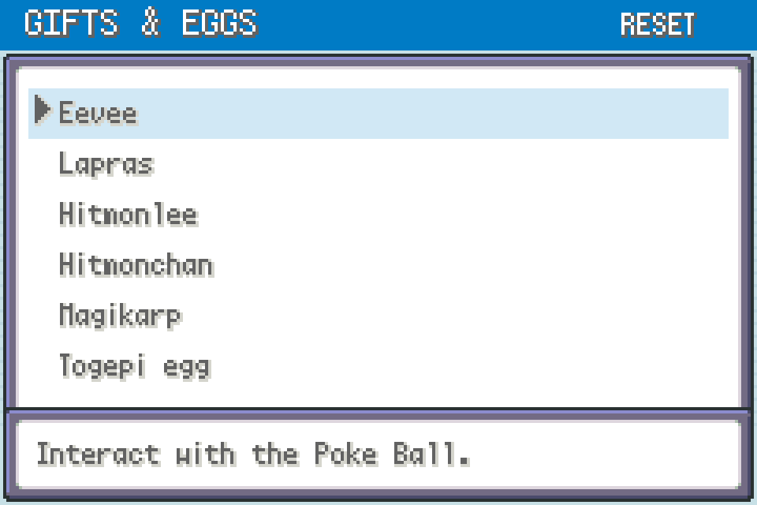
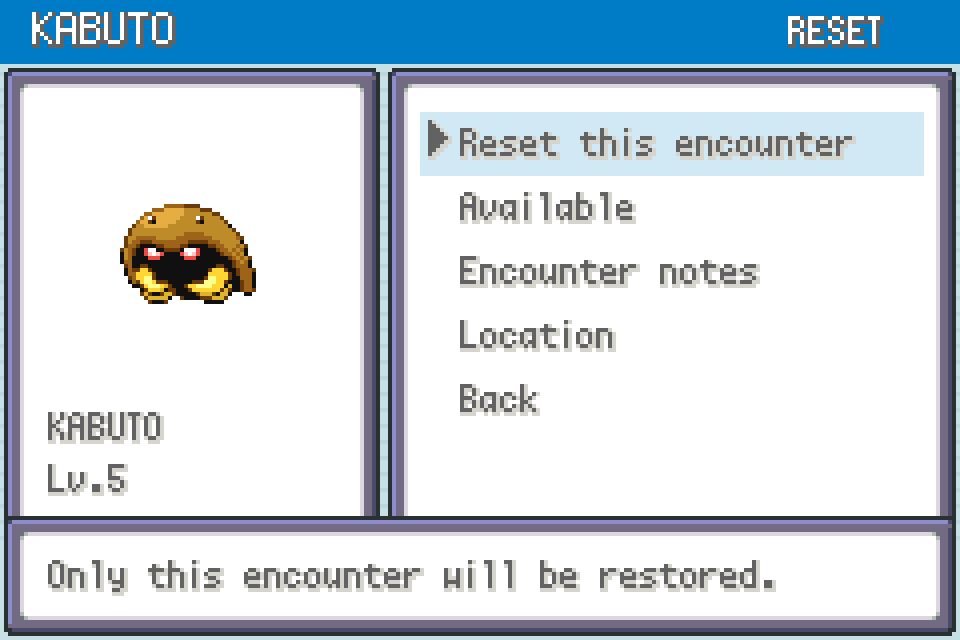
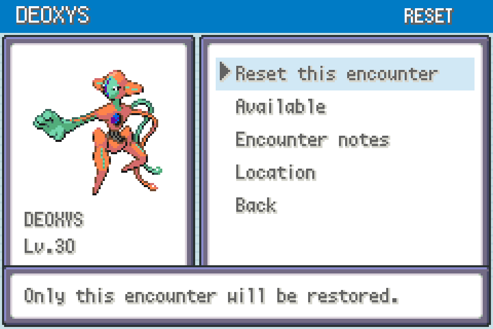

# Encounter Reset 0.2.0

**START → ENCOUNTER RESET** — restore one encounter, gift or NPC trade at a time, using the same native FRLG menus, frames and Pokémon sprites as Encounter Tour. Standalone; no other mod is required.

## Install and use

Import `encounter-reset-0.2.0.zip` through **MODS → Import mod .zip**, enable it and restart. Supports FireRed and LeafGreen, mod API 2, with `engine_internals` permission.

1. Pause Shiny Hunter / Encounter Tour automation. Keep a backup of your save.
2. Leave the map containing the encounter you want to restore.
3. Open **START → ENCOUNTER RESET**, select the encounter, choose **Reset this encounter**, then **Confirm reset**. Cancel is selected by default.
4. Return to its location and interact normally. Save normally to retain the reset and subsequent catches.

Each reset is independent. Both Snorlax locations and both Electrode item balls have separate entries. Your caught Pokémon, Pokédex, money, badges and other encounter flags are retained. Fossil resets add the required fossil item only if it is missing. The mod does not force a shiny, guarantee capture or grant island access. Resetting an already available static encounter is harmless, but Deoxys returns to its unsolved puzzle state.

## Coverage

| Category | Individual entries |
| --- | --- |
| Kanto legendaries | Articuno, Zapdos, Moltres, Mewtwo |
| Event islands | Lugia, Ho-Oh, Deoxys |
| Static battles | Route 12 Snorlax, Route 16 Snorlax, Electrode 1, Electrode 2, Lostelle's Hypno |
| Gifts & eggs | Eevee, Lapras, Hitmonlee, Hitmonchan, Magikarp, Togepi egg |
| Fossils | Omanyte, Kabuto, Aerodactyl |
| NPC trades | Mr. Mime, Nidoran, Nidorina/Nidorino, Lickitung, Jynx, Farfetch’d, Electrode, Tangela, Seel |
| Roaming beasts | Raikou, Entei, Suicune; only the beast previously unlocked for your starter can be reset |

**Deoxys:** resets the triangle puzzle and fled/fought state; complete the original puzzle again. Ho-Oh's approach trigger is restored on map entry. Lugia and Ho-Oh can also be restored after defeat.

**Hypno:** restoring Lostelle repeats her original rescue script, including the berry reward and warp to Two Island. Visit her father afterward to finish the replay. This is a story replay, not an isolated rematch.

**Roamers:** a caught/defeated beast is regenerated at level 50 by the engine with a new personality/IVs and route. An active beast cannot be replaced. The mod cannot unlock a different starter's beast or bypass its original unlock quest.

**Gifts:** receive Eevee and Lapras again through their original interactions. Magikarp still costs ₽500; Togepi still requires a free party slot and a high-friendship lead.

**Dojo:** claim your first prize normally before resetting. Hitmonlee and Hitmonchan can then be reset separately, including both at once. Only the selected ball is restored; the shared original claim and trainer flags stay unchanged. Keep this mod enabled until collection.

**Fossils:** the reset supplies a Helix Fossil, Dome Fossil or Old Amber if absent from your bag. Talk to the scientist in Cinnabar’s Experiment Room and accept revival. Walk into the lab entrance and return to collect the Pokémon. All three species work regardless of your original Mt. Moon choice. Only one fossil reset may be pending at a time; an unfinished original revival must be collected first. Resetting does not duplicate an item already in your bag. Pending resets persist in the gen1recomp save; keep this mod enabled until collected. They rely on mod metadata, so finish pending Dojo/fossil rewards before exporting for play outside gen1recomp.

**NPC trades:** all nine traders reset separately and still require the normal offered Pokémon. Species swaps between FireRed and LeafGreen are retained. The native trade’s fixed identity is preserved.

Starters and Game Corner purchases are excluded. The Pokémon Tower Marowak ghost remains uncatchable and is excluded. Mew, Celebi and Jirachi have no native FRLG map encounter.

`Used / hidden` describes native encounter flags; it does not distinguish catching from defeating. Resets do not clear Event Distributions claim receipts or recreate a previously consumed guaranteed event result. Subsequent encounters follow native generation unless another enabled mod intervenes.

## Controls and compatibility

A selects; B, L or START returns; Left/Right moves six rows. The menu pauses field updates. Resets are blocked during battles, scripts, movement, fades, warps, Safari games and linked activities. Static resets require leaving the encounter's entire map, even if the Pokémon is out of sight.

FRLG Dual Screen can display this through its native-menu fallback. It does not opt into live editing. Physical Android/Thor gameplay has not been tested.

## Validation

Real engine tests pass with both imported FireRed and LeafGreen caches: all 30 stationary encounter/gift/trade reset recipes and map transitions, individual isolation, all three starter-dependent roamer resets, guards, cancel/confirm, menu hooks and a native Zapdos battle after reset. Additional tests complete native gift claims, both Dojo prizes and all three fossil handover/collection sequences, plus duplicate-pending, full-bag and unfinished-revival guards. Native menu renders were visually inspected. See [VALIDATION.md](VALIDATION.md) for scope and reproduction.

These images render the actual menu draw code using fixture state; they are not live-play captures. No ROM or save data is bundled.

## Native Pokémon legality corrections — 0.1.1

This release includes the shared FRLG generation/export corrections. It sets valid ability slots for newly generated/caught Pokémon, creates native gift eggs with the correct egg metadata, preserves fixed NPC-trade identity and contest values, and generates new roamers with retail FRLG PID/IV correlations. The roaming beast's stored personality and IVs now reach the battle without being regenerated. Native unhatched eggs receive the required OT-name padding during in-game export.

The same helper is bundled independently with Dual Screen, Shiny Hunter, Encounter Reset, Encounter Tour, Day Care Viewer and Pokémon Services. No additional mod is required. Co-loading these packages applies the corrections once; disabling every participating mod or unloading the game stops the wrappers. Existing Pokémon are not rerolled or bulk-repaired.

**For a cartridge save, use MODS → this mod → SAVE + EXPORT while in the field.** This first saves the active game and then exports with the egg-name correction loaded. The log gives the output path under `exports/<edition>/`. A fresh launcher export can still use the host's unpatched egg-name encoder; copy the in-game export directly. Restart after installing updates.

See the collection's `docs/LEGALITY-FIXES.md` for the regression results and limits. This corrects the identified defects; a passing sample matrix does not certify every possible modified ROM, species combination or future host release.
