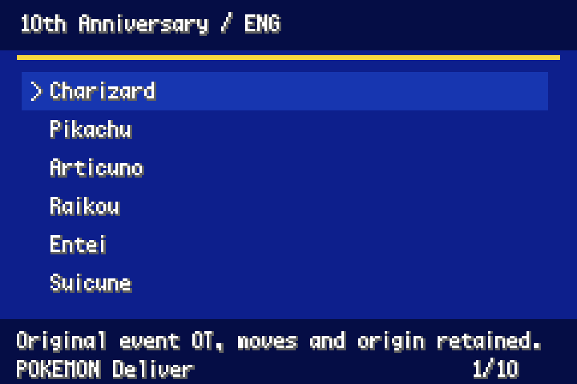
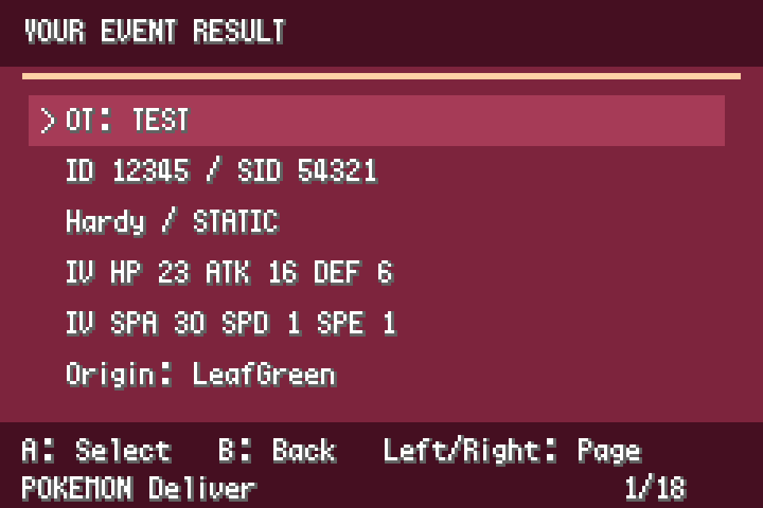
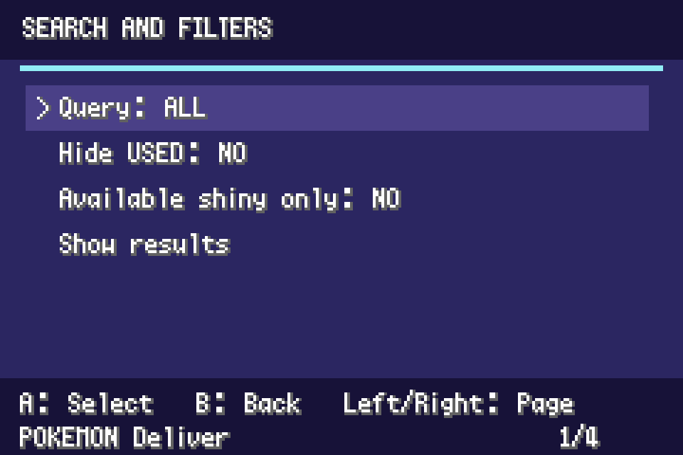
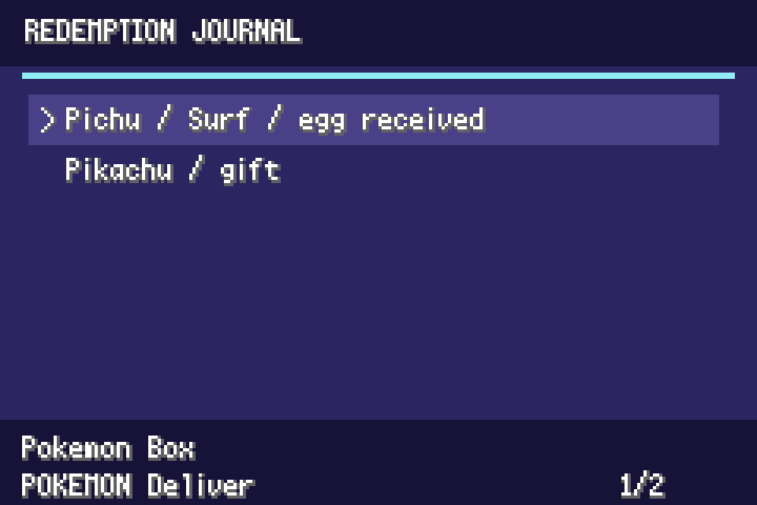
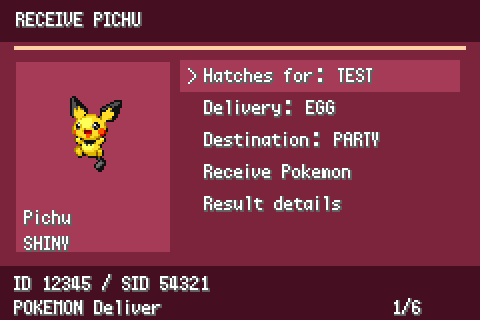
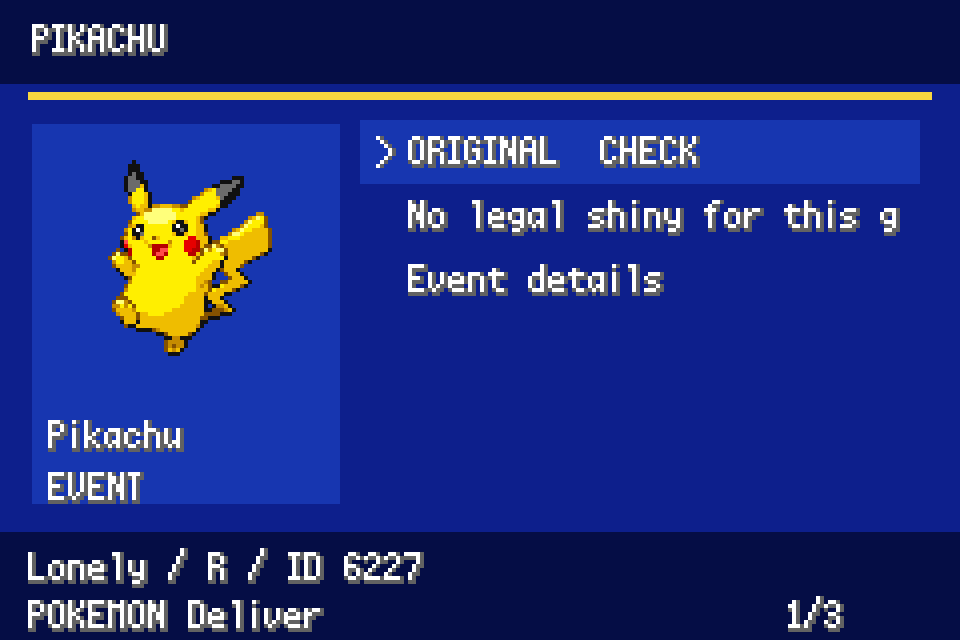
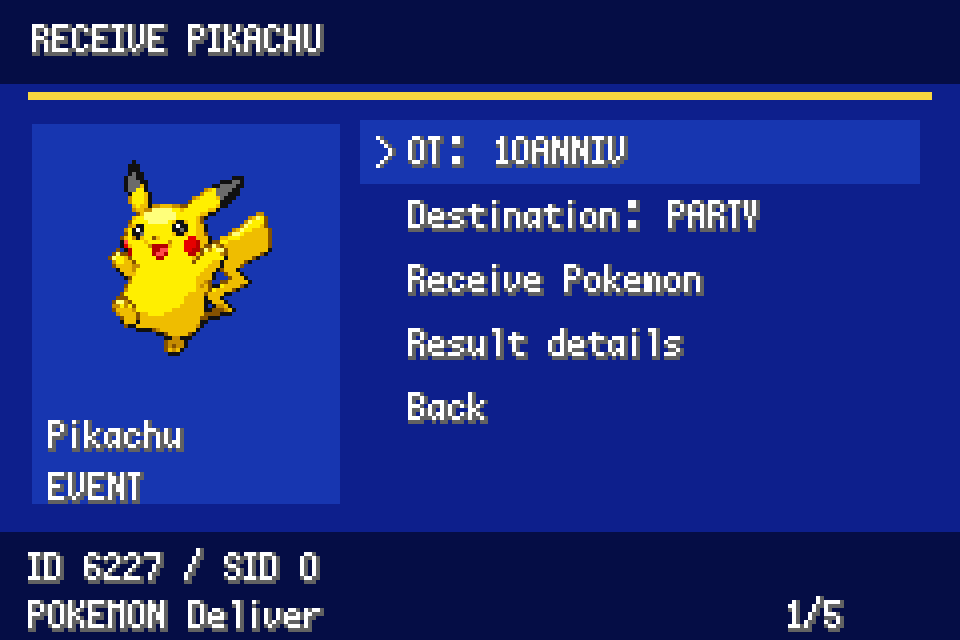
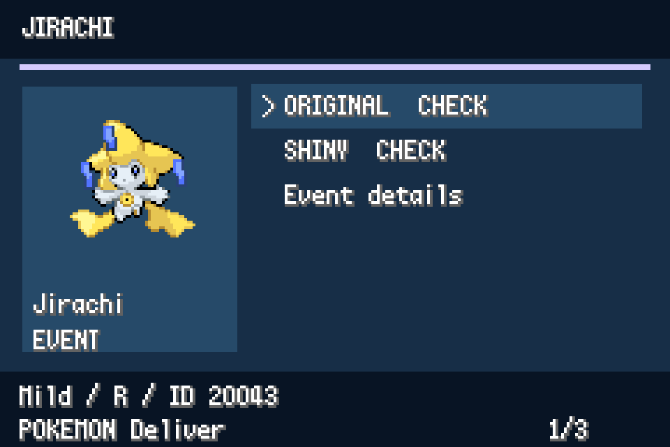
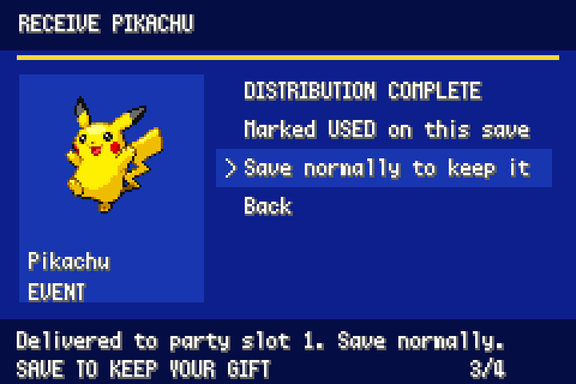

# Event Distributions 1.3.0

A standalone **EVENTS** entry beside LegalMon in the FireRed/LeafGreen START menu. Includes **87 campaign menus, 322 Pokémon choices and 670 selectable variants**. No LegalMon dependency, ROM download, PKHeX installation or network connection is needed to play.

## What's new in 1.3.0

Compared with 1.2.0, coverage grows from **80 to 87 campaign menus**, **305 to 322 Pokémon choices**, and **375 to 670 selectable variants**. The variant total includes city OTs and language rewards, not just different species or shiny choices.

- **Nine preserved JEREMY gifts:** Ekans, Vulpix, Oddish, Psyduck, Growlithe, Machamp, Gengar, Staryu and Tauros. Their preserved records retain the original OT, IDs, PID, IVs, moves and held items. These are fixed specimens, with no invented shiny rerolls.
- **Both Wishing Star Jirachi methods:** restores the missing recipient-gender variant alongside the original restricted-table method. Both keep the event OT and IDs and carry Salac Berry; only the alternate method matches your trainer's OT gender.
- **Japanese Pokémon Center city OTs:** select the permitted city OT for all 58 existing Gotta Catch 'Em All choices. Campaigns First–Fifth offer six cities; Sixth excludes Sapporo. City variants share the original claim.
- **Five additional Mt. Battle Ho-Oh languages:** Japanese, French, German, Italian and Spanish join English, with their appropriate OTs. All remain non-shiny.
- **Eon Ticket held-item correction:** all eight normal/shiny replica templates now carry Soul Dew.
- **Mystic Ticket fixes:** adds separate LeafGreen-origin replicas and uses the current game's origin for native captures. If you previously received one counterpart as a replica, you can claim the remaining one without receiving the used Pokémon again. Failed/cancelled delivery does not change encounter flags, and older LeafGreen reservations are recognised.

**All 305 previous claim IDs are retained:** upgrading does not reset USED markers or grant repeat claims. The development validation reports **14,896/14,896 exports passing the pinned PKHeX checks**, plus ticket, save and menu regression tests. These are automated headless checks; this release is not claimed to have had a new manual live-play test.

## What's missing, and why

| Missing or limited | Why it is not included |
| --- | --- |
| **JEREMY Sandshrew and Slowpoke** | The circulated records are disputed/rejected as fake by preservation researchers. They are not included as authenticated gifts. |
| **JEREMY Shellder** | No sufficiently authenticated preserved specimen was established in the audited source archive. Known species/move details alone are not enough to recreate its original record faithfully. |
| **Unevolved JEREMY Machoke and Haunter** | The original trades evolved them, so the mod supplies Machamp and Gengar. Devolved reconstructions are excluded. |
| **Pokémon Stamp Pichu and Absol** | Original identity or complete distribution data remains insufficiently verified for faithful reproduction. Newer Stamp Pichu research does not by itself provide a fully verified original specimen. |
| **Altering Cave distributions** | The audit did not establish a released campaign to reproduce. Unused game support is not treated as a historical release. |
| **Eon Ticket / Old Sea Map island travel** | These journeys require Ruby/Sapphire/Emerald maps and scripts that FRLG does not have. Their caught Pokémon replicas are included; Old Sea Map Mew keeps Japanese Emerald provenance. Aurora and Mystic Ticket journeys are implemented. |
| **e-Reader berries, decorations and Trainer Hill / Trainer Tower cards** | Their original delivery and gameplay systems are not implemented here. They are not converted into invented FRLG Pokémon gifts. |
| **Every regional Wonder Card and original distribution screen** | The mod recreates supported rewards and journeys through themed native menus. It does not run distribution ROMs, reproduce every historical operator screen, or overwrite your Wonder Cards. |

**Passing PKHeX checks does not prove historical authenticity.** These are the known gaps identified by the audit, not a claim that every historical regional variant has been accounted for. See the [fidelity audit and research sources](FIDELITY.md) and [full campaign list](COVERAGE.md).

## Install or upgrade

Extract the release ZIP into `mods/event-distributor` in gen1recomp's mod directory, so that `mods/event-distributor/manifest.json` exists. Replace the previous mod folder, enable **Event Distributions**, and restart the game session. It uses the same `engine_internals` permission as LegalMon. Import your own supported clean US FireRed or LeafGreen ROM normally.

**All 305 existing claim IDs are preserved.** Earlier USED markers and Pokémon remain unchanged. Native saves keep the journal, receipts and pending ticket encounters. Cartridge `.sav` exports cannot carry mod history or pending encounter selections. Save normally after receiving a gift or ticket; loading an older save restores its earlier history.

## Menu

Open **START → EVENTS → family → campaign → Pokémon**. Variants show **CHECK**, **READY** or **N/A** as their availability is checked against your trainer identity. Selecting N/A explains the restriction. Used entries remain marked USED. Checks and previews never consume an event.

Select a result to see your actual OT and IDs, choose party/PC, and confirm delivery. **Result details** includes nature, ability, all six IVs, moves, origin, language, PID and ribbons. For egg delivery, this is the expected hatch result; the details also show the unhatched egg's required identity.

Use A to select, B to return/cancel, and left/right to page. No NPC is added.

- **Search / filters:** search Pokémon, special move labels or campaign names with the controller-operated letter picker. Hide USED entries or show available shiny gifts only. Shiny results appear progressively as checks finish. Filters apply to search results; the complete campaign archive remains accessible.
- **Redemption journal:** records deliveries, hatches, ticket unlocks and native captures, including campaign, Pokémon, shiny status, destination and PID when known. Earlier receipts appear without invented historical details.
- **Native ticket journeys:** receive an Aurora or Mystic Ticket, unlock its real ferry route, and catch the Pokémon yourself.

## Hatchable event eggs

Every included egg campaign offers **Delivery: EGG / HATCHED**; EGG is the default. Eggs use the game's normal walking cycles and hatch sequence. They can be placed in the PC, but must be in your party to hatch. An egg and its hatched alternative share one claim, as do normal and shiny choices.

Unhatched eggs retain their required event OT, gender, language and IDs where fixed. Hatching applies the hatcher's OT, IDs and gender, English language and the actual hatch location. This includes Ruby-origin eggs traded into FRLG. PID/IV correlation and event moves are preserved. The chosen shiny outcome is prepared for your current trainer IDs; trading the egg to another trainer can change that outcome under Gen III rules.

Keep the mod enabled through hatching and export so the event-specific hatch and Japanese OT preservation support can run. Already-hatched gifts remain available for immediate receipt.

## Native ticket journeys

**Aurora Ticket:** Birth Island and its original Deoxys puzzle/encounter.

**Mystic Ticket:** Navel Rock and its original Lugia and Ho-Oh encounters.

Choose normal/shiny separately for each Pokémon, prepare the results, then confirm ticket delivery. The key item and native travel flags are granted through the engine's Mystery Gift delivery function. Travel from Vermilion port; existing story requirements remain in force. Catch mechanics and ball use remain normal.

Ticket delivery reserves each linked Pokémon's claim immediately, preventing a second replica delivery while the island encounter is pending. The journal adds a capture entry only after the Pokémon is stored. Saving preserves pending results. Fleeing, defeating the Pokémon or losing follows the original game's encounter rules; this mod does not reset fought flags or guarantee another attempt. Previously received tickets and fought encounters block new delivery. If only one Mystic counterpart was already received as a replica, the ticket reserves the remaining Pokémon and keeps the USED encounter unavailable. Older LeafGreen native reservations remain recognized.

**Eon Ticket and Old Sea Map journeys are unavailable in FRLG:** they require Ruby/Sapphire/Emerald maps. Their normal/shiny caught replicas remain under **Ticket encounters**, preserving the selected source game's provenance. The mod does not emulate Emerald's world or overwrite existing Wonder Cards.

## OT and legality

Direct distributions and bonus-disc gifts retain their fixed event OTs and IDs. Hatched eggs and ticket replicas use your trainer identity. Native island captures use your identity and the current FireRed/LeafGreen origin. The alternate Wishing Star Jirachi retains its fixed OT name and IDs while matching only your OT gender. The mod emulates distribution results; it does not execute distribution ROMs.

Some requests cannot be satisfied for every identity:

- Old Sea Map Mew retains Japanese Emerald origin. Your name must fit five supported letters, digits or spaces; names are never shortened.
- Ruby/Sapphire Eon Ticket replicas require an ID pair those games can generate. Use the Emerald option if your IDs are incompatible.
- Some egg distributions have finite RNG seed sets. A shiny hatch may be unavailable for your IDs. The reason is shown without changing your IDs or consuming the event.
- Unrestricted searches have a bounded attempt limit. B dismisses preparation without delivery; background availability checking may continue while the archive is open.

Normal/shiny variants share a claim. Berry Fix is shiny-only; most direct distributions have no legal shiny option. Original event moves, origin restrictions, ribbons and RNG correlations are preserved. Eon Ticket replicas carry the original Soul Dew. WISHMKR/CHANNEL retain algorithm-derived held items; additional documented items use Project Pokémon archive references.

Japanese OT bytes are preserved through a small runtime converter wrapper. **Keep the mod enabled when exporting Japanese event OTs.** The engine's Latin font may not display Japanese names. No engine files are changed on disk. Other mods that alter Pokémon after delivery are outside these checks; modified species/ability/move data is rejected during gift preparation.

These generated replicas satisfy the pinned PKHeX checks in the test matrix. This does not prove historical event attendance or guarantee every future checker version.

## Coverage and presentation

See [COVERAGE.md](COVERAGE.md) for all campaigns and choices. Coverage follows the pinned PKHeX Gen III event tables, bonus gifts and ticket encounters. It is not a claim to reproduce every historical regional machine or unreleased distribution. PCJP city selectors include all permitted city OTs; the Sixth campaign excludes Sapporo. The nine preserved JEREMY gifts have fixed records, including their original unused nickname bytes, and no speculative shiny rerolls. See [FIDELITY.md](FIDELITY.md) for additions, provenance and deliberately excluded uncertain events.

The native pixel menus use ROM-derived sprites, campaign palettes, status and counters. Layouts are inspired by distribution operator screens, not pixel-perfect copies of each historical cartridge.

## Validation and source

Tested against gen1recomp `5540fc1538c7c9c8a3c8c85e09679ae03f28beaf` and PKHeX `17157eb18013dc29a44f7bb7810117390431087b`.

- 1,340 byte-exact fixture exports, across both imported ROM data packs.
- 5,216 personalized exports across 20 identities and both games.
- 8,300 new exports: unhatched eggs, their engine-hatched results and native island captures, across both games. Egg profiles cover both genders, long names and boundary IDs.
- 40 fixed-specimen/recipient-gender exports; PKHeX: **14,896/14,896 exports valid** across all suites.
- Real engine tests cover egg cycles, ticket key items/travel flags, battle generation, party capture, deferred PC capture, save serialization and duplicate claims.
- UI tests cover all 670 variant paths, distinct city OT previews and partial Mystic claims plus search, filters, availability, egg modes, detailed previews, cancellation, journal and ticket confirmation.
- Strict modkit validation and reproducible packaging. Existing native draw previews illustrate the menu styling. These are headless engine integration tests, not a manual live-play session.

Source and tests are included in the source folder and excluded from the runtime ZIP. Build `tools/Build.csproj` with .NET 10 and `-p:PKHeXAssembly=/path/to/PKHeX.Core.dll`. Modes include `<output-directory>`, `--enrich <catalog.json> <held-items.json>`, `--check <export-directory>` and `--egg-meta <output.json>` and `--fidelity <enriched-catalog.json> <official-jeremy-directory> <augmented-catalog.json>`. Compile the main catalogue with `tools/catalog.py`; compile egg metadata with `python3 tools/egg_catalog.py <egg-meta.json> <mod-directory>/eggs.lua`.

Run Lua tests with LuaJIT, using a separate output directory for each export suite:

```sh
EVENT_CACHE='/path/to/edition-cache-root' luajit tests/roundtrip.lua /path/to/gen1recomp /path/to/event-distributor /path/to/fixture-exports firered
EVENT_CACHE='/path/to/edition-cache-root' luajit tests/personal.lua /path/to/gen1recomp /path/to/event-distributor /path/to/personal-exports firered
EVENT_CACHE='/path/to/edition-cache-root' luajit tests/features.lua /path/to/gen1recomp /path/to/event-distributor /path/to/feature-exports firered
EVENT_CACHE='/path/to/edition-cache-root' luajit tests/fidelity.lua /path/to/gen1recomp /path/to/event-distributor /path/to/fidelity-exports firered
EVENT_CACHE='/path/to/edition-cache-root' luajit tests/ui-features.lua /path/to/gen1recomp /path/to/event-distributor /path/to/scratch firered
luajit tests/screen.lua /path/to/gen1recomp /path/to/event-distributor
```

`EVENT_CACHE` contains `data/generated/gba`. Repeat the export suites for LeafGreen using its cache and `leafgreen`. Check each export directory with the PKHeX helper. Use fresh output directories for release verification.

## Sources and license

- [PKHeX Gen III event definitions](https://github.com/kwsch/PKHeX/blob/17157eb18013dc29a44f7bb7810117390431087b/PKHeX.Core/Legality/Encounters/Data/Gen3/EncountersWC3.cs), gift generators and legality checks.
- [Project Pokémon Events Gallery](https://github.com/projectpokemon/EventsGallery): held-item references.
- [Original GBA operator reports](https://projectpokemon.org/home/forums/topic/24664-archived-sticky-gba-distribution-system/).
- [Distribution algorithm research](https://projectpokemon.org/home/forums/topic/39517-gen-3-event-generation-algorithm-research-10anniv-etc/).

GPL-3.0; see LICENSE. PKHeX, distribution ROMs and Nintendo graphics are not bundled in the runtime mod. Sprites and fonts use your imported ROM cache. Based on the Pokemon Gen 1 Recompilation Project by BOIS CLUB GAMES, LLC.

## Screenshot gallery

Native UI renders from development, using fixture/demo state. Some images predate later menu additions; see the feature documentation above for the current release.

### Anniversary



### Details



### Filters



### Home


### Journal



### Personal



### Pikachu



### Receive



### Shiny



### Ticket


### Used


