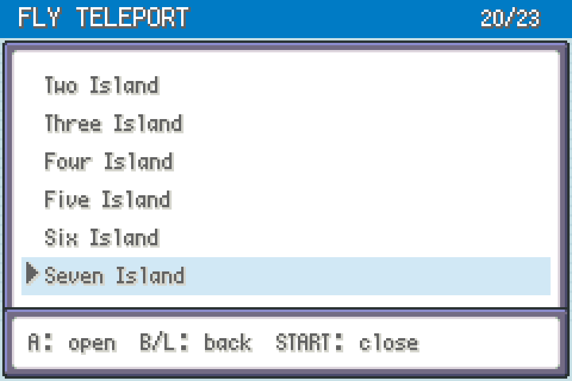
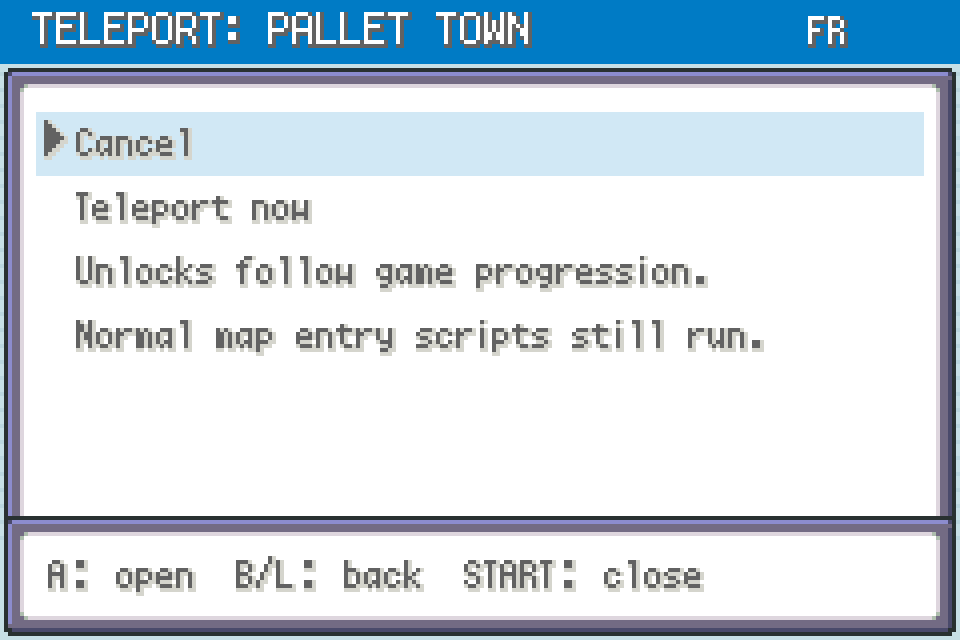

# Fly Teleport 0.2.0 — FireRed / LeafGreen

**START → TELEPORT** lists every native Fly destination in the collection's usual FRLG menu: blue header, striped background, six scrolling rows and the player's selected window frame.

Import [fly-teleport-0.2.0.zip](https://github.com/CapnJames95/gen1recomp-mod-releases/releases/download/v1.2.0/fly-teleport-0.2.0.zip), enable it for your edition and restart. Works independently. With [FRLG Dual Screen](../frlg_dual_screen/README.md) 0.3.15 installed and enabled, a **TELEPORT** map tile appears automatically on Home; the menu opens on the companion screen with touch rows and physical controls. Disabling or removing Fly Teleport hides its tile.

Select a destination, then **Teleport now**. Confirmation starts on **Cancel**. Up/Down scrolls, Left/Right skips five rows, A selects, B/L goes back and START closes.

## Destinations

Pallet Town, Viridian City, Pewter City, Cerulean City, Lavender Town, Vermilion City, Celadon City, Fuchsia City, Cinnabar Island, Indigo Plateau, Saffron City, Route 4 Pokémon Center, Route 10 Pokémon Center, and One through Seven Island: **20 destinations**.

**Game progression is the default.** Destinations unlock using the same visited flags as the native Fly map. Locked destinations remain listed with `[LOCKED]`; choosing one explains that you must visit it during normal play. Existing saves immediately use their existing progress.

Choose **Destinations: Game progression / All unlocked** below the destination list to switch modes. Alternatively, turn **ALL DESTINATIONS UNLOCKED** on or off in the mod manager. The setting is saved through the normal options system; switching modes never sets or clears game progress flags. All-unlocked mode includes unvisited destinations.

Neither mode requires a Pokémon with Fly, a badge or ferry ticket to perform the teleport. Progression mode checks destination unlocks, not the ability to use the Fly move. Normal arrival scripts still run. The mod does not grant badges or tickets. Save normally to keep your new position.

Coordinates come from the active edition's imported Fly data. Travel uses the native map warp and lands on foot facing down. Battles, dialogue, movement, fades, linked activities and Safari games block travel; missing maps or obstructed landing points report an error. Confirmation rechecks the active session and destination.

Requires Mod API 2, `engine_internals` and Gen1Recomp >=0.3.21 <0.4.0. Tested against engine commit `5540fc1538c7c9c8a3c8c85e09679ae03f28beaf`; other revisions and physical devices are not verified. No ROM, imported game data or player saves are distributed. See [validation](VALIDATION.md).

## Screenshots

Native draw traces from synthetic sessions, not live play captures.

Based on the Pokemon Gen 1 Recompilation Project by BOIS CLUB GAMES, LLC. Menu and travel conventions follow the collection's Quick Heal Party and Day Care Viewer mods.
