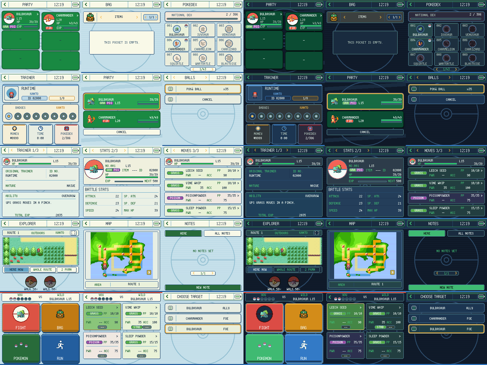
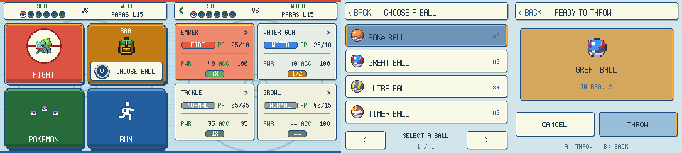
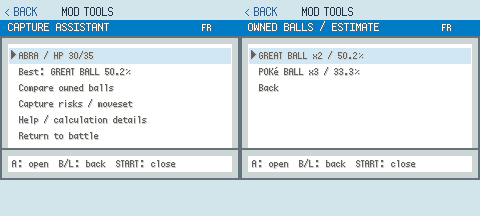

# FRLG Dual Screen 0.3.16

A FireRed / LeafGreen companion for gen1recomp and AYN Thor, based on **Kanto Gear 3.3.3**. Gen III blue borders, cream panels, edition accents and light/dark themes accompany the inherited DS-style touch layouts. Full DS feature parity is outside this fork's scope.

## Upstream update

Version 0.3.0 merged [Kanto Gear 3.3.3](https://github.com/AverageConsumer/kanto-gear/releases/tag/v3.3.3). Shared-window mouse/touch input now follows stacked, side and overlay layouts using upstream's instance-level pointer bridge. Captured gestures cancel cleanly, and synthetic mouse events from touch cannot double-trigger actions. The inherited summary navigation fixes are included. All FRLG styling, Home mod tiles, live editors, encounters, Start-menu filtering and battery preferences are preserved; virtual controller buttons remain removed.

The battery toggle also keeps its captured release in combined layouts, with drag-away cancellation. No host patch is required for the new pointer fix on upstream's supported host versions.

## Install

1. Import `frlg-dual-screen-0.3.16.zip` through **MODS → Import mod .zip**, enable it for FireRed/LeafGreen and restart. Disable Kanto Gear and gen1recomp DS for that edition: this fork owns the companion display.
2. Use a current FRLG-capable host. Tests use official dev `5540fc1538c7c9c8a3c8c85e09679ae03f28beaf`; the inherited manifest minimum is 0.3.20, not a claim that every intervening host version was tested.
3. Choose **Options → Display → Separate Screens**. Try AUTO targeting first; HANDHELD / EXTRA SCREEN can correct reversed panels. Combined Screen supports desktop use.
4. Home has **WILD POKEMON** on its first default page. **LIVE QOL** and installed mod shortcuts are on page 2. Existing custom layouts gain Wild Pokemon in the first free slot; Home editing lets you reposition it.
5. If installed, update **Shiny Hunter to 0.1.5** and **Encounter Tour to 0.1.3** using the companion downloads. These add explicit live-editor ownership and busy-state reporting. Older versions keep modal editors; encounter spawning asks for their update to avoid interfering with automation.

Other mods remain separately installed. No ROM, imported cache or player save is included. Existing upstream Kanto Gear settings/notes are not migrated into this fork's namespace.

## Battery display

Tap the battery indicator in the header to switch between its icon and a numeric percentage. Tap again to switch back. The preference is saved and is also available under **Options → Appearance → Battery Percent**. An unavailable reading displays `--%`.

## Wild Pokémon

Open **Home → Wild Pokemon**. Tap a sprite/card to start a normal native wild battle. Labels distinguish **CAUGHT**, **SEEN** (encountered but uncaught) and **NEW**. The display refreshes from the live Pokédex; viewing entries never changes it.

- **HERE** checks the current terrain: walking encounter tiles, surfing water, or fishable water you face with an owned rod.
- **ROUTE** lists the current map's pools and permits selecting them from elsewhere on that map. Rods, party field moves and badges still gate their methods. Rock Smash encounters currently require Route view.
- Each species/method appears once, with its native level range. Duplicate slots retain their weights and disjoint level bands. Current native encounter variants are respected. Dim cards explain unmet requirements when tapped.
- **ENCOUNTER UNCAUGHT** chooses the first eligible uncaught species (species ID, then method order). It safely does nothing if all accessible species are caught or the area has no eligible encounters. This lists random encounter tables, not scripted gifts, stationary legendaries or roamers.
- **Options → Controls → Uncaught Key / Uncaught Button / Uncaught Area** configure the shortcut. Keyboard defaults to **F8**; controller binding defaults OFF and offers either stick click or Back. Scope defaults to Current Tile. A held key triggers only once per press.

Targeted encounters bypass the normal step chance and Repel, intentionally. Pokémon generation, battle transition, capture and Pokédex writeback remain native; this does not force shininess, edit PID/IVs or guarantee capture. Requests recheck location and requirements and are blocked during movement, menus, dialogue, transitions, battles, Safari games, linked activity and active automation/snapshot hunts.

## Home mod tiles

Installed and enabled **LegalMon**, **Event Distributions**, **Shiny Hunter**, **Auto Breeder** **Encounter Tour**, **Day Care Viewer** and **Encounter Reset** automatically receive Home shortcuts. **Pokémon Services**, **Quick Heal Party** and **Capture Assistant** also have dedicated tiles. They use the existing Home app artwork, frames and theme colours. With the default layout, mod shortcuts extend across pages 2 and 3. Custom layouts keep their existing positions; new shortcuts fill free slots.

A tile opens the mod's normal editor directly and returns to Home when closed. Missing, disabled or failed mods have no visible tile or library entry; stale taps cannot open them. Re-enabling a mod restores its shortcut. Home editing supports repositioning these tiles like the existing apps.

Day Care Viewer and Encounter Reset open their normal menus on the lower screen with native modal ownership and physical controls. Scrollable Start Menu only changes the native menu renderer and has no separate menu to launch. No individual QoL tiles are added.

## Other mod controls while playing

Open an editor from its Home tile. While FRLG Dual Screen is enabled, the ten mod entries are hidden from the game's Start menu; disabling the companion restores them. LegalMon, Event Distributions, Auto Breeder, Shiny Hunter and Encounter Tour render below with their original Gen III artwork. Visible list rows and LegalMon keyboard keys are directly tappable; use the physical controls for navigation and special screens. Native confirmations remain intact.

Tap **PAUSED / LIVE** in the editor header to release field movement to the physical controller while using touch in the editor. Tap **LIVE / PAUSE** to restore modal ownership. Live actions wait until movement stops; battles, scripts and other native menus temporarily hide the editor. Text input, search jobs and active automation regain modal ownership. This is supported for the five collection editors, not an arbitrary third-party concurrency API.

**Live QoL** toggles the ENABLED setting of installed collection QoL mods without opening a modal menu, through normal option persistence and events. Detailed settings remain in each mod's own menu.

## Menus and touch

**0.3.15:** Adds a TELEPORT Home tile when [Fly Teleport](../fly-teleport/README.md) is installed and enabled. Opens its usual destination menu on the companion screen; disabling or removing the mod hides the tile.

**0.3.14:** The separate [Summary IVs](../summary-ivs/README.md) mod can retain the native orange Pokémon Skills page on the companion screen. Its IV column sits between the stat labels and totals. In 0.3.16, use ACTIONS for touch navigation on this native fallback; disabling SHOW IVS restores the custom summary adapter. Without Summary IVs, existing summary behavior is unchanged.

Inherited native touch adapters cover battles, Start, party, bag, summary, Pokédex, trainer, PC, naming and move learning. Egg summaries, move-detail reordering, region maps, specialized screens and unknown non-battle Stack panels use a native-render fallback below, operated with the physical controls. They retain native input/pause rules. Unknown panels are not promised direct row hit targets. Tutorial/link battle ownership stays native. The companion Map app is a viewer; native region-map menus retain their own selection behavior.

The virtual D-pad, A/B/L/R/Start/Select buttons and Controls app were removed in 0.2.2. Direct menu taps, Home tiles, encounter cards and normal navigation actions such as Back remain. The old Android multitouch patch is retained as a development reference; this version does not enable its control-deck protocol.

## Verification and remaining limits

Both-edition automated native-data, runtime, control, route and collection tests plus actual GPU previews are documented in [VALIDATION.md](VALIDATION.md). These use isolated generated sessions, not your playthrough. **AYN Thor is the only tested dual-screen device. Other dual-screen devices have not been tested.** This device-testing scope is reported by the maintainer; the automated results linked above are separate and do not establish exhaustive gameplay coverage. The optional Android patch is source-tested for application to the pinned host, not compiled or device-tested here.

Silph Connect is inherited optional online presence, off by default, accounting for the `network` permission. It is not a replacement trading service. `engine_internals` is required by the native adapters. This is an experimental unofficial fork.

## Attribution

Kanto Gear by AverageConsumer, MIT, vendored from `6155d4d9c01f9b2fe44840382193ef3ad1db332c`: <https://github.com/AverageConsumer/kanto-gear>. Original licenses and font credits are retained; [UPSTREAM_README.txt](https://github.com/CapnJames95/gen1recomp-mod-releases/releases/latest) documents upstream, not this fork.

BartInTheField's DS mod was reviewed for composition, frozen-world, split-battle, palette and DPI ideas: <https://github.com/BartInTheField/gen1recomp-ds-mod>. No code from it is copied. Host: <https://github.com/bryanthaboi/gen1recomp>.

The fork's additions were developed with AI assistance. Font assets retain their supplied licenses.

## QoL compatibility update 0.3.2

Ball Shortcut 0.2.1 publishes modal ownership so physical directions and direct bottom-screen taps select the intended action. Shop Owned Count now contributes live quantities to companion shop rows. Uncaught encounter hotkeys yield outside the idle field. Start-menu rendering delegates to the dedicated renderer. Quiet EXP is independently installable; Live QoL discovers currently installed packages.

## 0.3.4 — Assistant Home tiles

Quick Heal Party and Capture Assistant now have dedicated QUICK HEAL and CAPTURE HELP Home tiles, replacing their Live QoL toggles. Each tile opens the installed mod’s own menu below, preserves saved preferences, and hides when the mod is disabled or absent. Their native Start entries are hidden while Dual Screen is enabled. Capture Assistant’s battle shortcut remains R.

## Native Pokémon legality corrections — 0.3.5

This release includes the shared FRLG generation/export corrections. It sets valid ability slots for newly generated/caught Pokémon, creates native gift eggs with the correct egg metadata, preserves fixed NPC-trade identity and contest values, and generates new roamers with retail FRLG PID/IV correlations. The roaming beast's stored personality and IVs now reach the battle without being regenerated. Native unhatched eggs receive the required OT-name padding during in-game export.

The same helper is bundled independently with Dual Screen, Shiny Hunter, Encounter Reset, Encounter Tour, Day Care Viewer and Pokémon Services. No additional mod is required. Co-loading these packages applies the corrections once; disabling every participating mod or unloading the game stops the wrappers. Existing Pokémon are not rerolled or bulk-repaired.

**For a cartridge save, use MODS → this mod → SAVE + EXPORT while in the field.** This first saves the active game and then exports with the egg-name correction loaded. The log gives the output path under `exports/<edition>/`. A fresh launcher export can still use the host's unpatched egg-name encoder; copy the in-game export directly. Restart after installing updates.

See the collection's `docs/LEGALITY-FIXES.md` for the regression results and limits. This corrects the identified defects; a passing sample matrix does not certify every possible modified ROM, species combination or future host release.

## Battle tools — 0.3.7

The ball picker is built into Dual Screen; **no Battle Ball Shortcut mod is needed**. In an eligible wild single battle, press **Y** (controller) or **F7** (keyboard) to choose an owned ball. Set your preferred bindings in **Options → Battle → Ball Picker Button / Ball Picker Key**. The Bag tile displays a distinct binding badge beside **CHOOSE BALL**; tap that prompt to open the picker in the standard battle layout.

The picker and confirmation use the companion's themed panels, ball icons and touch buttons. Choose a ball, then press **THROW** or A to confirm. B returns or closes; dragging away cancels a touch. Physical directions page through the list. Native battle code resolves the throw and consumes inventory. Trainer, Safari, double, link and tutorial battles are excluded; Master Balls are not offered. The separate ball mod may remain installed for its independent functionality, but is not used by this picker.

Fight rows retain type-chart badges: **0X, 1/4, 1/2, 1X, 2X, 4X**, calculated from the opponent's current battle types. These are type matchups, not damage predictions or ability/weather checks. Status moves and doubles without one unambiguous defender show **--**.

Version 0.3.8 uses each ball’s native imported item sprite in the picker and confirmation, rather than a shared Poké Ball symbol. Artwork is loaded from your game cache; it is not bundled in the mod.

Version 0.3.9 styles the standard battle screen’s Y/X shortcut as a round Nintendo-style face button with a pale rim and white letter. Other bindings retain readable key labels.

Version 0.3.10 identifies the startup screen, Home heading and settings shortcut as FRLG Dual Screen. The startup screen retains a smaller Based on Kanto Gear credit.

Version 0.3.11 keeps battery percentages centred inside the header cell, including 100% and unavailable readings.

## Capture Assistant on the bottom screen — 0.3.12

With Capture Assistant **0.1.1+**, press **R** at ordinary wild battle commands to open its native panel over this companion screen. The battle stays visible on top and pauses while reading. Tap visible rows and **< BACK**, or use physical controls. Closing restores the normal Dual Screen interface. The assistant uses its standalone main-screen view when the companion is inactive or unavailable. Update both packages; earlier Capture Assistant versions do not opt in to the handoff.

## Main Start menu visibility

**Options → Display → HIDE MAIN START** is ON by default. With Separate Screens selected and a detected, ready companion display, the main screen hides the native Start menu while the companion retains its menu and controls. Turn the setting OFF to show both copies. Combined/fullscreen modes, a disconnected or unready companion, and a disabled Dual Screen mod retain the native menu. Safari statistics remain visible. This changes drawing only; Start-menu navigation, folders and callbacks remain active.

If using Scrollable Start Menu, update it to **0.2.2** too, so its scrollbar follows the same visibility setting.

## Touch support — 0.3.16

Collection mod panels now support tapping visible rows, vertical swipes, **PREV PAGE / NEXT PAGE**, and **ACTIONS**. Actions exposes menu navigation, confirmation, L/R, Select and Start; it also covers native fallback screens such as the Start Menu organizer. Numeric and alphabetic keyboards use their rendered key positions. Presses activate on release; cancelled gestures, another finger, a changed page or releasing over a different row cannot select a confirmation.

Use **MOD ACTIONS** on Party for held items, nicknames and the move reminder. In a native summary or Town Map panel, use **ACTIONS → SELECT** for extra summary information or map services. Existing requirements and confirmations still apply. On the companion Map page, MOD ACTIONS opens the native Town Map.

With Hold Fast Forward 0.2.1 enabled, open **LIVE QOL SETTINGS** and hold **HOLD TO FAST FORWARD**. Releasing, sliding off, losing focus or leaving the page releases the speed hold.

These controls are for mod menus and contextual shortcuts; no gameplay controller deck is added. [Touch coverage and checks](../../docs/TOUCH-SUPPORT.md).
