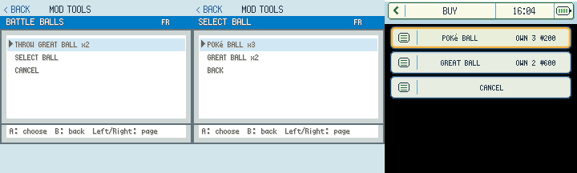

# QoL cleanup and fixes — 27 September 2026

## Result

25 independently installable QoL mods: removed Battle Type Hints and Move Inspector, retained the other 24, and added Quiet EXP. No existing playthrough save or installed-game mod settings were changed.

- **Quiet EXP 0.1.0:** skips individual EXP-gain announcements and, by default, accelerates EXP bars. Keeps actual awards, level-up messages/animations, stat-growth windows, move learning and subsequent trainer messages. Tutorials/link/spectator modes remain native; headless logs are unchanged.
- **Battle Ball Shortcut 0.2.1 + Dual Screen 0.3.2:** shared popup ownership prevents swallowed directions/unintended throws. LegalMon-style popup appears below, with direct row taps, physical navigation, stale-callback guards and explicit Throw confirmation. F7/R3 defaults and configurable bindings remain; focus loss cancels. The field encounter shortcut no longer steals the same key during battles.
- **Shop Owned Count 0.2.0:** live owned quantities appear beside prices on the bottom-screen shop list, honoring the mod toggle. Native standalone overlay retained.
- **Hold Fast Forward 0.2.0:** optional SDL controller hold binding (L3/R3/shoulders, OFF by default), with release/disconnect/focus handling and native speed locks. Select an otherwise-unused button; this does not remap other actions.
- **Scrollable Start Menu 0.1.1:** publishes renderer ownership. Every retained QoL helper delegates to it when active, retaining independent fallback pagination otherwise. Other QoL packages bumped to 0.1.1 for the helper fix.

## Install / migrate

Remove installed `frlg_qol_battle_hints` and `frlg_qol_move_info` through the game's MODS manager. Import the replacement ZIPs for mods you use, replacing rather than duplicating each ID; install Quiet EXP if desired. Update **both** Dual Screen and Ball Shortcut together. Restart the game after replacing packages. Source/download cleanup does not uninstall mods from your game automatically.

See [current packages](PACKAGES.md). The update bundle contains individual importable ZIPs; unpack it first, then import the desired ZIPs. No ROM or extracted assets are included. Back up your saves before beta testing.

## Validation

- 52/52 latest-QoL suites passed across FireRed and LeafGreen: 50 per-mod suites and two combined loader/reload/teardown/Start-ownership suites.
- Eight Ball Shortcut composition runs passed: both editions × Gear/Full navigation × both wrapper load orders. The earlier failing Down → A reproduction now selects a ball instead of throwing.
- 16/16 Dual Screen suites passed on both editions, including bottom-panel touch selection/explicit throw, stale callbacks, disabling, F8 arbitration, live shop counts and 37-mod coexistence. Collection test: 273 assertions per edition.
- 37 imported-data checks per edition passed. Native engine EXP-participant/distribution baseline passed in both editions; these baseline tests are not a complete modded battle playthrough.
- 100/100 QoL modkit validate/lint/gen3check/pack checks passed.
- Dual Screen and Scrollable Start each passed validate/lint/gen3check/pack. All 27 update archives match their runtime sources; the live collection verifier also passed (36 archives, zero broken local links).
- Actual LÖVE/GPU preview of the ball popup, picker and shop counts was rendered and inspected. Manager screenshots regenerated for all 25 packages.
- Host tested: official dev `5540fc1538c7c9c8a3c8c85e09679ae03f28beaf`. Tests use isolated fixture sessions and read-only imported caches, not your save. No physical Thor/controller playthrough was performed.

During implementation, two test-harness issues (a missing fixture species name and uninitialized test option tables) were corrected. Final suites are green. These fixes do not claim to finish unrelated beta limitations: Fly without a taught move/destination API, exhaustive route completion, party-to-box batch operations, full controller remapping and engine-level save/render features remain as documented.

The earlier DUAL_SCREEN_AUDIT.md is a historical pre-fix audit, not current release status.

