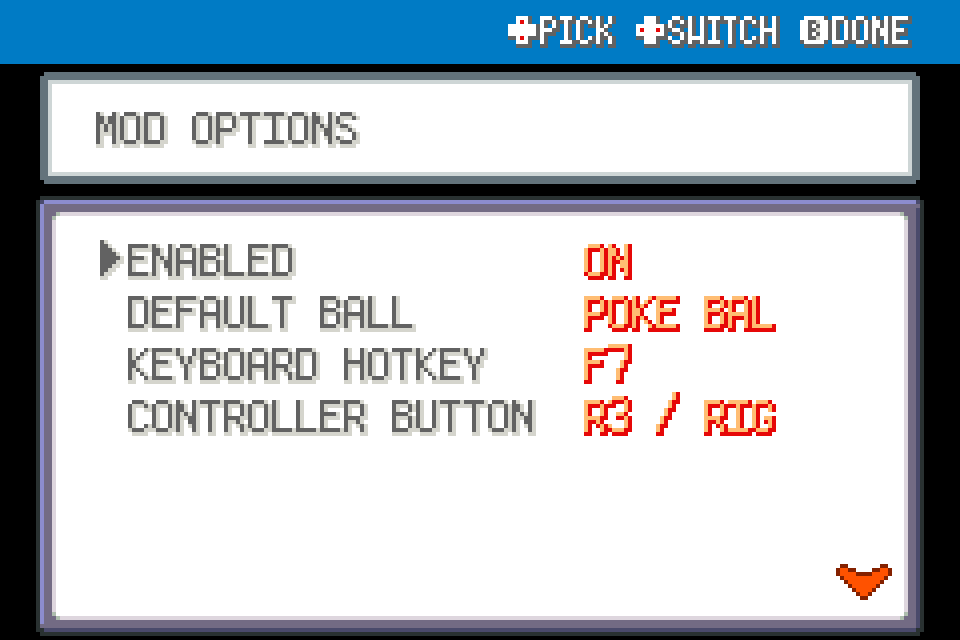

# Battle Ball Shortcut

Press Y (controller) or F7 (keyboard) to select an owned Ball from a wild single battle command menu, then confirm THROW.

Experimental FRLG beta mod for players; tested against upstream commit `84e076b2d1e2dda36073ff55ec7c311a6b97519c` using ROM-free fixtures, not ROM-playtested.

## Install

Import this mod's ZIP using launcher MODS > Import mod .zip, enable, and restart. Alternatively place this entire folder under `mods/frlg_qol_ball_shortcut/`. No other package is required. Back up your save for beta testing. Restart after installing, updating or disabling; restart fully after a load error.

## Use and configuration

Configure Poke/Great/Ultra Ball, then SELECT (Tab/Shift) in the main command menu. No fallback to a different Ball and no Master Ball option. Empty stock falls through. Trainer, Safari, double, link, spectated and tutorial battles excluded. The battle engine still resolves the normal turn and catch.

ENABLED and any other settings appear in this mod's manager entry. Tool mods share one START > QOL menu automatically; no central dependency.

## Compatibility and tests

FireRed and LeafGreen only. This mod declares `engine_internals`; a later beta or another mod replacing the same methods can break it. Inactive wrappers fall through after loader changes. Online/arena play excluded. See VALIDATION.md for actual checks; run upstream modkit lint/validate against this folder. No ROM-derived data or assets included.

## Screenshots

Native FRLG mod-manager renders from the loaded 0.1.0 package in an isolated test session. These show the real detail/options UI; they are not live gameplay captures.

## Compatibility update (0.2.1)

Shared Start-menu rendering yields to the dedicated Scrollable Start Menu when enabled. Independently installable; restart after replacement.
Requires Dual Screen 0.3.2 or later for companion popup ownership. Default F7 / Y; configurable key/button and optional SELECT fallback. Open, select an owned Ball, then explicitly Throw. Bottom-screen taps and physical navigation share one modal; focus loss cancels it.

## 0.2.2

Controller default is Y; keyboard default is F7. Both bindings are configurable in this mod's options and existing saved choices are preserved. These shortcuts open SELECT BALL directly; selecting a ball returns to the explicit THROW confirmation. Optional SELECT still opens the action menu. FRLG Dual Screen 0.3.6 displays the current binding on its bottom battle screen. The hint hides when the shortcut is unavailable or its modal is open.
