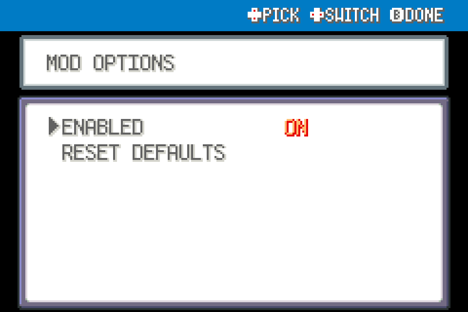

# Held Berry Replacement

Replace a berry actually consumed in battle using one matching berry from your Bag.

Experimental FRLG beta mod for players; tested against upstream commit `84e076b2d1e2dda36073ff55ec7c311a6b97519c` using ROM-free fixtures, not ROM-playtested.

## Install

Import this mod's ZIP using launcher MODS > Import mod .zip, enable, and restart. Alternatively place this entire folder under `mods/frlg_qol_berry_restock/`. No other package is required. Back up your save for beta testing. Restart after installing, updating or disabling; restart fully after a load error.

## Use and configuration

Restocks after battle writeback, only for confirmed berry consumption and an unchanged party member with an empty item slot. Never manufactures berries, restocks during battle, or replaces items merely lost to Knock Off/Thief. Link battles excluded.

ENABLED and any other settings appear in this mod's manager entry. Tool mods share one START > QOL menu automatically; no central dependency.

## Compatibility and tests

FireRed and LeafGreen only. This mod declares `engine_internals`; a later beta or another mod replacing the same methods can break it. Inactive wrappers fall through after loader changes. Online/arena play excluded. See VALIDATION.md for actual checks; run upstream modkit lint/validate against this folder. No ROM-derived data or assets included.

## Screenshots

Native FRLG mod-manager renders from the loaded 0.1.0 package in an isolated test session. These show the real detail/options UI; they are not live gameplay captures.

## Compatibility update (0.1.1)

Shared Start-menu rendering yields to the dedicated Scrollable Start Menu when enabled. Independently installable; restart after replacement.
