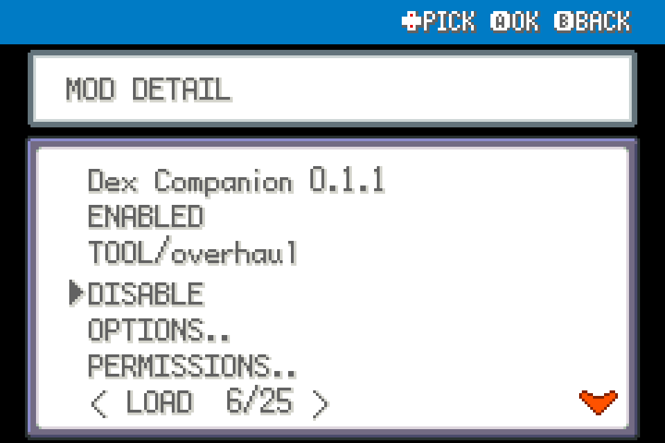
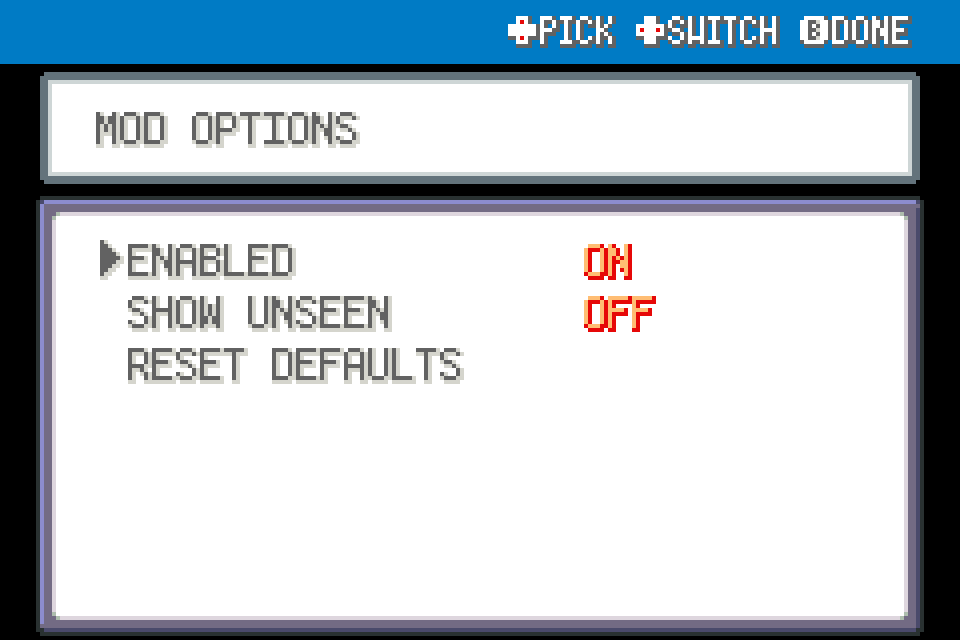
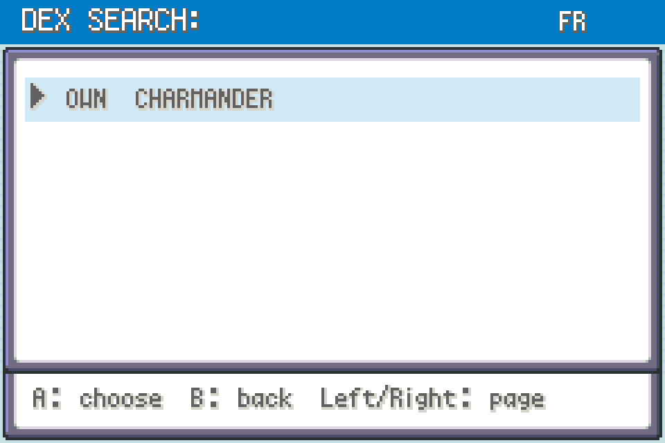

# Dex Companion

Search seen species by name; read imported evolutions and wild locations; count owned species in the current area's encounter tables.

Experimental FRLG beta tool for players. Install its ZIP through launcher MODS > Import mod .zip, enable, and restart. Or copy the folder to `mods/frlg_qol_dex_companion/`. No dependency required. START > QOL > DEX COMPANION opens the tool. Directions navigate; A chooses; B closes; left/right page. Uses the original naming keyboard for search (10 characters, literal substring matching).

SHOW UNSEEN defaults off; ENABLED can disable the tool. Location and evolution details can reveal future locations once a species is seen. Locations/route completion describe imported ordinary land/water/fishing/rock-smash encounters. They do not count gifts, trades, roaming or static encounters, story availability, or runtime encounter-hook changes. Evolution rows describe extracted rules; story/National Dex gates still apply. No encounter or evolution rules are changed.

Built against upstream `84e076b2d1e2dda36073ff55ec7c311a6b97519c`. Shared FireRed/LeafGreen code, declared engine_internals permission. No ROM/assets included. Not ROM-playtested. Restart after enable/disable/update; fully restart after load errors. See VALIDATION.md. Back up saves before beta testing. Test via upstream modkit lint/validate and the collection's tests.

## In-use UI examples

These are native UI renders from real mod hooks with isolated fixture data, not a live-play recording.

Selecting a seen species shows its imported evolution rule and available wild-location records.

## Screenshots

Native FRLG mod-manager renders from the loaded 0.1.0 package in an isolated test session. These show the real detail/options UI; they are not live gameplay captures.

Native UI example from the development render harness:

## Compatibility update (0.1.1)

Shared Start-menu rendering yields to the dedicated Scrollable Start Menu when enabled. Independently installable; restart after replacement.
