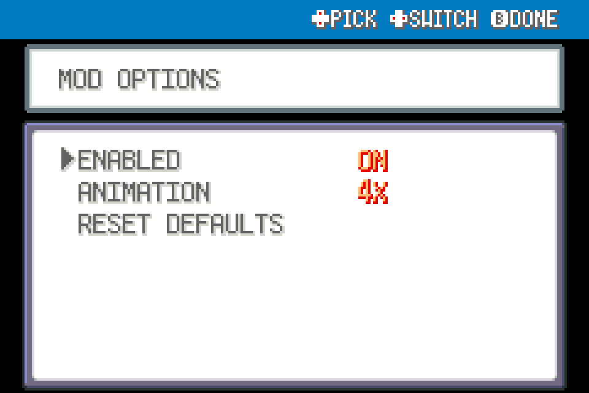

# Faster Center Healing 0.2.0

Speed up Center healing and remove the idle wait for the healing jingle.

Experimental FRLG beta mod for players. Tested against upstream commit `5540fc1538c7c9c8a3c8c85e09679ae03f28beaf`; not device-playtested.

## Install

Import this mod's ZIP through the launcher's MODS > Import mod .zip, enable it, and restart the game. Alternatively place this entire folder under `mods/frlg_qol_fast_healing/`. Install each desired mod separately; no common mod is required. Restart after enabling/disabling or updating. Keep a backup of your save when testing beta mods.

## Use and configuration

Choose animation speed 2x/4x/8x (default 4x). **WAIT FOR JINGLE** defaults to **OFF**: once the accelerated machine animation finishes, the nurse continues immediately instead of waiting for the full sound. The jingle plays out normally in the background; music restoration and unrelated fanfare waits are unchanged. Turn WAIT FOR JINGLE on to restore the original sound wait. Healing, dialogue, script progression and completion callbacks remain native; this does not skip prompts or heal the party early.

Options are in this mod's manager entry. ENABLED turns its behavior off. Mods with tools share one START > QOL menu automatically; there is no required central package.

## Compatibility

FireRed and LeafGreen only, using the shared FRLG engine. Declares `engine_internals` because the public API lacks the necessary narrow extension point. Other mods replacing the same functions may conflict. Inactive wrappers fall through after the loader changes; restart fully after a load error. Online/arena play is outside this package's scope. No ROM, graphics, audio or extracted data included.

## Validation

See VALIDATION.md and the collection's tests/ for the ROM-free checks and the exact limitations. For standalone checking, use upstream `tools/modkit.py lint` and `validate` on this directory.

## Screenshots

Native FRLG mod-manager renders from the loaded 0.1.0 package in an isolated test session. These show the real detail/options UI; they are not live gameplay captures.

## Compatibility update (0.1.1)

Shared Start-menu rendering yields to the dedicated Scrollable Start Menu when enabled. Independently installable; restart after replacement.
