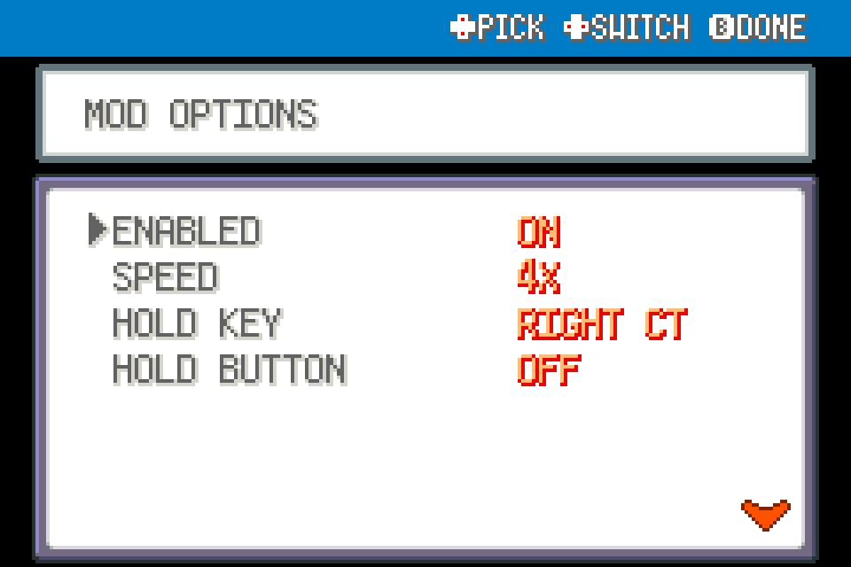

# Hold Fast Forward

Temporarily speed up gameplay while holding a spare keyboard key.

Experimental FRLG beta mod for players. Source-tested against upstream commit `84e076b2d1e2dda36073ff55ec7c311a6b97519c`; not ROM-playtested.

## Install

Import this mod's ZIP through the launcher's MODS > Import mod .zip, enable it, and restart the game. Alternatively place this entire folder under `mods/frlg_qol_hold_fast_forward/`. Install each desired mod separately; no common mod is required. Restart after enabling/disabling or updating. Keep a backup of your save when testing beta mods.

## Use and configuration

Hold Right Ctrl by default; choose Left Ctrl/F6 and 2x/4x/8x. Releasing restores native category speed immediately, without changing settings. Respects the engine's speed locks. Controller speed up/down and touch hold are already native.

Options are in this mod's manager entry. ENABLED turns its behavior off. Mods with tools share one START > QOL menu automatically; there is no required central package.

## Compatibility

FireRed and LeafGreen only, using the shared FRLG engine. Declares `engine_internals` because the public API lacks the necessary narrow extension point. Other mods replacing the same functions may conflict. Inactive wrappers fall through after the loader changes; restart fully after a load error. Online/arena play is outside this package's scope. No ROM, graphics, audio or extracted data included.

## Validation

See VALIDATION.md and the collection's tests/ for the ROM-free checks and the exact limitations. For standalone checking, use upstream `tools/modkit.py lint` and `validate` on this directory.

## Screenshots

Native FRLG mod-manager renders from the loaded 0.1.0 package in an isolated test session. These show the real detail/options UI; they are not live gameplay captures.

## Compatibility update (0.2.0)

Shared Start-menu rendering yields to the dedicated Scrollable Start Menu when enabled. Independently installable; restart after replacement.
HOLD BUTTON adds L3/R3 or shoulder choices, OFF by default. Uses connected SDL gamepad state, stops on release/disconnect/focus loss, and preserves native speed locks. Choose an otherwise-unused button; other button actions are not remapped.

## Touch hold — 0.2.1

With FRLG Dual Screen 0.3.16, open LIVE QOL SETTINGS and hold HOLD TO FAST FORWARD. Release or slide off to return to normal speed. Focus loss, page changes and session changes also end the hold. Existing keyboard/controller bindings and speed-lock restrictions still apply.
