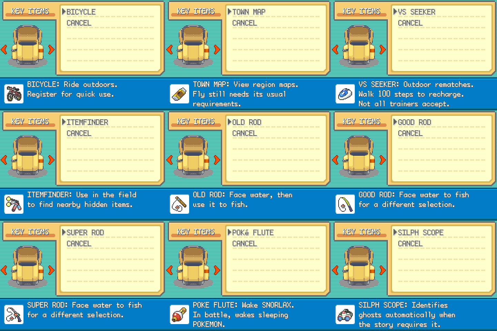
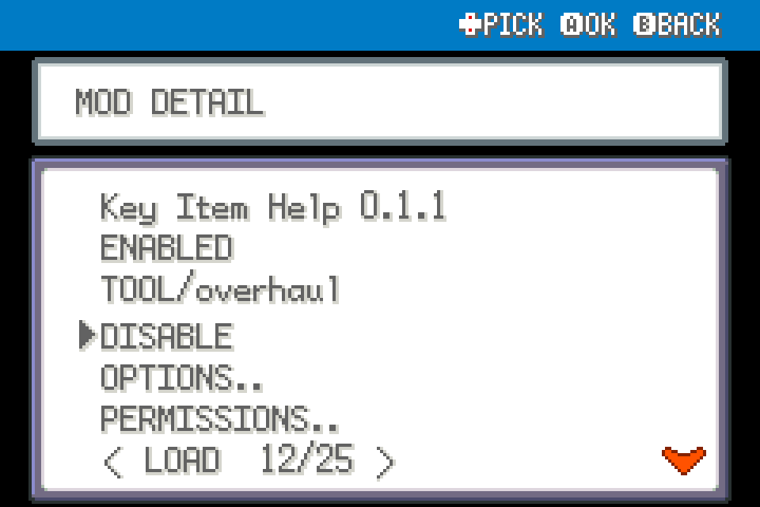
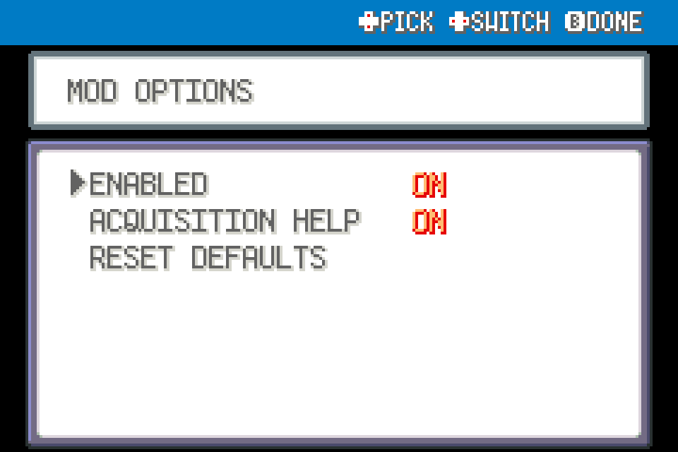

# Key Item Help 0.1.2

Explain useful key items after acquisition and in Bag descriptions.

Experimental FRLG beta mod targeting upstream `84e076b2d1e2dda36073ff55ec7c311a6b97519c`.

## Install

Import this mod's ZIP using launcher MODS > Import mod .zip, enable, and restart. Or place this folder under mods/. No shared dependency; install independently. Back up your save before beta testing.

## Use and configuration

Bag descriptions use compact, explicit line breaks: at most three lines, each within 192 pixels of the native 200-pixel text area. The fuller acquisition help remains unchanged. This fixes text extending beyond the Bag screen without shrinking the font or changing the native layout.

Authored guidance replaces descriptions for Bicycle, Town Map, VS Seeker, Itemfinder, three rods, Poke Flute and Silph Scope. First acquisition through Bag.add queues a LegalMon-style help panel after scripts, movement and other UI finish. ACQUISITION HELP disables popups. Existing saves do not trigger retroactive popups. Unknown items retain native descriptions. Direct inventory writes bypass this notification. VS Seeker Readiness takes priority for that item's description when both mods are enabled.

ENABLED disables this mod. Restart after enabling, disabling or updating.

## Compatibility and validation

FireRed and LeafGreen only. Uses private engine extension points with declared engine_internals permission. May conflict with replacements of the same functions. Online/arena play is unsupported. New panels match LegalMon's blue header, native frame and selection palette. No ROM assets/data included. See VALIDATION.md for exact checks and limitations; not interactive-gameplay certified.

## In-use UI examples

These are native UI renders from real mod hooks with isolated fixture data, not a live-play recording.

The mod’s native help panel explains the Bicycle and registered-item shortcut.

## Screenshots

Native FRLG mod-manager renders from the loaded 0.1.0 package in an isolated test session. These show the real detail/options UI; they are not live gameplay captures.

Native UI example from the development render harness:

## Compatibility update (0.1.1)

Shared Start-menu rendering yields to the dedicated Scrollable Start Menu when enabled. Independently installable; restart after replacement.
