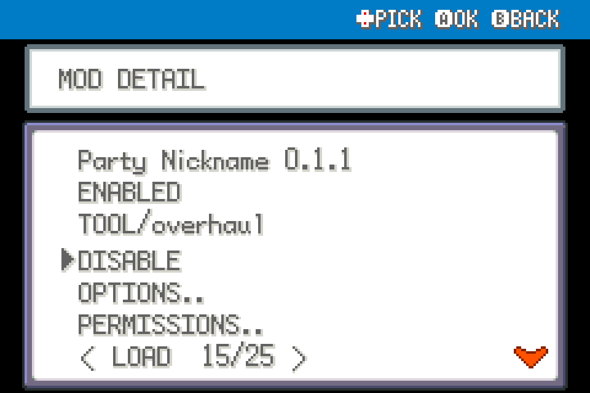

# Party Nickname 0.2.0

Rename non-Egg Pokemon from the party list, regardless of original trainer.

Experimental FRLG beta mod for players. Source-tested against upstream commit `5540fc1538c7c9c8a3c8c85e09679ae03f28beaf`; not ROM-playtested.

## Install

Import this mod's ZIP through the launcher's MODS > Import mod .zip, enable it, and restart the game. Alternatively place this entire folder under `mods/frlg_qol_party_nickname/`. Install each desired mod separately; no common mod is required. Restart after enabling/disabling or updating. Keep a backup of your save when testing beta mods.

## Use and configuration

On the normal party list, highlight a Pokemon and press SELECT (default Tab/Shift). Eggs, battle selection and item-target menus are excluded. Own, event/gift and genuinely traded Pokemon can all be renamed; original-trainer data is not changed. Uses the original naming UI and 10-character limit.

Options are in this mod's manager entry. ENABLED turns its behavior off. Mods with tools share one START > QOL menu automatically; there is no required central package.

## Compatibility

FireRed and LeafGreen only, using the shared FRLG engine. Declares `engine_internals` because the public API lacks the necessary narrow extension point. Other mods replacing the same functions may conflict. Inactive wrappers fall through after the loader changes; restart fully after a load error. Online/arena play is outside this package's scope. No ROM, graphics, audio or extracted data included.

## Validation

See VALIDATION.md and the collection's tests/ for the ROM-free checks and the exact limitations. For standalone checking, use upstream `tools/modkit.py lint` and `validate` on this directory.

## In-use UI examples

These are native UI renders from real mod hooks with isolated fixture data, not a live-play recording.

Pressing SELECT in the party list opens the native nickname keyboard for Charmander.

## Screenshots

Native FRLG mod-manager renders from the loaded 0.1.0 package in an isolated test session. These show the real detail/options UI; they are not live gameplay captures.

## Compatibility update (0.1.1)

Shared Start-menu rendering yields to the dedicated Scrollable Start Menu when enabled. Independently installable; restart after replacement.
