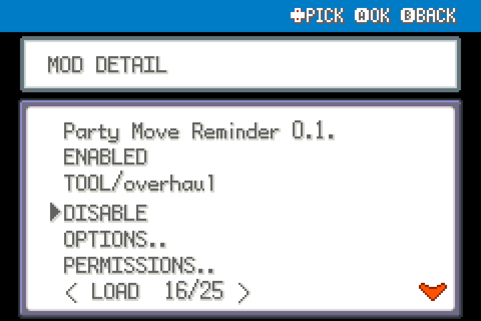

# Party Move Reminder

Open the move reminder from the party list with the original FRLG mushroom payment.

Experimental FRLG beta mod for players. Source-tested against upstream commit `84e076b2d1e2dda36073ff55ec7c311a6b97519c`; not ROM-playtested.

## Install

Import this mod's ZIP through the launcher's MODS > Import mod .zip, enable it, and restart the game. Alternatively place this entire folder under `mods/frlg_qol_party_reminder/`. Install each desired mod separately; no common mod is required. Restart after enabling/disabling or updating. Keep a backup of your save when testing beta mods.

## Use and configuration

On the normal party list press START (default Escape). Costs two Tiny Mushrooms, otherwise one Big Mushroom, only after learning. Cancel/no eligible move costs nothing. Uses FRLG's actual currency, not Heart Scales. Available wherever the normal party menu opens.

Options are in this mod's manager entry. ENABLED turns its behavior off. Mods with tools share one START > QOL menu automatically; there is no required central package.

## Compatibility

FireRed and LeafGreen only, using the shared FRLG engine. Declares `engine_internals` because the public API lacks the necessary narrow extension point. Other mods replacing the same functions may conflict. Inactive wrappers fall through after the loader changes; restart fully after a load error. Online/arena play is outside this package's scope. No ROM, graphics, audio or extracted data included.

## Validation

See VALIDATION.md and the collection's tests/ for the ROM-free checks and the exact limitations. For standalone checking, use upstream `tools/modkit.py lint` and `validate` on this directory.

## In-use UI examples

These are native UI renders from real mod hooks with isolated fixture data, not a live-play recording.

Pressing START in the party list opens the native move reminder when a Big Mushroom is available.

**Observed 0.1.0 limitation:** the Tiny Mushroom lookup uses `TINY MUSHROOM`, but the real imported item is `TINYMUSHROOM`; two Tiny Mushrooms are not recognized in the tested cache. The Big Mushroom path opens correctly. The release has been preserved unchanged; use one Big Mushroom until this is fixed.

## Screenshots

Native FRLG mod-manager renders from the loaded 0.1.0 package in an isolated test session. These show the real detail/options UI; they are not live gameplay captures.

## Compatibility update (0.1.1)

Shared Start-menu rendering yields to the dedicated Scrollable Start Menu when enabled. Independently installable; restart after replacement.
