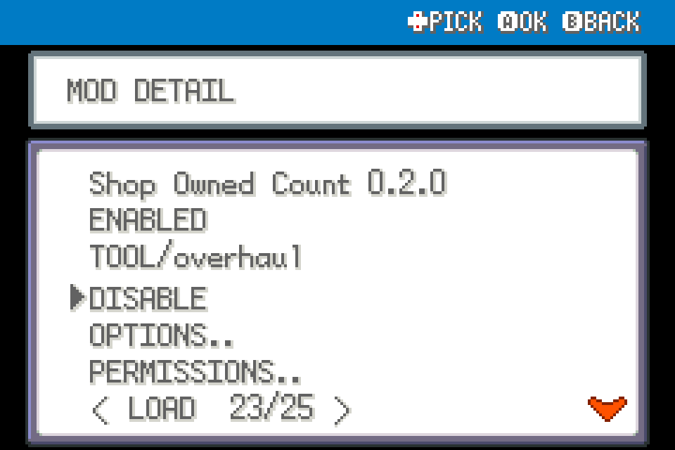

# Shop Owned Count

Show owned quantity while browsing a shop, before entering the purchase dialogue.

Experimental FRLG beta mod for players; tested against upstream commit `84e076b2d1e2dda36073ff55ec7c311a6b97519c` using ROM-free fixtures, not ROM-playtested.

## Install

Import this mod's ZIP using launcher MODS > Import mod .zip, enable, and restart. Alternatively place this entire folder under `mods/frlg_qol_shop_count/`. No other package is required. Back up your save for beta testing. Restart after installing, updating or disabling; restart fully after a load error.

## Use and configuration

Browsing the buy list shows current Bag count below the money box. Native quantity/confirmation count remains unchanged. Cancel row has no count. Does not include PC inventory or held items.

ENABLED and any other settings appear in this mod's manager entry. Tool mods share one START > QOL menu automatically; no central dependency.

## Compatibility and tests

FireRed and LeafGreen only. This mod declares `engine_internals`; a later beta or another mod replacing the same methods can break it. Inactive wrappers fall through after loader changes. Online/arena play excluded. See VALIDATION.md for actual checks; run upstream modkit lint/validate against this folder. No ROM-derived data or assets included.

## In-use UI examples

These are native UI renders from real mod hooks with isolated fixture data, not a live-play recording.

The added OWNED 7 panel shows the Bag quantity while browsing Potions.

## Screenshots

Native FRLG mod-manager renders from the loaded 0.1.0 package in an isolated test session. These show the real detail/options UI; they are not live gameplay captures.

## Compatibility update (0.2.0)

Shared Start-menu rendering yields to the dedicated Scrollable Start Menu when enabled. Independently installable; restart after replacement.
Dual Screen 0.3.2 includes live owned counts beside its shop prices while this mod is enabled. Standalone native overlay is retained.
