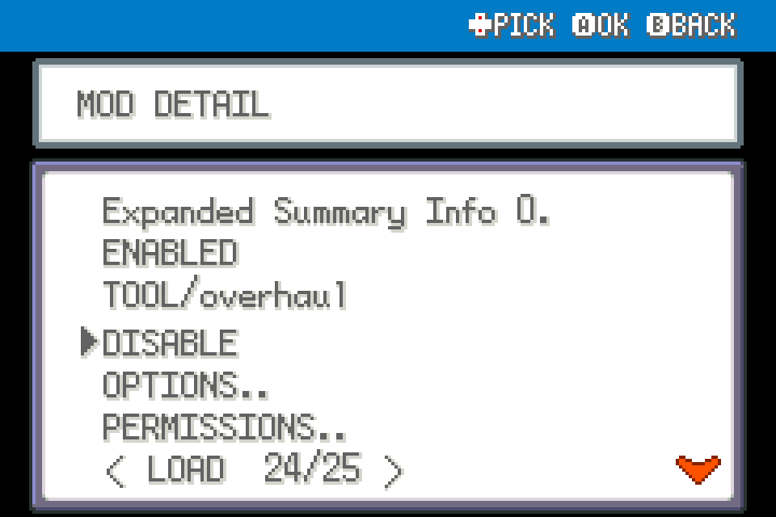
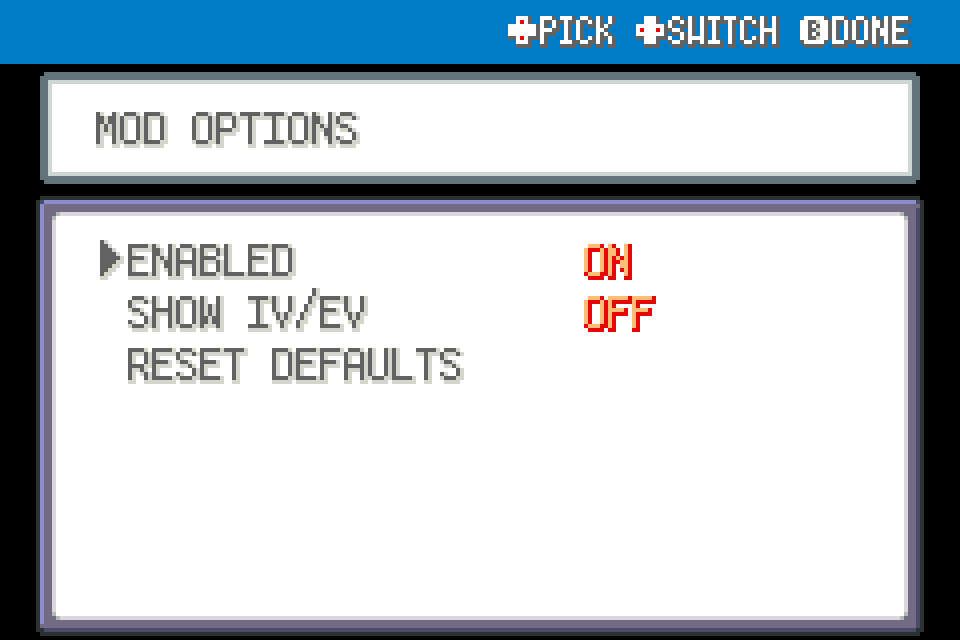

# Expanded Summary Info

Read nature effects and optional IV/EV values from the Summary screen.

Experimental FRLG beta mod for players; tested against upstream commit `84e076b2d1e2dda36073ff55ec7c311a6b97519c` using ROM-free fixtures, not ROM-playtested.

## Install

Import this mod's ZIP using launcher MODS > Import mod .zip, enable, and restart. Alternatively place this entire folder under `mods/frlg_qol_summary_info/`. No other package is required. Back up your save for beta testing. Restart after installing, updating or disabling; restart fully after a load error.

## Use and configuration

In an out-of-battle Summary screen press SELECT. Nature effects and ability appear in a paged read-only panel. SHOW IV/EV is off by default. These are Gen III IVs (0–31) and EVs, not Gen I DVs/stat experience. Native ability description remains on the normal Summary.

ENABLED and any other settings appear in this mod's manager entry. Tool mods share one START > QOL menu automatically; no central dependency.

## Compatibility and tests

FireRed and LeafGreen only. This mod declares `engine_internals`; a later beta or another mod replacing the same methods can break it. Inactive wrappers fall through after loader changes. Online/arena play excluded. See VALIDATION.md for actual checks; run upstream modkit lint/validate against this folder. No ROM-derived data or assets included.

## In-use UI examples

These are native UI renders from real mod hooks with isolated fixture data, not a live-play recording.

The extra Summary panel shows nature modifiers and optional IV/EV values.

## Screenshots

Native FRLG mod-manager renders from the loaded 0.1.0 package in an isolated test session. These show the real detail/options UI; they are not live gameplay captures.

Native UI example from the development render harness:

## Compatibility update (0.1.1)

Shared Start-menu rendering yields to the dedicated Scrollable Start Menu when enabled. Independently installable; restart after replacement.
